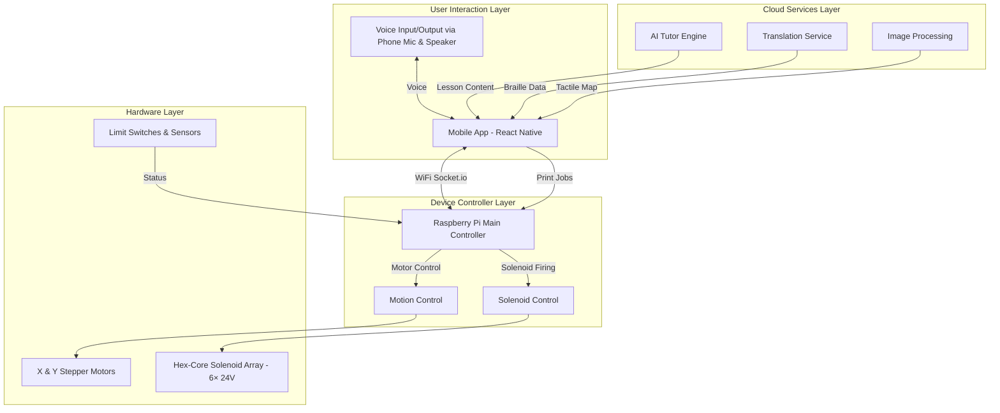
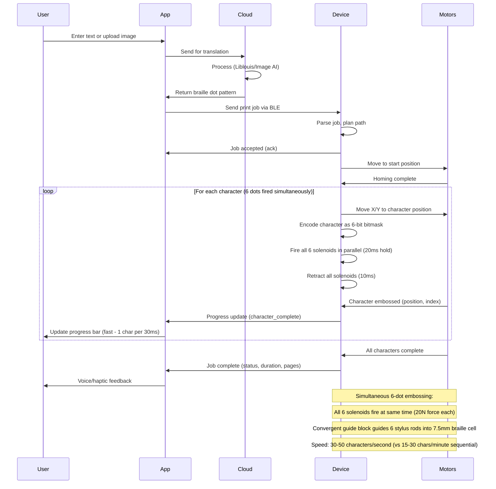
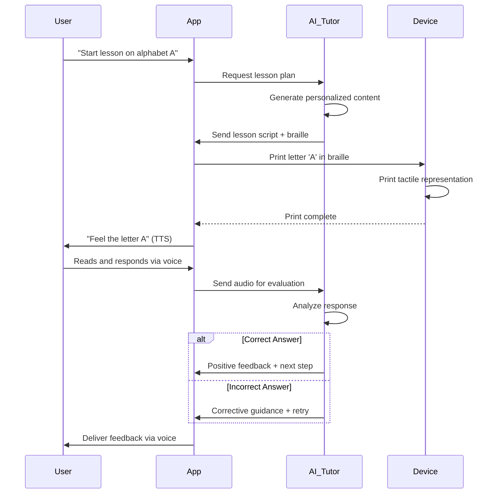
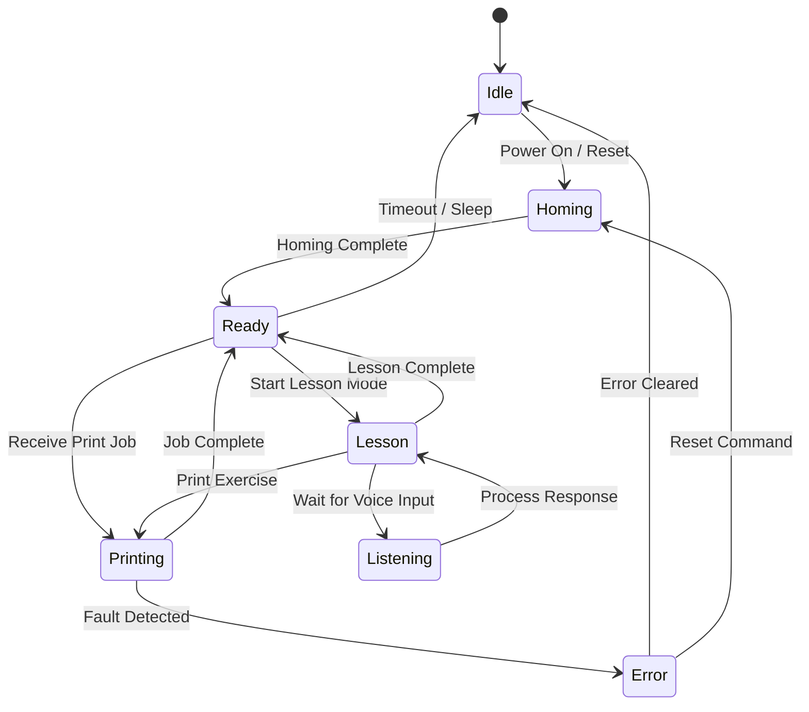
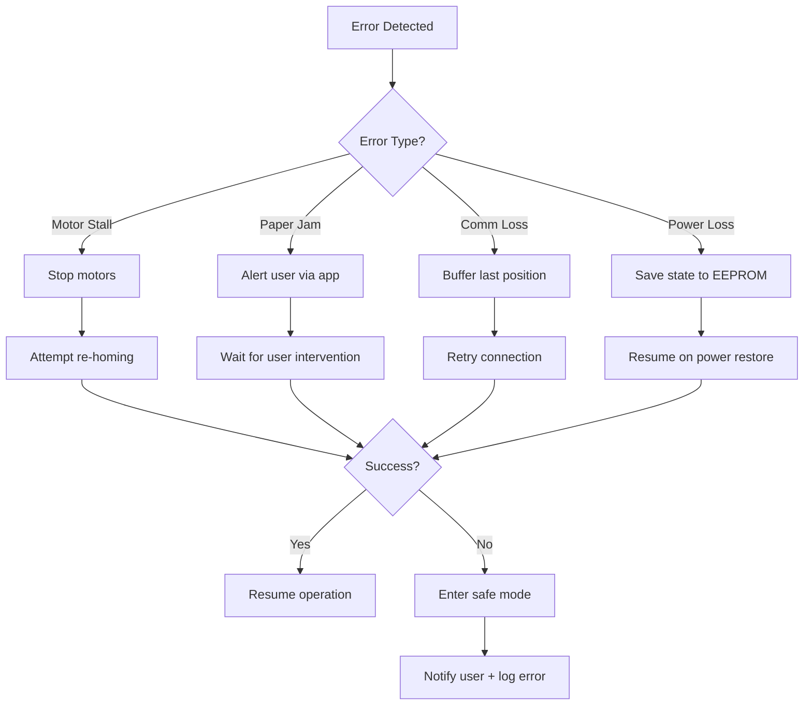

# Chapter 3: System Architecture & Design Philosophy

## 3.1 Overall System Design

### 3.1.1 High-Level Architecture

The system consists of four major subsystems that work together to deliver an integrated braille learning experience:



### 3.1.2 Design Philosophy

**Core Principles:**

1. **Modularity:** Each subsystem can be developed, tested, and upgraded independently
2. **Accessibility-First:** Voice and tactile interfaces prioritized over visual
3. **Offline Capability:** Essential functions work without internet connectivity
4. **Extensibility:** Open architecture for community contributions
5. **Fault Tolerance:** Graceful degradation when components fail

## 3.1.2 Final Hardware Specifications (Hex-Core Architecture)

| Component | Specification | Justification |
|-----------|---------------|---------------|
| **Embossing Mechanism** | Hex-core solenoid (6× simultaneous) | 100-200× faster than sequential, simultaneous character embossing |
| **Solenoid Array** | 6× 24V 20N push-pull solenoids | Simultaneous parallel firing, consistent 60N total convergent impact force |
| **Convergent Guide Block** | SLA 3D-printed (75mm → 7.5mm taper) | Solves spatial pitch constraint, proprietary innovation, ±0.1mm tolerance |
| **Motion System** | NEMA-17 stepper motors (XY gantry) | Precise positioning (±0.1mm), smooth motion, no jitter, 200×280mm travel |
| **Microcontroller** | Raspberry Pi Zero 2W or Pi 4 | Built-in WiFi, 26 GPIO pins (6 solenoids + 2 steppers + sensors), real-time socket.io |
| **Power Distribution** | Isolated 24V/5A SMPS + 5V USB-C | Solenoids on 24V, Pi on isolated 5V, prevents EMI noise corruption |
| **Communication** | WiFi + Socket.io (real-time) | Bi-directional live updates, 50m+ range, multi-client support |
| **Speed Capability** | 30-50 characters/second | Complete braille cell in 30ms (20ms fire + 10ms retract) |

## 3.2 Information Flow Architecture

### 3.2.1 Print Job Workflow



### 3.2.2 Lesson Mode Workflow



## 3.3 Data Models

### 3.3.1 Print Job Data Structure

```json
{
  "job_id": "uuid-string",
  "timestamp": "2025-11-16T10:30:00Z",
  "type": "braille_text | tactile_image | lesson_exercise",
  "content": {
    "source_text": "Hello World",
    "language": "en",
    "braille_grade": "1 | 2",
    "dot_pattern": [
      {"x": 0, "y": 0, "action": "dot"},
      {"x": 2.5, "y": 0, "action": "dot"},
      {"x": 0, "y": 2.5, "action": "dot"}
    ]
  },
  "settings": {
    "dot_depth_mm": 0.6,
    "paper_type": "150gsm",
    "speed_mm_per_sec": 50
  },
  "status": "queued | printing | completed | failed"
}
```

### 3.3.2 Lesson Data Structure

```json
{
  "lesson_id": "L001-alphabet-a",
  "level": "beginner",
  "chapter": "Alphabet Basics",
  "title": "Learning Letter A",
  "learning_objectives": [
    "Recognize tactile pattern for letter A",
    "Distinguish A from similar letters"
  ],
  "steps": [
    {
      "step_number": 1,
      "instruction_audio": "Let's learn the letter A in braille",
      "action": "print",
      "content": "⠁",
      "duration_sec": 30
    },
    {
      "step_number": 2,
      "instruction_audio": "Feel the raised dots with your finger",
      "action": "wait_for_input",
      "timeout_sec": 60
    },
    {
      "step_number": 3,
      "instruction_audio": "What letter did you feel?",
      "action": "voice_quiz",
      "expected_answer": ["A", "letter A"],
      "retry_limit": 3
    }
  ],
  "assessment": {
    "type": "formative",
    "success_criteria": "correct_answer_within_2_attempts"
  }
}
```

### 3.3.3 User Progress Data

```json
{
  "user_id": "user-12345",
  "name": "Student Name",
  "age": 12,
  "enrollment_date": "2025-10-01",
  "current_level": "beginner",
  "completed_lessons": [
    {
      "lesson_id": "L001-alphabet-a",
      "completion_date": "2025-11-05",
      "score": 100,
      "attempts": 1,
      "time_spent_sec": 180
    }
  ],
  "analytics": {
    "total_lessons_completed": 15,
    "average_score": 87.5,
    "reading_speed_wpm": 45,
    "common_errors": ["confusing b and d"],
    "strength_areas": ["vowels", "numbers"],
    "recommended_next_lesson": "L016-consonants-b"
  }
}
```

## 3.4 System States and Modes

### 3.4.1 Device State Machine



**State Descriptions:**

- **Idle:** Low-power state, waiting for user interaction
- **Homing:** Calibration sequence, moves to origin using limit switches
- **Ready:** System ready to accept commands
- **Printing:** Actively moving motors and actuating stylus
- **Lesson:** Interactive lesson mode with AI tutor
- **Listening:** Capturing and processing voice input
- **Error:** Fault state (paper jam, motor stall, limit switch error)

### 3.4.2 Operating Modes

**Mode 1: Printer Mode**
- Batch printing of text documents
- High-speed sequential dot placement
- No user interaction required
- Status updates via app

**Mode 2: Lesson Mode**
- Interactive, step-by-step instruction
- Real-time printing synchronized with audio
- Voice input for assessment
- Progress tracking and adaptation

**Mode 3: Image Mode**
- Converts uploaded images to tactile graphics
- Preview in app with adjustable parameters
- Print confirmation before execution

**Mode 4: Manual Mode**
- Direct control from app interface
- Custom dot placement
- For advanced users or testing

## 3.5 Communication Protocols

### 3.5.1 App-to-Device Communication

**Protocol:** BLE (Bluetooth Low Energy) or Wi-Fi

**Command Structure:**
```
START_BYTE | COMMAND_ID | LENGTH | PAYLOAD | CHECKSUM | END_BYTE
   0xAA    |   1 byte   | 2 bytes| N bytes |  1 byte  |   0x55
```

**Example Commands:**
- `0x01`: Home device
- `0x02`: Start print job
- `0x03`: Pause/Resume
- `0x04`: Cancel job
- `0x05`: Get status
- `0x06`: Set parameters
- `0x07`: Emergency stop

**Response Structure:**
```json
{
  "command_id": "0x02",
  "status": "success | error",
  "data": {
    "progress_percent": 75,
    "current_position": {"x": 45.2, "y": 30.5},
    "dots_printed": 1250,
    "estimated_time_remaining_sec": 120
  },
  "error_code": null
}
```

### 3.5.2 Device-to-Cloud Communication

**Protocol:** HTTPS REST API

**Endpoints:**
- `POST /api/translate` - Text to braille translation
- `POST /api/image-to-tactile` - Image processing
- `GET /api/lessons/{id}` - Fetch lesson content
- `POST /api/progress` - Upload user progress
- `GET /api/tutor/next-step` - AI tutor interaction

## 3.6 Security and Privacy

### 3.6.1 Data Protection

**Privacy Principles:**
1. **Data Minimization:** Collect only necessary information
2. **User Consent:** Explicit opt-in for cloud features
3. **Encryption:** TLS 1.3 for all cloud communication
4. **Local Storage:** Sensitive data encrypted on device
5. **Anonymization:** Analytics data de-identified

**GDPR/COPPA Compliance:**
- Parental consent for users under 13
- Right to access and delete data
- Data portability (export progress)
- Transparent privacy policy

### 3.6.2 Authentication

**User Authentication:**
- Optional cloud account (email/password)
- Offline mode: Device pairing only via BLE PIN
- Multi-factor authentication for cloud services

## 3.7 Error Handling and Recovery

### 3.7.1 Fault Detection

**Hardware Errors:**
- Motor stall detection (current sensing)
- Limit switch monitoring
- Paper presence validation
- Power supply voltage monitoring

**Software Errors:**
- Command parsing validation
- Path planning boundary checks
- Communication timeout handling
- Memory overflow protection

### 3.7.2 Recovery Strategies



## 3.8 Performance Requirements

### 3.8.1 Speed Specifications

| Metric | Target | Rationale |
|--------|--------|-----------|
| **Printing Speed** | 30-50 characters/second | Hex-core simultaneous 6-dot embossing; 100-200× faster than sequential |
| **Cycle Time per Character** | 30ms (20ms fire + 10ms retract) | All 6 solenoids fire in parallel |
| **Positioning Accuracy** | ±0.1 mm | Stepper motor microstepping (1/16), ensures proper braille spacing (2.5mm centers) |
| **Dot Consistency** | 98%+ success rate | Simultaneous force (6×20N = 60N), improved reliability |
| **Homing Time** | <10 seconds | Limit switch calibration on startup |
| **App Response Time** | <500ms | Real-time socket.io progress updates via WiFi |

### 3.8.2 Reliability Targets

- **MTBF (Mean Time Between Failures):** 500+ hours
- **Maintenance Interval:** 100,000 dots between calibration
- **Uptime:** 99% during lesson sessions

## 3.9 Scalability Considerations

### 3.9.1 Device Scalability

**Single User:** Individual home learner
**Classroom:** 10-20 devices connected to teacher dashboard
**Institution:** 100+ devices with centralized management

### 3.9.2 Cloud Scalability

- **Serverless architecture** (AWS Lambda, Google Cloud Functions)
- **Auto-scaling** for translation and AI services
- **CDN delivery** for lesson content
- **Database sharding** for user data

## 3.10 Technology Stack Summary

### 3.10.1 Hardware Stack

| Component | Technology | Justification |
|-----------|------------|---------------|
| **Microcontroller** | Raspberry Pi Zero 2W or Pi 4 | WiFi/BLE built-in, 26 GPIO pins, real-time socket.io server |
| **Stepper Drivers** | A4988 + microstepping (1/16) | Smooth XY motion, ±0.1mm precision, 1.8° motors with 0.1125° microsteps |
| **Motion Motors** | NEMA-17 (1.8° step, 42 oz-in) | XY-Cartesian gantry, 200×280mm travel, dual-rail X-axis for rigidity |
| **Solenoid Drivers** | ULN2803 Darlington + IRFZ44N MOSFET | 6-channel parallel solenoid control, simultaneous firing, fast switching |
| **Embossing Solenoids** | 6× 24V 20N push-pull | Simultaneous 6-dot firing (20ms hold), convergent guide block, ₹400 each |
| **Convergent Guide Block** | SLA 3D-printed stainless steel | Tapers 6 solenoids (75mm circle) to 7.5mm braille cell, ±0.1mm tolerance |
| **Power Supply** | 24V/5A SMPS (120W isolated) | Solenoids (14.4A peak) + stepper motors (3.4A) + 470µF ripple filter |
| **Logic Power** | 5V USB-C (Raspberry Pi supply) | Isolated from 24V domain to prevent EMI on GPIO signals |

### 3.10.2 Software Stack

| Layer | Technology | Purpose |
|-------|------------|---------|
| **Firmware** | Python 3.8+ (Raspberry Pi) | GPIO control, stepper motion, solenoid firing |
| **Libraries** | RPi.GPIO, Flask, SocketIO, threading | Real-time motion control + WiFi communication |
| **Mobile App** | React Native + Expo | Cross-platform (iOS/Android) with WiFi socket.io |
| **Backend** | Node.js + Express | REST API server, print job queue |
| **Database** | PostgreSQL (user data), MongoDB (lessons) | Relational + document store |
| **AI/ML** | OpenAI API (GPT-4), TensorFlow Lite | Tutoring + image processing |
| **Translation** | Liblouis (C library via FFI) | Braille conversion |
| **Cloud** | AWS or Google Cloud | Hosting, compute, storage |

---

## Summary

This chapter established the complete system architecture, showing how hardware, firmware, mobile app, and cloud services integrate to deliver an AI-powered braille learning platform. The design prioritizes modularity, accessibility, and scalability while maintaining cost-effectiveness.

**Next Chapter:** Detailed hardware design and electrical schematics.

---
