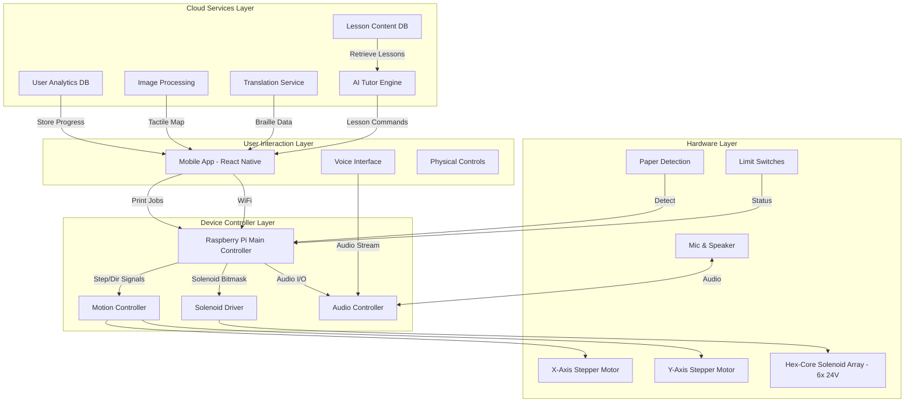
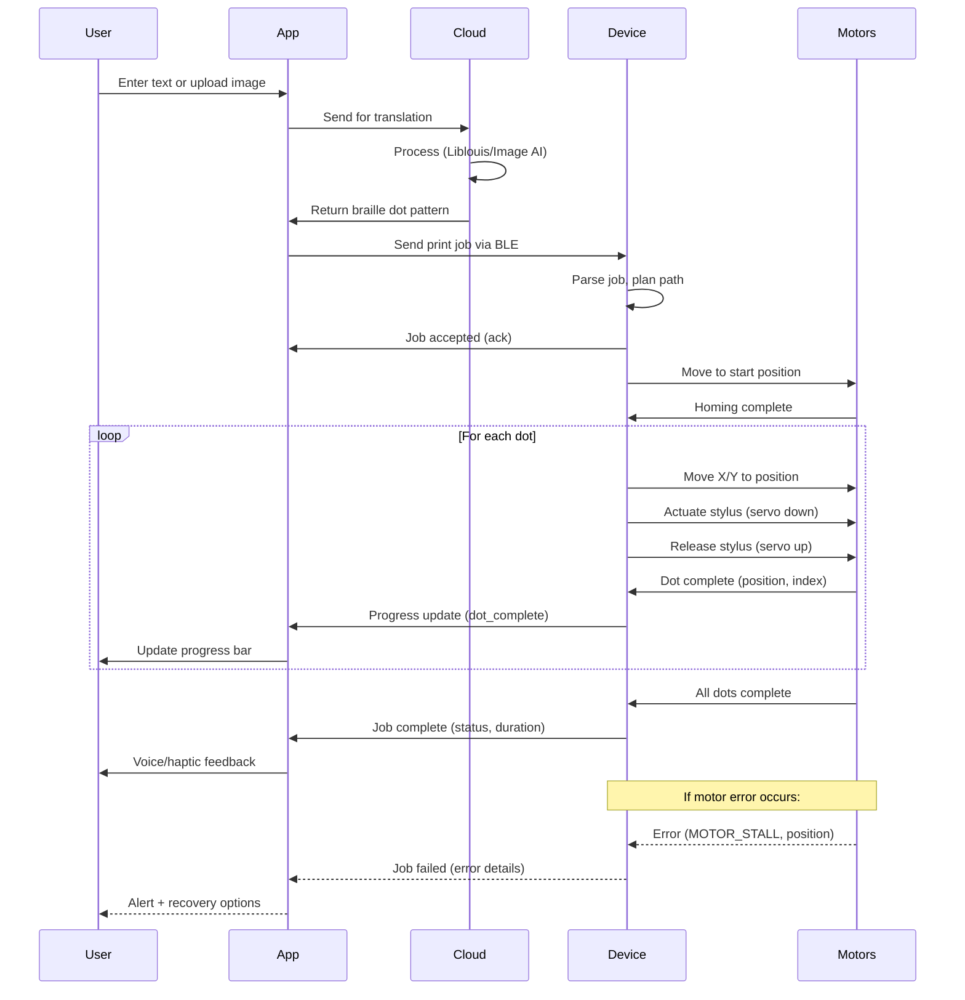

# Chapter 3: System Architecture & Design Philosophy

## 3.1 Overall System Design

### 3.1.1 High-Level Architecture

The system consists of four major subsystems that work together to deliver an integrated braille learning experience:



### 3.1.2 Design Philosophy

**Core Principles:**

1. **Modularity:** Each subsystem can be developed, tested, and upgraded independently
2. **Accessibility-First:** Voice and tactile interfaces prioritized over visual
3. **Offline Capability:** Essential functions work without internet connectivity
4. **Extensibility:** Open architecture for community contributions
5. **Fault Tolerance:** Graceful degradation when components fail

**Design Trade-offs:**

| Aspect | Option A | Option B | **Selected** | Rationale |
|--------|----------|----------|--------------|-----------|
| **Stylus Mechanism** | Multi-pin head (parallel) | Single servo stylus (sequential) | **Single servo** | Lower cost, easier calibration, adequate speed for learning |
| **Controller** | Arduino Mega | ESP32 | **ESP32** | Built-in WiFi/BLE, more memory, faster processing |
| **Power Supply** | Battery (portable) | AC adapter | **AC adapter** | Desktop use case, consistent power, lower cost |
| **Translation** | On-device | Cloud-based | **Hybrid** | Cloud for complex, local cache for common words |
| **Voice Processing** | On-device (Vosk) | Cloud (Google API) | **Cloud** | Better accuracy, multiple languages, lower device cost |

## 3.2 Information Flow Architecture

### 3.2.1 Print Job Workflow



### 3.2.2 Lesson Mode Workflow


## 3.3 Data Models

### 3.3.1 Print Job Data Structure

```json
{
  "job_id": "uuid-string",
  "timestamp": "2025-11-16T10:30:00Z",
  "type": "braille_text | tactile_image | lesson_exercise",
  "content": {
    "source_text": "Hello World",
    "language": "en",
    "braille_grade": "1 | 2",
    "dot_pattern": [
      {"x": 0, "y": 0, "action": "dot"},
      {"x": 2.5, "y": 0, "action": "dot"},
      {"x": 0, "y": 2.5, "action": "dot"}
    ]
  },
  "settings": {
    "dot_depth_mm": 0.6,
    "paper_type": "150gsm",
    "speed_mm_per_sec": 50
  },
  "status": "queued | printing | completed | failed"
}
```

### 3.3.2 Lesson Data Structure

```json
{
  "lesson_id": "L001-alphabet-a",
  "level": "beginner",
  "chapter": "Alphabet Basics",
  "title": "Learning Letter A",
  "learning_objectives": [
    "Recognize tactile pattern for letter A",
    "Distinguish A from similar letters"
  ],
  "steps": [
    {
      "step_number": 1,
      "instruction_audio": "Let's learn the letter A in braille",
      "action": "print",
      "content": "⠁",
      "duration_sec": 30
    },
    {
      "step_number": 2,
      "instruction_audio": "Feel the raised dots with your finger",
      "action": "wait_for_input",
      "timeout_sec": 60
    },
    {
      "step_number": 3,
      "instruction_audio": "What letter did you feel?",
      "action": "voice_quiz",
      "expected_answer": ["A", "letter A"],
      "retry_limit": 3
    }
  ],
  "assessment": {
    "type": "formative",
    "success_criteria": "correct_answer_within_2_attempts"
  }
}
```

### 3.3.3 User Progress Data

```json
{
  "user_id": "user-12345",
  "name": "Student Name",
  "age": 12,
  "enrollment_date": "2025-10-01",
  "current_level": "beginner",
  "completed_lessons": [
    {
      "lesson_id": "L001-alphabet-a",
      "completion_date": "2025-11-05",
      "score": 100,
      "attempts": 1,
      "time_spent_sec": 180
    }
  ],
  "analytics": {
    "total_lessons_completed": 15,
    "average_score": 87.5,
    "reading_speed_wpm": 45,
    "common_errors": ["confusing b and d"],
    "strength_areas": ["vowels", "numbers"],
    "recommended_next_lesson": "L016-consonants-b"
  }
}
```

## 3.4 System States and Modes

### 3.4.1 Device State Machine


**State Descriptions:**

- **Idle:** Low-power state, waiting for user interaction
- **Homing:** Calibration sequence, moves to origin using limit switches
- **Ready:** System ready to accept commands
- **Printing:** Actively moving motors and actuating stylus
- **Lesson:** Interactive lesson mode with AI tutor
- **Listening:** Capturing and processing voice input
- **Error:** Fault state (paper jam, motor stall, limit switch error)

### 3.4.2 Operating Modes

**Mode 1: Printer Mode**
- Batch printing of text documents
- High-speed sequential dot placement
- No user interaction required
- Status updates via app

**Mode 2: Lesson Mode**
- Interactive, step-by-step instruction
- Real-time printing synchronized with audio
- Voice input for assessment
- Progress tracking and adaptation

**Mode 3: Image Mode**
- Converts uploaded images to tactile graphics
- Preview in app with adjustable parameters
- Print confirmation before execution

**Mode 4: Manual Mode**
- Direct control from app interface
- Custom dot placement
- For advanced users or testing

## 3.5 Communication Protocols

### 3.5.1 App-to-Device Communication

**Protocol:** BLE (Bluetooth Low Energy) or Wi-Fi

**Command Structure:**
```
START_BYTE | COMMAND_ID | LENGTH | PAYLOAD | CHECKSUM | END_BYTE
   0xAA    |   1 byte   | 2 bytes| N bytes |  1 byte  |   0x55
```

**Example Commands:**
- `0x01`: Home device
- `0x02`: Start print job
- `0x03`: Pause/Resume
- `0x04`: Cancel job
- `0x05`: Get status
- `0x06`: Set parameters
- `0x07`: Emergency stop

**Response Structure:**
```json
{
  "command_id": "0x02",
  "status": "success | error",
  "data": {
    "progress_percent": 75,
    "current_position": {"x": 45.2, "y": 30.5},
    "dots_printed": 1250,
    "estimated_time_remaining_sec": 120
  },
  "error_code": null
}
```

### 3.5.2 Device-to-Cloud Communication

**Protocol:** HTTPS REST API

**Endpoints:**
- `POST /api/translate` - Text to braille translation
- `POST /api/image-to-tactile` - Image processing
- `GET /api/lessons/{id}` - Fetch lesson content
- `POST /api/progress` - Upload user progress
- `GET /api/tutor/next-step` - AI tutor interaction

## 3.6 Security and Privacy

### 3.6.1 Data Protection

**Privacy Principles:**
1. **Data Minimization:** Collect only necessary information
2. **User Consent:** Explicit opt-in for cloud features
3. **Encryption:** TLS 1.3 for all cloud communication
4. **Local Storage:** Sensitive data encrypted on device
5. **Anonymization:** Analytics data de-identified

**GDPR/COPPA Compliance:**
- Parental consent for users under 13
- Right to access and delete data
- Data portability (export progress)
- Transparent privacy policy

### 3.6.2 Authentication

**User Authentication:**
- Optional cloud account (email/password)
- Offline mode: Device pairing only via BLE PIN
- Multi-factor authentication for cloud services

## 3.7 Error Handling and Recovery

### 3.7.1 Fault Detection

**Hardware Errors:**
- Motor stall detection (current sensing)
- Limit switch monitoring
- Paper presence validation
- Power supply voltage monitoring

**Software Errors:**
- Command parsing validation
- Path planning boundary checks
- Communication timeout handling
- Memory overflow protection

### 3.7.2 Recovery Strategies


## 3.8 Performance Requirements

### 3.8.1 Speed Specifications

| Metric | Target | Rationale |
|--------|--------|-----------|
| **Printing Speed** | 15-30 characters/min | Adequate for lesson mode; embossers do 60-120 cps |
| **Positioning Accuracy** | ±0.1 mm | Ensures proper braille spacing (2.5mm centers) |
| **Dot Consistency** | 95%+ success rate | Minimal misprints for readability |
| **Homing Time** | <10 seconds | Quick startup |
| **App Response Time** | <500ms | Feels instant to users |

### 3.8.2 Reliability Targets

- **MTBF (Mean Time Between Failures):** 500+ hours
- **Maintenance Interval:** 100,000 dots between calibration
- **Uptime:** 99% during lesson sessions

## 3.9 Scalability Considerations

### 3.9.1 Device Scalability

**Single User:** Individual home learner
**Classroom:** 10-20 devices connected to teacher dashboard
**Institution:** 100+ devices with centralized management

### 3.9.2 Cloud Scalability

- **Serverless architecture** (AWS Lambda, Google Cloud Functions)
- **Auto-scaling** for translation and AI services
- **CDN delivery** for lesson content
- **Database sharding** for user data

## 3.10 Technology Stack Summary

### 3.10.1 Hardware Stack

| Component | Technology | Justification |
|-----------|------------|---------------|
| **Microcontroller** | ESP32-WROOM-32 | WiFi/BLE, dual-core, 4MB flash |
| **Motor Driver** | TMC2209 (UART) | Silent operation, stall detection |
| **Stepper Motors** | NEMA 17 (1.8° step) | Standard, affordable, adequate torque |
| **Stylus Actuator** | SG90 or MG995 Servo | Fast, precise, cost-effective |
| **Power Supply** | 12V 5A SMPS | Sufficient for motors + logic |

### 3.10.2 Software Stack

| Layer | Technology | Purpose |
|-------|------------|---------|
| **Firmware** | Arduino C++ (ESP-IDF) | Low-level motor control |
| **Libraries** | AccelStepper, ESP32Servo | Motion control |
| **Mobile App** | React Native + Expo | Cross-platform (iOS/Android) |
| **Backend** | Node.js + Express | REST API server |
| **Database** | PostgreSQL (user data), MongoDB (lessons) | Relational + document store |
| **AI/ML** | OpenAI API (GPT-4), TensorFlow Lite | Tutoring + image processing |
| **Translation** | Liblouis (C library via FFI) | Braille conversion |
| **Cloud** | AWS or Google Cloud | Hosting, compute, storage |

---

## Summary

This chapter established the complete system architecture, showing how hardware, firmware, mobile app, and cloud services integrate to deliver an AI-powered braille learning platform. The design prioritizes modularity, accessibility, and scalability while maintaining cost-effectiveness.

**Next Chapter:** Detailed hardware design and electrical schematics.

---
