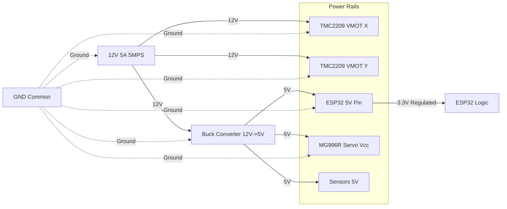

# Chapter 4: Hardware Design & Electrical Schematics

## 4.1 Mechanical Design Overview

### 4.1.1 XY Plotter Mechanism

Based on the reference image provided, our design uses a **CoreXY-style or H-Bot plotter mechanism** with the following characteristics:

**Mechanical Structure:**
- **Frame:** Aluminum extrusion (20×20mm or 20×40mm T-slot profiles)
- **X-Axis Travel:** 200mm (sufficient for standard braille paper width)
- **Y-Axis Travel:** 280mm (A4 length coverage)
- **Z-Axis (Stylus):** Servo-actuated vertical movement (5-10mm stroke)
- **Build Platform:** Black acrylic or MDF board (acts as braille slate backing)
- **Linear Motion:** GT2 timing belts with 20-tooth pulleys OR lead screws (T8, 2mm pitch)

**Key Design Features:**
1. **Paper Holding:** Spring-loaded clamps or magnetic hold-downs on platform
2. **Adjustable Backing:** Platform height adjustment for paper thickness (140-160 GSM)
3. **Cable Management:** Orange servo/stepper wires routed along drag chains
4. **Endstop Switches:** Mechanical microswitches at X-min, Y-min positions
5. **Portable Base:** Compact desktop footprint (~300×350mm)

### 4.1.2 Stylus Mechanism Design

**Option A: Servo-Driven Stylus (Selected)**
- **Servo Motor:** MG996R or SG90 (metal gear for durability)
- **Actuation:** Servo arm with linkage to stylus shaft
- **Stylus Tip:** Hardened steel ball-point (1.5mm diameter)
- **Force Control:** Servo angle controls depth (0.5-0.8mm penetration)
- **Speed:** Fast actuation (~50ms down-up cycle)

**Mechanical Diagram (Cross-Section):**
```
    [Servo Motor Body]
         |
    [Servo Arm] --- 90° rotation
         |
    [Linkage Rod]
         |
    [Stylus Shaft] ---> Vertical guide sleeve
         |
    [Ball-Point Tip] ──┐
                       │
    ═══════════════════╧═══  [Paper - 150 GSM]
    ▓▓▓▓▓▓▓▓▓▓▓▓▓▓▓▓▓▓▓▓▓▓  [Backing Plate/Slate]
```

**Force Calculation:**
- Required force for 0.6mm dot: ~2-3N (from literature)
- Servo torque: 10kg-cm (MG996R) = ~1N at 10cm arm
- Mechanical advantage via linkage: 3:1 ratio achieves sufficient force

### 4.1.3 Paper Handling System

**Paper Support:**
- Black acrylic or thick MDF board (10mm) as rigid backing
- Surface must be flat within 0.1mm across print area
- Optional: thin rubber mat (1mm) to improve dot formation

**Paper Positioning:**
- Registration pins at corner for consistent placement
- Transparent acrylic hold-down bar for paper visibility
- Paper sensor: IR reflective sensor (TCRT5000) detects paper presence

## 4.2 Electronic Components Selection

### 4.2.1 Microcontroller: ESP32-DevKitC

**Specifications:**
- **Chip:** ESP32-WROOM-32D
- **CPU:** Dual-core Xtensa LX6, 240 MHz
- **Memory:** 520 KB SRAM, 4 MB Flash
- **Connectivity:** Wi-Fi 802.11 b/g/n, Bluetooth 4.2 + BLE
- **GPIO:** 34 pins (sufficient for all peripherals)
- **ADC:** 12-bit, 18 channels
- **UART:** 3 hardware UART ports
- **Power:** 3.3V logic, 5V input via USB or Vin pin

**Pinout Selection (see detailed diagram below)**

### 4.2.2 Stepper Motors: NEMA 17

**Specifications:**
- **Model:** 17HS4401 (or equivalent)
- **Step Angle:** 1.8° (200 steps/rev)
- **Holding Torque:** 40 N·cm (56 oz-in)
- **Rated Current:** 1.7A per phase
- **Voltage:** 12V recommended
- **Connector:** 4-wire (bipolar)

**Quantity:** 2 motors (X-axis and Y-axis)

**Mechanical Coupling:**
- X-Motor: Drives belt via 20-tooth GT2 pulley
- Y-Motor: Drives belt via 20-tooth GT2 pulley

### 4.2.3 Stepper Motor Drivers: TMC2209

**Specifications:**
- **Current:** Up to 2A per coil
- **Voltage:** 4.75-29V
- **Microstepping:** Up to 256 microsteps
- **Interface:** STEP/DIR + UART (for advanced config)
- **Features:** StealthChop2 (silent), StallGuard4 (stall detection)
- **Protection:** Overtemperature, short circuit

**Quantity:** 2 drivers (one per motor)

**Configuration:**
- Microstep resolution: 1/16 (3200 steps/rev)
- UART address: X-driver = 0x00, Y-driver = 0x01

### 4.2.4 Servo Motor: MG996R

**Specifications:**
- **Torque:** 11 kg·cm (at 6V)
- **Speed:** 0.17 sec/60° (at 6V)
- **Voltage:** 4.8-7.2V
- **Control:** PWM (50Hz, 1-2ms pulse width)
- **Gear:** Metal gear (for durability)
- **Angle:** 180° rotation

**Usage:** Stylus actuation (Z-axis)
- 0° position: Stylus UP (retracted)
- 45-60° position: Stylus DOWN (dot embossing)

### 4.2.5 Power Supply

**Primary Supply:**
- **Type:** Switching power supply (SMPS)
- **Output:** 12V DC, 5A (60W)
- **Input:** 100-240V AC, 50/60Hz
- **Connector:** 5.5×2.1mm barrel jack
- **Protection:** Overcurrent, overvoltage, short circuit

**Voltage Regulators:**
- **Buck Converter 1:** 12V → 5V @ 3A (for ESP32, servo, sensors)
  - Model: LM2596 or XL4015 module
- **Linear Regulator:** 5V → 3.3V @ 1A (backup for ESP32)
  - Model: AMS1117-3.3V

### 4.2.6 Limit Switches

**Specifications:**
- **Type:** Mechanical microswitch (lever arm)
- **Rating:** 125V AC, 1A
- **Actuation Force:** ~50g
- **Connector:** 3-pin (COM, NO, NC)

**Quantity:** 2 switches (X-min, Y-min)
**Mounting:** Aluminum bracket at frame corners

### 4.2.7 Sensors

**Paper Presence Sensor:**
- **Model:** TCRT5000 Infrared Reflective Sensor
- **Detection Range:** 2-10mm
- **Output:** Analog voltage (0-3.3V)
- **Placement:** Below paper platform

**Optional Temperature Sensor:**
- **Model:** DS18B20 (1-Wire digital)
- **Purpose:** Monitor motor/driver temperature

### 4.2.8 Audio Components (Optional On-Device)

**Microphone:**
- **Model:** MAX4466 Electret Microphone Amplifier
- **Output:** Analog (0-3.3V)
- **Gain:** Adjustable via potentiometer

**Speaker:**
- **Model:** 8Ω 2W speaker
- **Amplifier:** PAM8403 Class-D (3W stereo)
- **Input:** I2S or analog from ESP32

**Note:** For MVP, audio is handled via mobile app; on-device audio is optional.

## 4.3 Detailed Circuit Schematic

### 4.3.1 Power Distribution Schematic



**Critical Notes:**
- **Common Ground:** All GND must be connected (SMPS GND, ESP32 GND, Driver GND, Servo GND)
- **Decoupling Capacitors:**
  - 100µF electrolytic across 12V rail (near drivers)
  - 10µF ceramic across 5V rail (near ESP32)
  - 0.1µF ceramic near each IC Vcc pin

### 4.3.2 ESP32 Pinout Assignment

| Pin # | GPIO | Function | Connected To | Notes |
|-------|------|----------|--------------|-------|
| 1 | 3V3 | Power Out | Sensors Vcc | Max 600mA |
| 2 | EN | Reset | Pull-up 10kΩ | External reset button |
| 3 | VP (GPIO36) | ADC | Paper sensor | Analog input only |
| 4 | VN (GPIO39) | ADC | Reserved | Analog input only |
| 5 | GPIO34 | Input | X Limit Switch | Pull-up enabled |
| 6 | GPIO35 | Input | Y Limit Switch | Pull-up enabled |
| 7 | GPIO32 | PWM | Servo Control | 50Hz PWM |
| 8 | GPIO33 | Output | Reserved (LED) | Status indicator |
| 9 | GPIO25 | Output | Enable Pin (Drivers) | Common enable |
| 10 | GPIO26 | Output | X-STEP | Step pulse to TMC2209 |
| 11 | GPIO27 | Output | X-DIR | Direction to TMC2209 |
| 12 | GPIO14 | Output | Y-STEP | Step pulse to TMC2209 |
| 13 | GPIO12 | Output | Y-DIR | Direction to TMC2209 |
| 14 | GND | Ground | Common GND | - |
| 15 | GPIO13 | Reserved | Future (I2S/SPI) | - |
| 16 | GPIO9 | - | **Do Not Use** | Flash memory |
| 17 | GPIO10 | - | **Do Not Use** | Flash memory |
| 18 | GPIO11 | - | **Do Not Use** | Flash memory |
| 19 | VIN | Power In | 5V from buck | Or USB 5V |
| 20 | GND | Ground | Common GND | - |
| 21-22 | GPIO6-8 | - | **Do Not Use** | Flash memory |
| 23 | GPIO15 | UART TX | UART2 TX (TMC2209) | Optional config |
| 24 | GPIO2 | Output | Onboard LED | Boot strapping |
| 25 | GPIO0 | Input | Boot button | Pull-up, boot mode |
| 26 | GPIO4 | UART RX | UART2 RX (TMC2209) | Optional config |
| 27 | GPIO16 | Reserved | Future (UART2) | - |
| 28 | GPIO17 | Reserved | Future (UART2) | - |
| 29 | GPIO5 | Output | Optional (SS pin) | - |
| 30 | GPIO18 | Reserved | Future (I2S/SPI) | - |

### 4.3.3 Stepper Driver Wiring (TMC2209)

**X-Axis Driver (TMC2209 #1):**
```
TMC2209 Pin          ESP32 Pin / Connection
-----------          ----------------------
VMOT                 12V Rail
GND                  Common GND
1A, 1B               X-Motor Coil A
2A, 2B               X-Motor Coil B
STEP                 GPIO26
DIR                  GPIO27
EN                   GPIO25 (common enable)
UART (TX/RX)         GPIO15/GPIO4 (optional)
SPREAD               GND (enable SpreadCycle)
Vref                 Internal (set via UART or trimpot)
```

**Y-Axis Driver (TMC2209 #2):**
```
TMC2209 Pin          ESP32 Pin / Connection
-----------          ----------------------
VMOT                 12V Rail
GND                  Common GND
1A, 1B               Y-Motor Coil A
2A, 2B               Y-Motor Coil B
STEP                 GPIO14
DIR                  GPIO12
EN                   GPIO25 (common enable)
UART (TX/RX)         GPIO15/GPIO4 (optional, address 0x01)
SPREAD               GND
Vref                 Internal
```

**Microstepping Configuration:**
- MS1, MS2 pins: See TMC2209 datasheet or configure via UART
- For 1/16 microstepping: MS1=GND, MS2=VDD (or UART config)

### 4.3.4 Servo Wiring (MG996R)

```
Servo Wire Color     Connection
----------------     ----------
Brown/Black          GND (Common GND)
Red                  5V (from buck converter)
Orange/Yellow        GPIO32 (PWM signal)
```

**PWM Configuration:**
- Frequency: 50Hz (20ms period)
- Pulse width: 1ms (0°) to 2ms (180°)
- Neutral: 1.5ms (90°)

**ESP32 Code Example:**
```cpp
#include <ESP32Servo.h>

Servo stylusServo;
const int servoPin = 32;

void setup() {
  stylusServo.attach(servoPin, 1000, 2000); // min, max pulse (us)
  stylusServo.write(0); // Stylus UP
}

void embossDot() {
  stylusServo.write(50); // Stylus DOWN (adjust angle)
  delay(50);             // Hold for dot formation
  stylusServo.write(0);  // Stylus UP
  delay(50);             // Settle time
}
```

### 4.3.5 Limit Switch Wiring

**X-Min Limit Switch:**
```
Switch Pin           Connection
----------           ----------
COM                  GND
NO (Normally Open)   GPIO34 (with internal pull-up enabled)
```

**Y-Min Limit Switch:**
```
Switch Pin           Connection
----------           ----------
COM                  GND
NO                   GPIO35 (with internal pull-up enabled)
```

**Firmware Logic:**
- When switch is **not pressed:** GPIO reads HIGH (pull-up)
- When switch **is pressed:** GPIO reads LOW (contacts close to GND)

### 4.3.6 Paper Sensor Wiring (TCRT5000)

```
TCRT5000 Pin         Connection
------------         ----------
VCC                  5V (or 3.3V with current-limiting resistor)
GND                  Common GND
OUT (Analog)         GPIO36 (ADC1_CH0)
```

**Firmware Logic:**
```cpp
const int paperSensorPin = 36;

bool isPaperPresent() {
  int sensorValue = analogRead(paperSensorPin);
  return sensorValue > 2000; // Threshold (adjust after testing)
}
```

## 4.4 Complete Schematic Diagram (Text Representation)

```
                    +12V Rail (from SMPS)
                      │
                      ├─────────────────┬──────────────────┬──────────────┐
                      │                 │                  │              │
                 [TMC2209-X]       [TMC2209-Y]      [Buck 12V→5V]   [470µF Cap]
                   VMOT               VMOT              │              │
                      │                 │               │              │
                   [Motor-X]        [Motor-Y]         +5V Rail         GND
                    (4-wire)         (4-wire)          │
                                                        ├──────┬──────┬──────┬─────┐
                                                        │      │      │      │     │
                                                     [ESP32] [Servo] │  [Sensors] │
                                                      Vin=5V  Vcc=5V │      │  [10µF Cap]
                                                        │      │      │      │
                                                       GND────GND────GND────GND──Common GND
                                                        
ESP32 GPIO Connections:
  GPIO26 ──STEP──> TMC2209-X (STEP)
  GPIO27 ──DIR───> TMC2209-X (DIR)
  GPIO14 ──STEP──> TMC2209-Y (STEP)
  GPIO12 ──DIR───> TMC2209-Y (DIR)
  GPIO25 ──EN────> TMC2209-X,Y (EN, common)
  GPIO32 ──PWM───> Servo (Signal)
  GPIO34 <──IN──── X-Limit Switch (with pull-up)
  GPIO35 <──IN──── Y-Limit Switch (with pull-up)
  GPIO36 <──ADC─── Paper Sensor (analog)
  
Optional UART (for TMC2209 configuration):
  GPIO15 ──TX───> TMC2209 UART (RX)
  GPIO4  <─RX──── TMC2209 UART (TX)
```

## 4.5 PCB Design Recommendations

### 4.5.1 PCB Layout Guidelines

For a custom PCB (optional, can use breadboard/perfboard for prototype):

**Layer Stack:**
- 2-layer PCB sufficient
- Top layer: Signal traces, components
- Bottom layer: Ground plane (majority), power traces

**Trace Width:**
- Signal traces (logic): 0.3mm (10 mil)
- Power traces (5V, 3.3V): 0.8mm (30 mil)
- Motor power (12V, 2A per driver): 1.5mm (60 mil) or wider

**Thermal Management:**
- TMC2209: Heatsink (10×10mm) + thermal vias to bottom layer
- Buck converter: Heatsink or copper pour for heat dissipation

**Connector Placement:**
- Screw terminals for motor connections (5mm pitch)
- JST-XH for limit switches, sensors
- Barrel jack for 12V input

### 4.5.2 Prototype Assembly (Breadboard Alternative)

For quick prototyping without PCB:

**Materials:**
- Large breadboard (830 tie-points) or perfboard
- DuPont jumper wires (M-M, M-F, F-F)
- Screw terminal blocks
- Heat-shrink tubing for insulation

**Assembly Steps:**
1. Mount ESP32 DevKit on breadboard
2. Connect power rails (5V and GND)
3. Place TMC2209 modules (use header pins)
4. Wire motors via screw terminals
5. Connect servo with 3-pin header
6. Add limit switches with 3-pin JST connectors
7. Double-check all connections before powering on

## 4.6 Mechanical Assembly Guide

### 4.6.1 Frame Construction

**Materials:**
- 4× 20×20mm aluminum extrusion (lengths: 2×300mm, 2×350mm)
- 8× corner brackets (90°)
- 16× M5×10mm screws + T-nuts

**Assembly:**
1. Create rectangular frame (300×350mm outer dimensions)
2. Secure corners with brackets and screws
3. Ensure frame is square (measure diagonals; should be equal)

### 4.6.2 Linear Motion System

**Option A: Belt-Driven (Recommended)**

**X-Axis:**
- 2× 8mm linear rods (300mm length)
- 2× LM8UU linear bearings
- 1× GT2 timing belt (700mm closed loop)
- 2× 20-tooth GT2 pulleys (1 on motor, 1 idler)
- Belt tensioner mechanism

**Y-Axis:**
- Similar to X-axis with 350mm rods
- Y-carriage mounts on X-axis bearings

**Assembly:**
1. Install X-axis rods parallel (spacing: 100mm)
2. Mount X-motor with pulley on one end
3. Install idler pulley on other end
4. Thread belt around pulleys
5. Attach belt to X-carriage with belt clamps
6. Tension belt (should twang when plucked)
7. Repeat for Y-axis perpendicular to X

**Option B: Lead Screw (Higher Precision, Slower)**
- Replace belts with T8 lead screws (2mm pitch)
- Use anti-backlash nuts for minimal play
- Slower but eliminates belt stretch

### 4.6.3 Stylus Mount Assembly

**Components:**
- Servo motor (MG996R)
- 3D-printed or laser-cut servo bracket
- Linkage arm (3D-printed or bent wire)
- Linear guide sleeve for stylus shaft
- Stylus: 1.5mm hardened steel ball-point pen tip

**Assembly:**
1. Mount servo to X-carriage (or Y-carriage if design dictates)
2. Attach linkage arm to servo horn
3. Connect linkage to stylus shaft
4. Insert stylus shaft through linear guide (smooth vertical motion)
5. Adjust linkage length so 0° servo = stylus UP, 50° = stylus DOWN by 0.6mm
6. Secure all connections with screws or glue

### 4.6.4 Electronics Mounting

**Placement:**
- ESP32 + drivers on side-mounted electronics enclosure (3D-printed or acrylic)
- Power supply external (to reduce noise) or mounted under platform
- Route motor cables through cable chains or spiral wrap

**Cable Management:**
- Use zip ties and adhesive cable mounts
- Keep motor cables away from signal wires (reduce EMI)
- Provide strain relief at connectors

## 4.7 Calibration Procedures

### 4.7.1 Steps-per-mm Calibration

**For Belt-Driven System:**
```
Steps per mm = (Motor steps per rev × Microsteps) / (Pulley teeth × Belt pitch)

Example:
  Motor: 200 steps/rev
  Microsteps: 16
  Pulley: 20 teeth
  Belt: GT2 (2mm pitch)
  
  Steps/mm = (200 × 16) / (20 × 2) = 3200 / 40 = 80 steps/mm
```

**Verification:**
1. Command motor to move 100mm
2. Measure actual travel with caliper
3. Adjust steps/mm in firmware if discrepancy exists

### 4.7.2 Servo Angle Calibration

**Procedure:**
1. Set servo to 0° (stylus fully retracted)
2. Gradually increase angle in 5° increments
3. Measure stylus tip protrusion with depth gauge
4. Find angle that gives 0.6-0.8mm protrusion into paper
5. Record this angle as `DOT_DOWN_ANGLE` in firmware

**Test:**
- Print test pattern of dots on 150 GSM paper
- Verify dots are tactilely readable (height and spacing)

### 4.7.3 Homing Sequence

**Firmware Logic:**
```cpp
void homingSequence() {
  // Enable motors
  digitalWrite(EN_PIN, LOW);
  
  // Home X-axis
  while (digitalRead(X_LIMIT_PIN) == HIGH) {
    stepMotor(X_STEP_PIN, BACKWARD, 1); // Slow speed
  }
  currentX = 0;
  
  // Home Y-axis
  while (digitalRead(Y_LIMIT_PIN) == HIGH) {
    stepMotor(Y_STEP_PIN, BACKWARD, 1);
  }
  currentY = 0;
  
  // Move off switches (5mm)
  moveAbsolute(5, 5);
  
  Serial.println("Homing complete");
}
```

## 4.8 Safety Features

### 4.8.1 Electrical Safety

**Protections:**
- Fuse on 12V input (5A fast-blow)
- Reverse polarity protection diode (1N5408 or higher)
- ESD protection on ESP32 GPIO (built-in, but add TVS diodes for external connectors)
- Enclosure grounding (if metal parts used)

### 4.8.2 Mechanical Safety

**Limits:**
- Software endstops (prevent movement beyond calibrated area)
- Hardware limit switches (hard stops)
- Emergency stop button (cuts motor enable line)

**Firmware Safeguards:**
```cpp
// Software limits
const float X_MAX = 200.0; // mm
const float Y_MAX = 280.0; // mm

bool isSafePosition(float x, float y) {
  return (x >= 0 && x <= X_MAX && y >= 0 && y <= Y_MAX);
}
```

## 4.9 Bill of Materials (BOM) - Hardware Components

| Item | Description | Qty | Unit Price (USD) | Total (USD) | Supplier |
|------|-------------|-----|------------------|-------------|----------|
| **Electronics** |
| ESP32-DevKitC | Microcontroller board | 1 | $10 | $10 | Amazon, Aliexpress |
| TMC2209 | Stepper driver module | 2 | $10 | $20 | Amazon, BTT |
| NEMA 17 | Stepper motor | 2 | $12 | $24 | Stepatonline |
| MG996R | Servo motor (metal gear) | 1 | $8 | $8 | Amazon |
| 12V 5A SMPS | Power supply | 1 | $15 | $15 | Amazon |
| LM2596 | Buck converter module | 1 | $3 | $3 | Amazon |
| Microswitch | Limit switches | 2 | $1 | $2 | Aliexpress |
| TCRT5000 | IR sensor module | 1 | $2 | $2 | Amazon |
| Capacitors | 100µF, 10µF, 0.1µF | 10 | $0.50 | $5 | Digikey |
| Connectors | JST-XH, screw terminals | 10 | $0.50 | $5 | Amazon |
| Wires | 22 AWG, various colors | 10m | $1/m | $10 | Amazon |
| **Mechanical** |
| Aluminum extrusion | 20×20mm, 1m total | 4 | $5/m | $20 | Local hardware |
| Linear rods | 8mm×300mm | 4 | $8 | $32 | Amazon |
| LM8UU bearings | 8mm linear bearings | 4 | $2 | $8 | Amazon |
| GT2 belt | 6mm width, 2m | 2m | $3/m | $6 | Amazon |
| GT2 pulleys | 20-tooth, 5mm bore | 4 | $3 | $12 | Amazon |
| Acrylic plate | 5mm, 300×350mm | 1 | $15 | $15 | Local laser cutting |
| M5 screws/T-nuts | Assorted | 50 | $0.20 | $10 | Amazon |
| 3D printed parts | Mounts, brackets | - | $20 | $20 | (Filament cost) |
| Stylus tip | Hardened steel ball-point | 5 | $2 | $10 | Amazon |
| **Subtotal** | | | | **$237** | |
| **Contingency (20%)** | | | | **$47** | |
| **Total Prototype Cost** | | | | **$284** | |

**Note:** Prices are estimates and vary by region/supplier. Bulk purchases reduce unit costs.

## 4.10 Summary

This chapter provided detailed hardware specifications, electrical schematics, pinout assignments, and mechanical assembly instructions for the AI-powered braille plotter. The design uses readily available components (ESP32, NEMA 17, TMC2209, MG996R servo) in a modular architecture that is:

- **Cost-effective:** ~$284 prototype BOM
- **Scalable:** Easy to source components globally
- **Maintainable:** Modular design for repairs/upgrades
- **Open-source ready:** Full schematics for community replication

**Next Chapter:** Software and AI architecture (firmware, translation pipeline, AI tutor).

---
