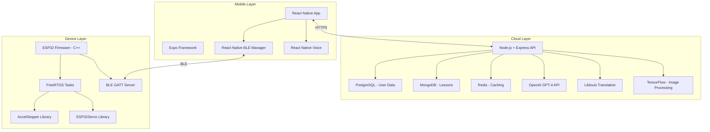
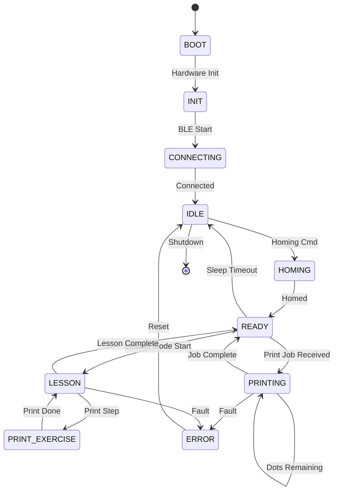
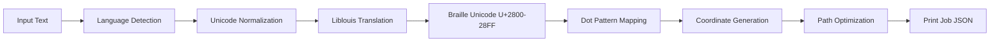
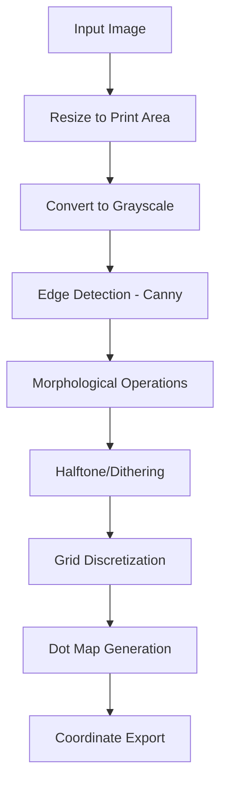
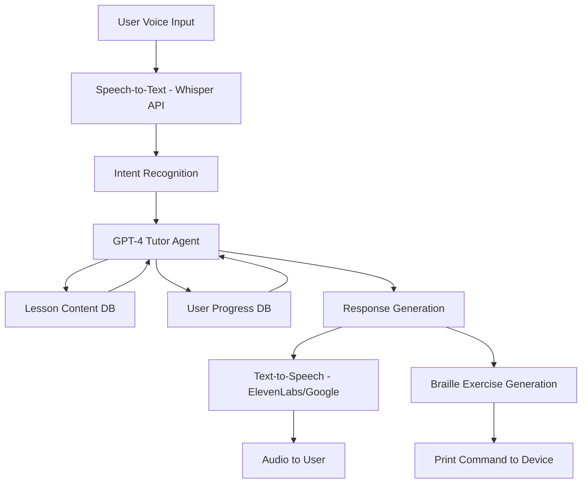

# Chapter 5: Software & AI Architecture

## 5.1 Software System Overview

The software stack consists of three major components working in concert:

1. **Device Firmware** (ESP32) - Low-level motor control, sensor handling
2. **Cloud Backend** - AI tutor, translation services, analytics
3. **Mobile Application** (React Native) - User interface, voice control

### 5.1.1 Technology Stack



## 5.2 Device Firmware Architecture

### 5.2.1 Firmware Components

**Core Modules:**
1. **Motion Controller** - Stepper motor path planning and execution
2. **Stylus Controller** - Servo actuation with timing
3. **Communication Handler** - BLE/WiFi command parsing
4. **Sensor Manager** - Limit switches, paper detection
5. **State Machine** - Device modes and error handling

**Development Environment:**
- **IDE:** Arduino IDE 2.x or PlatformIO
- **Framework:** Arduino Core for ESP32
- **Language:** C/C++
- **Build System:** Arduino/PlatformIO build

### 5.2.2 Firmware State Machine



### 5.2.3 Core Firmware Code Structure

**main.cpp (pseudocode):**
```cpp
#include <Arduino.h>
#include <BLEDevice.h>
#include <AccelStepper.h>
#include <ESP32Servo.h>

// Pin definitions
#define X_STEP_PIN 26
#define X_DIR_PIN 27
#define Y_STEP_PIN 14
#define Y_DIR_PIN 12
#define EN_PIN 25
#define SERVO_PIN 32
#define X_LIMIT_PIN 34
#define Y_LIMIT_PIN 35
#define PAPER_SENSOR_PIN 36

// Constants
#define STEPS_PER_MM_X 80
#define STEPS_PER_MM_Y 80
#define DOT_SPACING_MM 2.5
#define DOT_DOWN_ANGLE 50
#define DOT_UP_ANGLE 0

// Global objects
AccelStepper stepperX(AccelStepper::DRIVER, X_STEP_PIN, X_DIR_PIN);
AccelStepper stepperY(AccelStepper::DRIVER, Y_STEP_PIN, Y_DIR_PIN);
Servo stylusServo;

// BLE
BLEServer *pServer = nullptr;
BLECharacteristic *pTxCharacteristic;
bool deviceConnected = false;

// State
enum DeviceState { IDLE, HOMING, READY, PRINTING, ERROR };
DeviceState currentState = IDLE;

void setup() {
  Serial.begin(115200);
  
  // Pin modes
  pinMode(EN_PIN, OUTPUT);
  pinMode(X_LIMIT_PIN, INPUT_PULLUP);
  pinMode(Y_LIMIT_PIN, INPUT_PULLUP);
  
  // Stepper setup
  stepperX.setMaxSpeed(2000);
  stepperX.setAcceleration(1000);
  stepperY.setMaxSpeed(2000);
  stepperY.setAcceleration(1000);
  
  // Servo setup
  stylusServo.attach(SERVO_PIN);
  stylusServo.write(DOT_UP_ANGLE);
  
  // BLE setup
  initBLE();
  
  // Homing
  currentState = HOMING;
  homingSequence();
  currentState = READY;
}

void loop() {
  // BLE event handling
  if (deviceConnected) {
    handleBLECommands();
  }
  
  // State-specific logic
  switch (currentState) {
    case PRINTING:
      executePrintJob();
      break;
    case READY:
      // Idle, wait for commands
      break;
    case ERROR:
      handleError();
      break;
  }
  
  // Always run steppers
  stepperX.run();
  stepperY.run();
  
  delay(1); // Small delay for stability
}

void homingSequence() {
  digitalWrite(EN_PIN, LOW); // Enable motors
  
  // Home X
  while (digitalRead(X_LIMIT_PIN) == HIGH) {
    stepperX.move(-1);
    stepperX.run();
  }
  stepperX.setCurrentPosition(0);
  
  // Home Y
  while (digitalRead(Y_LIMIT_PIN) == HIGH) {
    stepperY.move(-1);
    stepperY.run();
  }
  stepperY.setCurrentPosition(0);
  
  // Move to safe position
  moveAbsolute(5, 5);
  
  Serial.println("Homing complete");
}

void moveAbsolute(float x_mm, float y_mm) {
  long x_steps = x_mm * STEPS_PER_MM_X;
  long y_steps = y_mm * STEPS_PER_MM_Y;
  
  stepperX.moveTo(x_steps);
  stepperY.moveTo(y_steps);
  
  while (stepperX.distanceToGo() != 0 || stepperY.distanceToGo() != 0) {
    stepperX.run();
    stepperY.run();
  }
}

void embossDot() {
  stylusServo.write(DOT_DOWN_ANGLE);
  delay(50); // Hold time
  stylusServo.write(DOT_UP_ANGLE);
  delay(30); // Retract time
}

void executePrintJob() {
  // Iterate through dot pattern from print job queue
  // For each dot: moveAbsolute(x, y), embossDot()
  // Update progress, send BLE notifications
  
  currentState = READY; // When done
}

void initBLE() {
  BLEDevice::init("BraillePlotter");
  pServer = BLEDevice::createServer();
  // Create services, characteristics
  // (Full BLE code omitted for brevity)
}

void handleBLECommands() {
  // Parse incoming BLE commands
  // Execute based on command type
}

void handleError() {
  // Log error, notify app, enter safe state
}
```

### 5.2.4 BLE GATT Profile

**Service UUID:** `0000ffe0-0000-1000-8000-00805f9b34fb` (Custom)

**Characteristics:**

| Characteristic | UUID | Properties | Description |
|----------------|------|------------|-------------|
| Command RX | `0000ffe1-...` | Write | Receive commands from app |
| Status TX | `0000ffe2-...` | Read, Notify | Send status updates to app |
| Progress TX | `0000ffe3-...` | Notify | Real-time print progress (%) |

**Command Format (JSON over BLE):**
```json
{
  "cmd": "print | home | pause | resume | cancel | set_param",
  "data": { ... }
}
```

**Example Commands:**
```json
// Start print job
{"cmd": "print", "data": {"job_id": "123", "dots": [[0,0], [2.5,0]]}}

// Homing
{"cmd": "home"}

// Set parameter
{"cmd": "set_param", "data": {"dot_depth": 0.7}}
```

## 5.3 Translation Pipeline

### 5.3.1 Text-to-Braille Conversion

**Process Flow:**


**Liblouis Integration (Node.js Backend):**

```javascript
const liblouis = require('liblouis');

async function translateToBraille(text, language = 'en', grade = 2) {
  // Select appropriate table
  const table = grade === 1 
    ? `${language}-g1.ctb` 
    : `${language}-g2.ctb`;
  
  try {
    const brailleUnicode = await liblouis.translateString(table, text);
    return brailleUnicode;
  } catch (error) {
    console.error('Translation error:', error);
    throw error;
  }
}

// Example
const result = await translateToBraille("Hello World", "en", 2);
// Returns: "⠓⠑⠇⠇⠕ ⠺⠕⠗⠇⠙" (Grade 2 braille)
```

**Supported Languages (via Liblouis tables):**
- English (en-us, en-gb)
- Spanish (es)
- French (fr)
- German (de)
- Hindi (hi)
- Arabic (ar)
- 180+ total languages

### 5.3.2 Braille Unicode to Dot Pattern

**Mapping Algorithm:**

Each braille cell (6-dot or 8-dot) is encoded in Unicode:
- Unicode range: U+2800 (⠀) to U+28FF (⣿)
- Bit pattern maps to dot positions:

```
Dot numbering:     Bit positions:
  1 • • 4             0x01  0x08
  2 • • 5             0x02  0x10
  3 • • 6             0x04  0x20
  7 • • 8 (8-dot)     0x40  0x80
```

**JavaScript Function:**
```javascript
function unicodeToDots(brailleChar) {
  const codePoint = brailleChar.charCodeAt(0);
  const offset = codePoint - 0x2800; // Base offset
  
  const dots = [];
  if (offset & 0x01) dots.push(1);
  if (offset & 0x02) dots.push(2);
  if (offset & 0x04) dots.push(3);
  if (offset & 0x08) dots.push(4);
  if (offset & 0x10) dots.push(5);
  if (offset & 0x20) dots.push(6);
  if (offset & 0x40) dots.push(7); // 8-dot braille
  if (offset & 0x80) dots.push(8);
  
  return dots;
}

// Example: ⠓ (letter H)
unicodeToDots('⠓'); // Returns: [1, 2, 5]
```

### 5.3.3 Dot Coordinates Generation

**Algorithm:**
```javascript
function generateDotCoordinates(brailleText) {
  const DOT_SPACING = 2.5; // mm
  const CELL_WIDTH = 6.2; // mm
  const LINE_HEIGHT = 10.0; // mm
  
  let x = 5; // Start margin (mm)
  let y = 5;
  const coordinates = [];
  
  for (let char of brailleText) {
    if (char === ' ') {
      x += CELL_WIDTH; // Space between words
      continue;
    }
    if (char === '\n') {
      y += LINE_HEIGHT;
      x = 5;
      continue;
    }
    
    const dots = unicodeToDots(char);
    for (let dot of dots) {
      const [dx, dy] = getDotOffset(dot);
      coordinates.push({
        x: x + dx * DOT_SPACING,
        y: y + dy * DOT_SPACING
      });
    }
    
    x += CELL_WIDTH; // Move to next cell
  }
  
  return coordinates;
}

function getDotOffset(dotNumber) {
  // Returns [x_offset, y_offset] multipliers
  const offsets = {
    1: [0, 0], 2: [0, 1], 3: [0, 2],
    4: [1, 0], 5: [1, 1], 6: [1, 2],
    7: [0, 3], 8: [1, 3] // 8-dot
  };
  return offsets[dotNumber];
}
```

### 5.3.4 Path Optimization

To minimize travel time, use **Nearest Neighbor** or **2-opt TSP** algorithm:

```javascript
function optimizePath(dots) {
  if (dots.length < 2) return dots;
  
  const visited = new Set();
  const optimized = [dots[0]];
  visited.add(0);
  
  while (optimized.length < dots.length) {
    const current = optimized[optimized.length - 1];
    let nearestIndex = -1;
    let minDist = Infinity;
    
    for (let i = 0; i < dots.length; i++) {
      if (visited.has(i)) continue;
      const dist = distance(current, dots[i]);
      if (dist < minDist) {
        minDist = dist;
        nearestIndex = i;
      }
    }
    
    optimized.push(dots[nearestIndex]);
    visited.add(nearestIndex);
  }
  
  return optimized;
}

function distance(p1, p2) {
  return Math.sqrt((p1.x - p2.x)**2 + (p1.y - p2.y)**2);
}
```

## 5.4 Image-to-Tactile Conversion

### 5.4.1 Image Processing Pipeline



**Python Implementation (Backend Service):**

```python
import cv2
import numpy as np

def image_to_tactile(image_path, width_mm=100, height_mm=140, dot_spacing_mm=2.5):
    # Load image
    img = cv2.imread(image_path)
    
    # Calculate grid dimensions
    grid_width = int(width_mm / dot_spacing_mm)
    grid_height = int(height_mm / dot_spacing_mm)
    
    # Resize to grid dimensions
    img_resized = cv2.resize(img, (grid_width, grid_height))
    
    # Convert to grayscale
    gray = cv2.cvtColor(img_resized, cv2.COLOR_BGR2GRAY)
    
    # Edge detection for line art
    edges = cv2.Canny(gray, 50, 150)
    
    # Apply dithering for photos (Floyd-Steinberg)
    dithered = floyd_steinberg_dither(gray)
    
    # Combine edges + dithered
    combined = cv2.addWeighted(edges, 0.6, dithered, 0.4, 0)
    
    # Threshold to binary
    _, binary = cv2.threshold(combined, 127, 255, cv2.THRESH_BINARY)
    
    # Generate dot coordinates
    dots = []
    for y in range(grid_height):
        for x in range(grid_width):
            if binary[y, x] > 127:  # White = dot
                dots.append({
                    'x': x * dot_spacing_mm,
                    'y': y * dot_spacing_mm
                })
    
    return dots

def floyd_steinberg_dither(image):
    img = image.astype(float)
    for y in range(img.shape[0] - 1):
        for x in range(1, img.shape[1] - 1):
            old_pixel = img[y, x]
            new_pixel = 255 if old_pixel > 127 else 0
            img[y, x] = new_pixel
            error = old_pixel - new_pixel
            
            img[y, x + 1] += error * 7 / 16
            img[y + 1, x - 1] += error * 3 / 16
            img[y + 1, x] += error * 5 / 16
            img[y + 1, x + 1] += error * 1 / 16
    
    return img.astype(np.uint8)
```

### 5.4.2 AI-Enhanced Image Understanding

For complex images (charts, diagrams), use AI to segment and simplify:

**Process:**
1. **Object Detection** (YOLOv8 or similar) - Identify key elements
2. **Scene Understanding** (GPT-4 Vision) - Describe image content
3. **Tactile Simplification** - Remove unnecessary details
4. **Label Extraction** - Convert text labels to braille annotations

**Example GPT-4 Vision Prompt:**
```
"Analyze this diagram and identify the key tactile-friendly elements 
that should be preserved for a blind user. List the main shapes, 
boundaries, and any text labels. Suggest a simplified line-art 
version optimized for tactile printing with 2.5mm dot spacing."
```

## 5.5 AI Tutor Engine

### 5.5.1 Tutor Architecture



### 5.5.2 GPT-4 Tutor Prompt Engineering

**System Prompt:**
```
You are an expert braille instructor teaching a blind student. Your goals:
1. Provide clear, encouraging, tactile-focused explanations
2. Adapt difficulty based on student performance
3. Use Socratic questioning to reinforce learning
4. Give immediate, constructive feedback
5. Generate braille exercises appropriate to lesson level

Current lesson: {lesson_title}
Student level: {student_level}
Previous performance: {recent_scores}

When the student makes an error, explain WHY and provide a mnemonic or 
tactile comparison to help them remember. Always be patient and positive.
```

**Example Interaction:**
```
User: "I'm ready to learn the letter B"

AI Tutor: "Great! Let's explore the letter B in braille. The letter B 
has two dots: dots 1 and 2, stacked vertically on the left side of the 
cell. Imagine a tall pole with two dots going down. I'm printing it now 
for you to feel. [PRINT: ⠃]

Feel the two raised dots on the left. Now, compare it to the letter A, 
which only has dot 1. B is like A with an extra dot below it. 

Can you tell me how many dots you feel?"

User: "Two dots"

AI Tutor: "Perfect! You've got it. Now let's practice distinguishing B 
from other similar letters..."
```

### 5.5.3 Adaptive Learning Algorithm

**Spaced Repetition (Leitner System):**
```javascript
class AdaptiveLearning {
  constructor(userId) {
    this.userId = userId;
    this.boxes = [[], [], [], [], []]; // 5 boxes for spaced repetition
  }
  
  async getNextLesson() {
    // Prioritize box 0 (new/failed items)
    if (this.boxes[0].length > 0) {
      return this.boxes[0][0];
    }
    
    // Then review items due for repetition
    for (let i = 1; i < this.boxes.length; i++) {
      const dueItems = this.boxes[i].filter(item => item.dueDate <= Date.now());
      if (dueItems.length > 0) {
        return dueItems[0];
      }
    }
    
    // Otherwise, introduce new content
    return await this.getNewContent();
  }
  
  recordPerformance(lessonId, correct) {
    const item = this.findItem(lessonId);
    
    if (correct) {
      // Move to next box (longer interval)
      this.promoteItem(item);
    } else {
      // Move back to box 0 (review soon)
      this.demoteItem(item);
    }
    
    this.saveProgress();
  }
  
  promoteItem(item) {
    const currentBox = this.findBox(item);
    const nextBox = Math.min(currentBox + 1, 4);
    this.boxes[currentBox] = this.boxes[currentBox].filter(i => i !== item);
    
    // Set next review date (exponential backoff)
    item.dueDate = Date.now() + this.getInterval(nextBox);
    this.boxes[nextBox].push(item);
  }
  
  getInterval(boxNumber) {
    const intervals = [
      1000 * 60 * 5,      // Box 0: 5 minutes
      1000 * 60 * 60,     // Box 1: 1 hour
      1000 * 60 * 60 * 24, // Box 2: 1 day
      1000 * 60 * 60 * 24 * 7,  // Box 3: 1 week
      1000 * 60 * 60 * 24 * 30  // Box 4: 1 month
    ];
    return intervals[boxNumber];
  }
}
```

## 5.6 Cloud Backend API

### 5.6.1 API Endpoints

**Base URL:** `https://api.brailleplotter.com/v1`

| Endpoint | Method | Description | Auth Required |
|----------|--------|-------------|---------------|
| `/auth/register` | POST | User registration | No |
| `/auth/login` | POST | User login | No |
| `/translate` | POST | Text to braille | Yes |
| `/image/convert` | POST | Image to tactile | Yes |
| `/lessons` | GET | List lessons | Yes |
| `/lessons/:id` | GET | Get lesson detail | Yes |
| `/progress` | POST | Update user progress | Yes |
| `/progress/:userId` | GET | Get user analytics | Yes |
| `/tutor/chat` | POST | AI tutor interaction | Yes |
| `/devices` | GET | List user devices | Yes |
| `/devices/:id/status` | GET | Device status | Yes |

**Example Request (Translation):**
```bash
curl -X POST https://api.brailleplotter.com/v1/translate \
  -H "Authorization: Bearer <token>" \
  -H "Content-Type: application/json" \
  -d '{
    "text": "Hello World",
    "language": "en",
    "grade": 2
  }'
```

**Response:**
```json
{
  "success": true,
  "data": {
    "original_text": "Hello World",
    "braille_unicode": "⠓⠑⠇⠇⠕ ⠺⠕⠗⠇⠙",
    "dot_pattern": [
      {"x": 5.0, "y": 5.0},
      {"x": 5.0, "y": 7.5},
      {"x": 7.5, "y": 5.0},
      // ... more dots
    ],
    "estimated_print_time_sec": 45
  }
}
```

### 5.6.2 Database Schema

**PostgreSQL (User Data):**

```sql
-- Users table
CREATE TABLE users (
  id UUID PRIMARY KEY DEFAULT gen_random_uuid(),
  email VARCHAR(255) UNIQUE NOT NULL,
  password_hash VARCHAR(255) NOT NULL,
  name VARCHAR(255),
  age INTEGER,
  created_at TIMESTAMP DEFAULT NOW(),
  updated_at TIMESTAMP DEFAULT NOW()
);

-- Devices table
CREATE TABLE devices (
  id UUID PRIMARY KEY DEFAULT gen_random_uuid(),
  user_id UUID REFERENCES users(id),
  device_name VARCHAR(255),
  mac_address VARCHAR(17) UNIQUE,
  firmware_version VARCHAR(20),
  last_seen TIMESTAMP,
  created_at TIMESTAMP DEFAULT NOW()
);

-- Progress table
CREATE TABLE progress (
  id UUID PRIMARY KEY DEFAULT gen_random_uuid(),
  user_id UUID REFERENCES users(id),
  lesson_id VARCHAR(50),
  completed_at TIMESTAMP,
  score INTEGER,
  attempts INTEGER,
  time_spent_sec INTEGER
);

-- Print jobs table
CREATE TABLE print_jobs (
  id UUID PRIMARY KEY DEFAULT gen_random_uuid(),
  user_id UUID REFERENCES users(id),
  device_id UUID REFERENCES devices(id),
  job_type VARCHAR(50), -- 'text', 'image', 'lesson'
  content TEXT,
  status VARCHAR(20), -- 'queued', 'printing', 'completed', 'failed'
  created_at TIMESTAMP DEFAULT NOW(),
  completed_at TIMESTAMP
);
```

**MongoDB (Lessons & Content):**

```javascript
// Lessons collection
{
  _id: ObjectId("..."),
  lesson_id: "L001-alphabet-a",
  level: "beginner",
  chapter: "Alphabet Basics",
  title: "Learning Letter A",
  description: "Introduction to the braille letter A",
  learning_objectives: ["Recognize pattern for A", "Distinguish from similar letters"],
  content: {
    steps: [
      {
        step_number: 1,
        type: "instruction",
        audio_script: "Let's learn the letter A...",
        duration_sec: 30
      },
      {
        step_number: 2,
        type: "print",
        braille_content: "⠁",
        print_settings: {dot_depth: 0.6}
      },
      {
        step_number: 3,
        type: "quiz",
        question: "What letter did you feel?",
        expected_answers: ["A", "letter A"],
        hints: ["It's the first letter of the alphabet"]
      }
    ]
  },
  prerequisites: [],
  estimated_duration_min: 10,
  difficulty: 1,
  tags: ["alphabet", "vowels"],
  created_at: ISODate("2025-11-01T00:00:00Z")
}
```

## 5.7 Voice Interface

### 5.7.1 Speech-to-Text (ASR)

**Options:**

| Service | Accuracy | Latency | Cost | Offline? |
|---------|----------|---------|------|----------|
| **OpenAI Whisper API** | 95%+ | ~2sec | $0.006/min | No |
| **Google Cloud Speech** | 95%+ | <1sec | $0.024/min | No |
| **Vosk (on-device)** | 85-90% | Real-time | Free | Yes |

**Recommended:** OpenAI Whisper for MVP (best accuracy), with Vosk option for offline mode

**Implementation (React Native):**
```javascript
import Voice from '@react-native-voice/voice';
import axios from 'axios';

class VoiceHandler {
  async startListening() {
    try {
      await Voice.start('en-US');
      Voice.onSpeechResults = this.onSpeechResults;
    } catch (error) {
      console.error(error);
    }
  }
  
  onSpeechResults = async (event) => {
    const spokenText = event.value[0];
    
    // Send to backend for processing
    const response = await axios.post('/api/tutor/chat', {
      user_input: spokenText,
      session_id: this.sessionId
    });
    
    // Play AI response
    this.playAudioResponse(response.data.audio_url);
  }
  
  async playAudioResponse(audioUrl) {
    // Use react-native-sound or expo-av
    const sound = new Sound(audioUrl, '', (error) => {
      if (!error) sound.play();
    });
  }
}
```

### 5.7.2 Text-to-Speech (TTS)

**Options:**
- **ElevenLabs:** Most natural voices, $0.30/1K chars
- **Google Cloud TTS:** Good quality, $4/1M chars
- **Amazon Polly:** Neural voices, $4/1M chars

**Backend Integration:**
```javascript
const axios = require('axios');

async function generateSpeech(text, voiceId = 'Rachel') {
  const response = await axios.post(
    'https://api.elevenlabs.io/v1/text-to-speech/' + voiceId,
    {
      text: text,
      model_id: 'eleven_monolingual_v1',
      voice_settings: {
        stability: 0.75,
        similarity_boost: 0.85
      }
    },
    {
      headers: {
        'xi-api-key': process.env.ELEVENLABS_API_KEY,
        'Content-Type': 'application/json'
      },
      responseType: 'arraybuffer'
    }
  );
  
  return response.data; // Audio buffer (MP3)
}
```

## 5.8 Summary

This chapter detailed the complete software architecture:

**Firmware:**
- ESP32-based C++ firmware with BLE communication
- AccelStepper for precise motion control
- State machine for robust operation

**Translation:**
- Liblouis integration for 180+ languages
- Braille Unicode to dot pattern conversion
- Path optimization algorithms

**Image Processing:**
- OpenCV-based image-to-tactile pipeline
- AI-enhanced diagram simplification

**AI Tutor:**
- GPT-4 powered personalized instruction
- Adaptive learning with spaced repetition
- Voice interaction via Whisper + ElevenLabs

**Backend:**
- Node.js REST API
- PostgreSQL + MongoDB databases
- Scalable cloud architecture

**Next Chapter:** Mobile application specification (React Native UI/UX, BLE integration).

---
