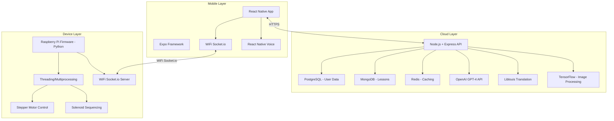
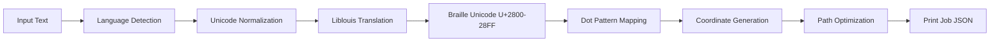
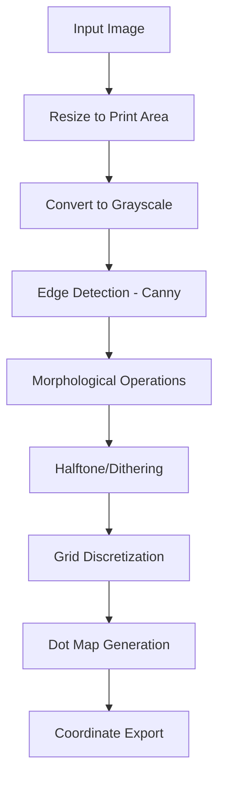
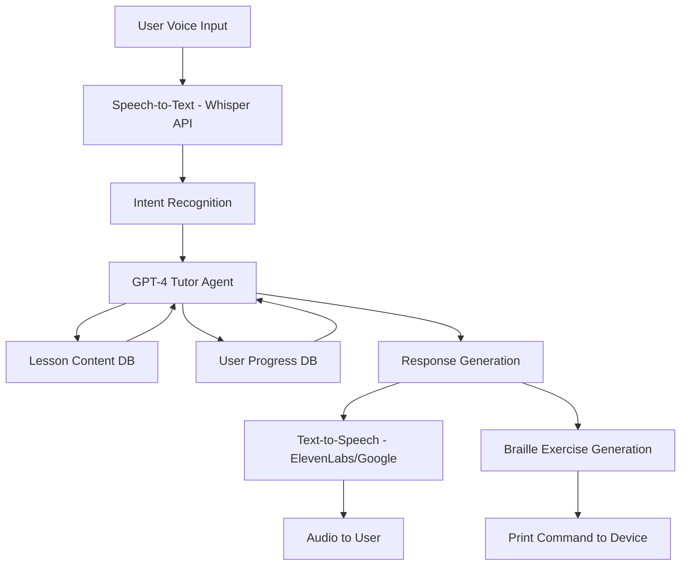

# Chapter 6: Software & AI Architecture

## 6.1 Software System Overview

The software stack consists of three major components working in concert:

1. **Device Firmware** (Raspberry Pi) - Real-time motion control, solenoid sequencing, sensor handling
2. **Cloud Backend** - AI tutor, translation services, analytics
3. **Mobile Application** (React Native) - User interface, voice control

### 6.1.1 Technology Stack



## 5.2 Device Firmware Architecture (Raspberry Pi)

### 5.2.1 Firmware Components

**Core Modules:**
1. **Motion Controller** - Stepper motor step/dir generation with acceleration profiles
2. **Solenoid Controller** - Simultaneous 6-solenoid firing based on character bitmask
3. **Communication Handler** - WiFi socket.io, REST API endpoints for remote control
4. **Sensor Manager** - Limit switches, paper presence detection
5. **State Machine** - Device modes and error handling

**Development Environment:**
- **Language:** Python 3.8+ (RPi native, easier than C++ for motion logic)
- **GPIO Library:** RPi.GPIO or gpiozero (higher-level abstraction)
- **Real-Time:** Threading for concurrent stepper/solenoid control
- **Framework:** Flask + SocketIO for network communication

### 5.2.2 Firmware State Machine

**Visual State Flow Diagram (ASCII):**

```
┌─────────────────────────────────────────────────────────────────────────┐
│              RASPBERRY PI FIRMWARE STATE MACHINE                         │
│                    (Socket.io WiFi Communication)                        │
└─────────────────────────────────────────────────────────────────────────┘

                    ┌──────────────────┐
                    │    [ IDLE ]      │  Boot complete, waiting
                    │   (No job)       │  GPIO initialized
                    └──────────────────┘
                           │
                   [Reset / Power ON]
                           │
                           ▼
                    ┌──────────────────┐
                    │   [ HOMING ]     │  Seeking origin position
                    │  (Initializing)  │  - Move X toward limit
                    └──────────────────┘  - Move Y toward limit
                           │ │
           X limit hit ◄─━━┫ ┃━━─► Motor stall
           Y limit hit ◄─━━┫ ┃   / Timeout
                           │ │
                           ▼ ▼
                    ┌──────────────────┐
                    │   [ READY ]      │  Waiting for commands
                    │   (Idle/Waiting) │  - No print job
                    └──────────────────┘  - No lesson active
                           │ │
         ┌─────────────────┤ ├─────────────┐
         │                 │ │             │
    Print Job          Lesson Mode      Shutdown
         │                 │             │
         ▼                 ▼             ▼
    ┌──────────────┐ ┌──────────────┐ [IDLE]
    │  [ PRINTING ]│ │  [ LESSON ]  │
    │   (Active)   │ │  (Teaching)  │
    │ Firing solenoids │ Printing + Voice
    │ Moving XY motors │
    └──────────────┘ └──────────────┘
         │ │                │ │
         │ └────┬───────────┘ │
         │      │             │
      Job  Character    Lesson Done
      Done embossed           │
         │      │             │
         └──────┴─────────────┘
                │
                ▼
        ┌──────────────────┐
        │    [ READY ]     │  Return to waiting
        └──────────────────┘

                    ERROR PATH
    ┌──────────────────────────────────┐
    │  Any State + Hardware Fault       │
    │  (Motor stall / Solenoid fail)    │
    │               │                  │
    │               ▼                  │
    │        ┌──────────────┐           │
    │        │  [ ERROR ]   │           │
    │        │ (Fault State)│           │
    │        └──────────────┘           │
    │               │                  │
    │      ┌────────┴────────┐          │
    │      │                 │          │
    │   Auto-recover     Manual         │
    │   (Re-home)        Clear          │
    │      │                 │          │
    │      ▼                 ▼          │
    │  [HOMING] ──Success──► [READY]   │
    │      │                           │
    │   Failure                         │
    │      │                           │
    │      └──────► [IDLE]             │
    │         (Fatal error)             │
    └──────────────────────────────────┘

═══════════════════════════════════════════════════════════════════════════

DETAILED STATE DESCRIPTIONS:

┌─────────────────────────────────────────────────────────────────────────┐
│ STATE: IDLE (Boot Complete)                                             │
├─────────────────────────────────────────────────────────────────────────┤
│ What firmware does:                                                     │
│   ✓ GPIO pins initialized                                              │
│   ✓ Socket.io server listening on port 5000                           │
│   ✓ Watchdog timer running                                            │
│   ✓ Waiting for homing command                                        │
│                                                                         │
│ What device does: Nothing (low power)                                  │
│ What app sees: "Device connected (waiting for homing)"                │
│ Next state: HOMING                                                     │
└─────────────────────────────────────────────────────────────────────────┘

┌─────────────────────────────────────────────────────────────────────────┐
│ STATE: HOMING (Calibration)                                             │
├─────────────────────────────────────────────────────────────────────────┤
│ Sequence:                                                               │
│   1. Motor X moves left (negative direction)                           │
│   2. Waits for X limit switch to close                                │
│   3. Records X=0 position                                             │
│   4. Motor Y moves forward (positive direction)                       │
│   5. Waits for Y limit switch to close                                │
│   6. Records Y=0 position                                             │
│                                                                         │
│ Success condition: Both limit switches pressed                         │
│ Failure condition: Motor stalls or timeout (10 sec)                   │
│ What app sees: "Initializing..." (progress 0% → 100%)                │
│ Next state: READY (success) or ERROR (fail)                           │
└─────────────────────────────────────────────────────────────────────────┘

┌─────────────────────────────────────────────────────────────────────────┐
│ STATE: READY (Idle / Waiting for Commands)                              │
├─────────────────────────────────────────────────────────────────────────┤
│ Firmware listens for:                                                  │
│   • /api/print - Receive print job (braille dot pattern)              │
│   • /api/lesson - Start lesson mode                                   │
│   • /api/home - Start homing sequence                                 │
│   • /api/status - Return device status                                │
│                                                                         │
│ Device position: At origin (X=0, Y=0)                                │
│ Motors: Powered but not moving                                        │
│ What app sees: "Device ready" (green checkmark)                       │
│ Next state: PRINTING, LESSON, HOMING, or ERROR                      │
└─────────────────────────────────────────────────────────────────────────┘

┌─────────────────────────────────────────────────────────────────────────┐
│ STATE: PRINTING (Actively Embossing)                                    │
├─────────────────────────────────────────────────────────────────────────┤
│ For each character in print job:                                       │
│                                                                         │
│   1. Receive 6-bit braille pattern from app                           │
│      Example: 101100 = dots 1,3,4 active (letter 'm')                │
│                                                                         │
│   2. Motor control: Move to XY position                                │
│      X += 6.0mm (next character position)                              │
│      Y += 2.5mm (next line, if needed)                                │
│                                                                         │
│   3. Solenoid firing:                                                  │
│      - Set GPIO pins [1,1,0,1,0,0] for solenoids 1-6                 │
│      - Hold for 20ms (impact force on paper)                          │
│      - Release for 10ms (retraction)                                  │
│                                                                         │
│   4. Send ACK back to app:                                            │
│      { "type": "PROGRESS", "char_index": 5, "percent": 15 }         │
│                                                                         │
│ Speed: 30-50 characters/second (30ms per character)                  │
│ What app sees: Progress bar updating in real-time                     │
│ Next state: PRINTING (loop) → READY (job done) or ERROR (fault)     │
└─────────────────────────────────────────────────────────────────────────┘

┌─────────────────────────────────────────────────────────────────────────┐
│ STATE: LESSON (Interactive Teaching Mode)                              │
├─────────────────────────────────────────────────────────────────────────┤
│ Firmware workflow:                                                      │
│                                                                         │
│   1. Receive lesson step from app (e.g., "Print letter A")            │
│   2. Transition to PRINTING state (emboss letter)                     │
│   3. Return to LESSON state (wait for next step)                      │
│   4. App provides voice feedback & questions via TTS                  │
│   5. User responds via voice (processed by app)                       │
│   6. Continue to next lesson step                                     │
│                                                                         │
│ What device does: Prints on demand (one letter at a time)             │
│ What app does: Handles all voice and timing                           │
│ What user experiences: Interactive tactile + audio lesson              │
│ Next state: PRINTING (for exercise) → LESSON (next step) → READY    │
└─────────────────────────────────────────────────────────────────────────┘

┌─────────────────────────────────────────────────────────────────────────┐
│ STATE: ERROR (Hardware Fault)                                           │
├─────────────────────────────────────────────────────────────────────────┤
│ Triggered by:                                                           │
│   • Solenoid won't fire (GPIO pin stuck)                              │
│   • Motor won't move (stalled at current position)                    │
│   • Limit switch not reached during homing                            │
│   • Paper jam detected (sensor triggered)                             │
│                                                                         │
│ Auto-recovery attempt:                                                 │
│   1. Log error to system (timestamp, error_code, GPIO state)          │
│   2. Send ERROR message to app with details                           │
│   3. Attempt auto-homing (reset position)                             │
│                                                                         │
│ If auto-homing succeeds: Return to READY                              │
│ If auto-homing fails: Return to IDLE (fatal, user must power-cycle)   │
│                                                                         │
│ What app shows: "Hardware Error: Solenoid 3 failed"                   │
│ User options: Retry, Cancel, or Power off                             │
│ Next state: HOMING (auto-recovery) → READY/IDLE                      │
└─────────────────────────────────────────────────────────────────────────┘

═══════════════════════════════════════════════════════════════════════════

TYPICAL OPERATION SEQUENCE:

Power-Up:
  Device boots → [ IDLE ] → App requests homing → [ HOMING ] 
    → Find X limit ✓ → Find Y limit ✓ → [ READY ]

Print Job:
  User selects text in app → App sends job → [ PRINTING ]
    → Char 1: Move to (6,0) → Fire solenoids → Send ACK
    → Char 2: Move to (12,0) → Fire solenoids → Send ACK
    → ... (repeat 32 times) ...
    → [ READY ]

Lesson:
  User starts lesson → [ LESSON ] → App requests "Print A"
    → [ PRINTING ] → Emboss one letter
    → [ LESSON ] → Wait for voice response (processed by app)
    → Next lesson step → [ PRINTING ] → Continue

Error Recovery:
  During printing, solenoid 3 fails → [ ERROR ]
    → Log fault (solenoid_id=3, timestamp=...)
    → Send ERROR ack to app (with error_code & recovery options)
    → Auto-attempt home [ HOMING ]
    → Success → [ READY ] (user can retry)
    → Failure → [ IDLE ] (user must power-cycle)
```

**Firmware Control Flow (Python Pseudocode):**

```
STARTUP SEQUENCE:
  ① GPIO.setmode(GPIO.BCM)
  ② GPIO.setup([all pins], direction)
  ③ State = IDLE
  ④ Listen on Socket.io port 5000
  ⑤ Await commands

HOMING SEQUENCE:
  ① State = HOMING
  ② Move X motor left until limit pressed
  ③ Move Y motor forward until limit pressed
  ④ State = READY
  ⑤ Send "Homing complete" to app

PRINTING SEQUENCE:
  ① State = PRINTING
  ② For each character:
     a. Parse braille pattern (6-bit: dot 1,2,3,4,5,6)
     b. Move motors to calculated XY position
     c. Fire solenoid bitmask (GPIO pins HIGH)
     d. Sleep 20ms (hold impact)
     e. Release solenoid (GPIO pins LOW)
     f. Sleep 10ms (retraction)
     g. Send PROGRESS ack to app
  ③ State = READY
  ④ Send COMPLETE ack to app

ERROR HANDLING:
  ① Detect fault (solenoid/motor/sensor)
  ② State = ERROR
  ③ Log event to device memory
  ④ Send ERROR ack to app
  ⑤ Attempt auto-home [ HOMING ]
  ⑥ If success: State = READY
  ⑦ If failure: State = IDLE (requires power-cycle)
```

### 5.2.3 Core Firmware Code Structure (Python)

**main.py (pseudocode):**
```python
import RPi.GPIO as GPIO
import time
import threading
from gpiozero import Motor, AngularServo
from flask import Flask, request
from flask_socketio import SocketIO, emit

# ═══════════════════════════════════════════════════════
# GPIO PIN DEFINITIONS
# ═══════════════════════════════════════════════════════

# Stepper Motors
X_STEP_PIN = 17
X_DIR_PIN = 22
Y_STEP_PIN = 18
Y_DIR_PIN = 23

# Solenoid Drivers (ULN2803 inputs)
SOLENOID_PINS = [24, 25, 12, 16, 20, 21]  # Pins for solenoids 1-6

# Limit Switches
X_LIMIT_PIN = 13
Y_LIMIT_PIN = 14

# Paper Sensor
PAPER_SENSOR_PIN = 4

# ═══════════════════════════════════════════════════════
# CONFIGURATION CONSTANTS
# ═══════════════════════════════════════════════════════

STEPS_PER_MM = 1000 / 8  # 125 steps per mm (8mm GT2 belt)
DOT_SPACING_MM = 2.5
CHAR_SPACING_MM = 6.0
MAX_SPEED = 500  # steps/sec
ACCELERATION = 300  # steps/sec²
HOMING_SPEED = 100  # steps/sec (slower for accuracy)

# Solenoid timings
SOLENOID_FIRE_MS = 20  # How long solenoid stays energized
SOLENOID_RETRACT_MS = 10  # Retraction delay

# ═══════════════════════════════════════════════════════
# STATE MANAGEMENT
# ═══════════════════════════════════════════════════════

class BraillePlotterState:
    BOOT = "BOOT"
    IDLE = "IDLE"
    HOMING = "HOMING"
    READY = "READY"
    PRINTING = "PRINTING"
    ERROR = "ERROR"

class MotionController:
    """Manages stepper motor motion and positioning"""
    
    def __init__(self):
        GPIO.setmode(GPIO.BCM)
        
        # Setup stepper pins
        GPIO.setup(X_STEP_PIN, GPIO.OUT)
        GPIO.setup(X_DIR_PIN, GPIO.OUT)
        GPIO.setup(Y_STEP_PIN, GPIO.OUT)
        GPIO.setup(Y_DIR_PIN, GPIO.OUT)
        
        # Setup limit switches (input with pull-up)
        GPIO.setup(X_LIMIT_PIN, GPIO.IN, pull_up_down=GPIO.PUD_UP)
        GPIO.setup(Y_LIMIT_PIN, GPIO.IN, pull_up_down=GPIO.PUD_UP)
        
        # Current position (mm)
        self.x_pos = 0.0
        self.y_pos = 0.0
        
        # Velocity profile
        self.current_speed = 0
        self.target_speed = MAX_SPEED
        
    def move_absolute(self, x_mm, y_mm, callback=None):
        """Move gantry to absolute position with acceleration profile"""
        x_target_steps = int(x_mm * STEPS_PER_MM)
        y_target_steps = int(y_mm * STEPS_PER_MM)
        
        x_current_steps = int(self.x_pos * STEPS_PER_MM)
        y_current_steps = int(self.y_pos * STEPS_PER_MM)
        
        x_distance = x_target_steps - x_current_steps
        y_distance = y_target_steps - y_current_steps
        
        # Move both axes simultaneously
        threading.Thread(
            target=self._step_axis,
            args=(X_STEP_PIN, X_DIR_PIN, x_distance, "X")
        ).start()
        
        threading.Thread(
            target=self._step_axis,
            args=(Y_STEP_PIN, Y_DIR_PIN, y_distance, "Y")
        ).start()
        
        if callback:
            callback()
    
    def _step_axis(self, step_pin, dir_pin, distance, axis):
        """Generate step/dir pulses for a single axis"""
        if distance < 0:
            GPIO.output(dir_pin, GPIO.LOW)  # Negative direction
            distance = abs(distance)
        else:
            GPIO.output(dir_pin, GPIO.HIGH)  # Positive direction
        
        for i in range(distance):
            # Simple constant-speed stepping (can add acceleration profile)
            GPIO.output(step_pin, GPIO.HIGH)
            time.sleep(0.001)  # 1ms pulse width
            GPIO.output(step_pin, GPIO.LOW)
            time.sleep(1.0 / MAX_SPEED)  # Interval between steps
    
    def home(self):
        """Home both axes using limit switches"""
        print("Homing X-axis...")
        while GPIO.input(X_LIMIT_PIN) == GPIO.HIGH:
            GPIO.output(X_DIR_PIN, GPIO.LOW)  # Move left
            GPIO.output(X_STEP_PIN, GPIO.HIGH)
            time.sleep(0.001)
            GPIO.output(X_STEP_PIN, GPIO.LOW)
            time.sleep(1.0 / HOMING_SPEED)
        
        self.x_pos = 0.0
        time.sleep(0.5)  # Debounce
        
        print("Homing Y-axis...")
        while GPIO.input(Y_LIMIT_PIN) == GPIO.HIGH:
            GPIO.output(Y_DIR_PIN, GPIO.LOW)  # Move forward
            GPIO.output(Y_STEP_PIN, GPIO.HIGH)
            time.sleep(0.001)
            GPIO.output(Y_STEP_PIN, GPIO.LOW)
            time.sleep(1.0 / HOMING_SPEED)
        
        self.y_pos = 0.0
        
        # Move to safe starting position (5mm from origin)
        self.move_absolute(5, 5)
        print("Homing complete at (5, 5)")

class SolenoidController:
    """Manages 6-solenoid embossing array"""
    
    def __init__(self):
        GPIO.setmode(GPIO.BCM)
        for pin in SOLENOID_PINS:
            GPIO.setup(pin, GPIO.OUT)
            GPIO.output(pin, GPIO.LOW)  # Start all off
    
    def fire_character(self, bitmask):
        """Fire solenoids based on 6-bit bitmask
        
        Bitmask layout (braille dots 1-6):
        Bit 0 = Solenoid 1 (dot 1)
        Bit 1 = Solenoid 2 (dot 2)
        Bit 2 = Solenoid 3 (dot 3)
        Bit 3 = Solenoid 4 (dot 4)
        Bit 4 = Solenoid 5 (dot 5)
        Bit 5 = Solenoid 6 (dot 6)
        
        Example: Character 'A' (dot 1 only) = 0b000001
        """
        
        # Fire active solenoids
        for i in range(6):
            if bitmask & (1 << i):
                GPIO.output(SOLENOID_PINS[i], GPIO.HIGH)
        
        # Hold time (solenoid energized)
        time.sleep(SOLENOID_FIRE_MS / 1000.0)
        
        # Retract all solenoids
        for i in range(6):
            GPIO.output(SOLENOID_PINS[i], GPIO.LOW)
        
        # Retraction delay (allows plunger to fully retract)
        time.sleep(SOLENOID_RETRACT_MS / 1000.0)

class BraillePlotter:
    """Main controller integrating motion + embossing"""
    
    def __init__(self):
        self.motion = MotionController()
        self.solenoid = SolenoidController()
        self.state = BraillePlotterState.BOOT
        
        # Initialize Flask for network control
        self.app = Flask(__name__)
        self.socketio = SocketIO(self.app, cors_allowed_origins="*")
        
        # Setup routes
        self.setup_routes()
    
    def setup_routes(self):
        @self.app.route('/api/home', methods=['POST'])
        def api_home():
            self.state = BraillePlotterState.HOMING
            self.motion.home()
            self.state = BraillePlotterState.READY
            return {"status": "homed"}
        
        @self.app.route('/api/print', methods=['POST'])
        def api_print():
            data = request.json
            job_id = data.get('job_id')
            dots = data.get('dots')  # List of [x, y, bitmask] tuples
            
            self.state = BraillePlotterState.PRINTING
            self.print_job(job_id, dots)
            self.state = BraillePlotterState.READY
            return {"status": "complete"}
        
        @self.socketio.on('connect')
        def handle_connect():
            print("Client connected")
            self.socketio.emit('status', {'state': self.state})
    
    def print_job(self, job_id, dots):
        """Execute a complete print job"""
        total_dots = len(dots)
        
        for idx, (x_mm, y_mm, bitmask) in enumerate(dots):
            # Move to position
            self.motion.move_absolute(x_mm, y_mm)
            
            # Small delay for motion completion
            time.sleep(0.05)
            
            # Fire solenoids for this character
            self.solenoid.fire_character(bitmask)
            
            # Send progress update
            self.socketio.emit('progress', {
                'job_id': job_id,
                'dot_index': idx,
                'total_dots': total_dots,
                'percent': int(100 * idx / total_dots),
                'position': {'x': x_mm, 'y': y_mm}
            })
        
        # Job complete
        self.socketio.emit('job_complete', {
            'job_id': job_id,
            'total_dots': total_dots,
            'duration_ms': total_dots * 30  # Approx 30ms per dot
        })
    
    def start(self):
        """Initialize and start the plotter"""
        print("═══════════════════════════════════════════════")
        print("  Braille Buddy Plotter - Hex-Core Control")
        print("═══════════════════════════════════════════════")
        
        self.state = BraillePlotterState.READY
        print(f"[{self.state}] Ready to receive commands")
        
        # Start web server
        self.socketio.run(self.app, host='0.0.0.0', port=5000, debug=False)

# ═══════════════════════════════════════════════════════
# ENTRY POINT
# ═══════════════════════════════════════════════════════

if __name__ == '__main__':
    plotter = BraillePlotter()
    try:
        plotter.start()
    except KeyboardInterrupt:
        print("\nShutdown initiated...")
        GPIO.cleanup()
```

### 5.2.4 Real-Time Solenoid Firing Logic

**Braille Bitmask Encoding:**

```
Standard Braille Cell (6-dot):

Dot layout in cell:       Binary representation:
┌───┬───┐                Bit 0 = Dot 1 (top-left)
│ 1 │ 4 │                Bit 1 = Dot 2 (middle-left)
├───┼───┤                Bit 2 = Dot 3 (bottom-left)
│ 2 │ 5 │                Bit 3 = Dot 4 (top-right)
├───┼───┤                Bit 4 = Dot 5 (middle-right)
│ 3 │ 6 │                Bit 5 = Dot 6 (bottom-right)
└───┴───┘

Examples:
Character 'A' (only dot 1):      0b000001 = 0x01
Character 'B' (dots 1, 2, 4):    0b011001 = 0x19
Character 'M' (dots 1, 3, 4):    0b011101 = 0x1D
Character space (no dots):        0b000000 = 0x00
```

**Solenoid Firing Sequence:**

```python
def fire_pattern(bitmask, duration_ms=20):
    """
    Simultaneous fire pattern for 6 solenoids
    
    Sequence:
    0ms:  Set all GPIO HIGH where bitmask bit = 1
    5ms:  Solenoids reach full extension
    10ms: Styli rods impact paper (0.15-0.20mm indent)
    15ms: Full embossing complete
    20ms: Set all GPIO LOW (retract phase begins)
    25ms: Solenoids fully retracted
    30ms: Ready for next character
    
    Total cycle: 30ms per dot = 33 characters/second
    """
    
    start_time = time.time()
    
    # Fire phase
    for i in range(6):
        if bitmask & (1 << i):
            GPIO.output(SOLENOID_PINS[i], GPIO.HIGH)
    
    # Hold for specified duration
    while (time.time() - start_time) < (duration_ms / 1000.0):
        pass  # Busy wait for precision timing
    
    # Retract phase
    for i in range(6):
        GPIO.output(SOLENOID_PINS[i], GPIO.LOW)
    
    # Allow plunger to fully retract
    time.sleep(0.010)
```

---

## 5.3 Translation Pipeline

### 5.3.1 Text-to-Braille Conversion

**Process Flow:**


**Liblouis Integration (Node.js Backend):**

```javascript
const liblouis = require('liblouis');

async function translateToBraille(text, language = 'en', grade = 2) {
  // Select appropriate table
  const table = grade === 1 
    ? `${language}-g1.ctb` 
    : `${language}-g2.ctb`;
  
  try {
    const brailleUnicode = await liblouis.translateString(table, text);
    return brailleUnicode;
  } catch (error) {
    console.error('Translation error:', error);
    throw error;
  }
}

// Example
const result = await translateToBraille("Hello World", "en", 2);
// Returns: "⠓⠑⠇⠇⠕ ⠺⠕⠗⠇⠙" (Grade 2 braille)
```

**Supported Languages (via Liblouis tables):**
- English (en-us, en-gb)
- Spanish (es)
- French (fr)
- German (de)
- Hindi (hi)
- Arabic (ar)
- 180+ total languages

### 5.3.2 Braille Unicode to Dot Pattern

**Mapping Algorithm:**

Each braille cell (6-dot or 8-dot) is encoded in Unicode:
- Unicode range: U+2800 (⠀) to U+28FF (⣿)
- Bit pattern maps to dot positions:

```
Dot numbering:     Bit positions:
  1 • • 4             0x01  0x08
  2 • • 5             0x02  0x10
  3 • • 6             0x04  0x20
  7 • • 8 (8-dot)     0x40  0x80
```

**JavaScript Function:**
```javascript
function unicodeToDots(brailleChar) {
  const codePoint = brailleChar.charCodeAt(0);
  const offset = codePoint - 0x2800; // Base offset
  
  const dots = [];
  if (offset & 0x01) dots.push(1);
  if (offset & 0x02) dots.push(2);
  if (offset & 0x04) dots.push(3);
  if (offset & 0x08) dots.push(4);
  if (offset & 0x10) dots.push(5);
  if (offset & 0x20) dots.push(6);
  if (offset & 0x40) dots.push(7); // 8-dot braille
  if (offset & 0x80) dots.push(8);
  
  return dots;
}

// Example: ⠓ (letter H)
unicodeToDots('⠓'); // Returns: [1, 2, 5]
```

### 5.3.3 Dot Coordinates Generation

**Algorithm:**
```javascript
function generateDotCoordinates(brailleText) {
  const DOT_SPACING = 2.5; // mm
  const CELL_WIDTH = 6.2; // mm
  const LINE_HEIGHT = 10.0; // mm
  
  let x = 5; // Start margin (mm)
  let y = 5;
  const coordinates = [];
  
  for (let char of brailleText) {
    if (char === ' ') {
      x += CELL_WIDTH; // Space between words
      continue;
    }
    if (char === '\n') {
      y += LINE_HEIGHT;
      x = 5;
      continue;
    }
    
    const dots = unicodeToDots(char);
    for (let dot of dots) {
      const [dx, dy] = getDotOffset(dot);
      coordinates.push({
        x: x + dx * DOT_SPACING,
        y: y + dy * DOT_SPACING
      });
    }
    
    x += CELL_WIDTH; // Move to next cell
  }
  
  return coordinates;
}

function getDotOffset(dotNumber) {
  // Returns [x_offset, y_offset] multipliers
  const offsets = {
    1: [0, 0], 2: [0, 1], 3: [0, 2],
    4: [1, 0], 5: [1, 1], 6: [1, 2],
    7: [0, 3], 8: [1, 3] // 8-dot
  };
  return offsets[dotNumber];
}
```

### 5.3.4 Path Optimization

To minimize travel time, use **Nearest Neighbor** or **2-opt TSP** algorithm:

```javascript
function optimizePath(dots) {
  if (dots.length < 2) return dots;
  
  const visited = new Set();
  const optimized = [dots[0]];
  visited.add(0);
  
  while (optimized.length < dots.length) {
    const current = optimized[optimized.length - 1];
    let nearestIndex = -1;
    let minDist = Infinity;
    
    for (let i = 0; i < dots.length; i++) {
      if (visited.has(i)) continue;
      const dist = distance(current, dots[i]);
      if (dist < minDist) {
        minDist = dist;
        nearestIndex = i;
      }
    }
    
    optimized.push(dots[nearestIndex]);
    visited.add(nearestIndex);
  }
  
  return optimized;
}

function distance(p1, p2) {
  return Math.sqrt((p1.x - p2.x)**2 + (p1.y - p2.y)**2);
}
```

## 5.4 Image-to-Tactile Conversion

### 5.4.1 Image Processing Pipeline



**Python Implementation (Backend Service):**

```python
import cv2
import numpy as np

def image_to_tactile(image_path, width_mm=100, height_mm=140, dot_spacing_mm=2.5):
    # Load image
    img = cv2.imread(image_path)
    
    # Calculate grid dimensions
    grid_width = int(width_mm / dot_spacing_mm)
    grid_height = int(height_mm / dot_spacing_mm)
    
    # Resize to grid dimensions
    img_resized = cv2.resize(img, (grid_width, grid_height))
    
    # Convert to grayscale
    gray = cv2.cvtColor(img_resized, cv2.COLOR_BGR2GRAY)
    
    # Edge detection for line art
    edges = cv2.Canny(gray, 50, 150)
    
    # Apply dithering for photos (Floyd-Steinberg)
    dithered = floyd_steinberg_dither(gray)
    
    # Combine edges + dithered
    combined = cv2.addWeighted(edges, 0.6, dithered, 0.4, 0)
    
    # Threshold to binary
    _, binary = cv2.threshold(combined, 127, 255, cv2.THRESH_BINARY)
    
    # Generate dot coordinates
    dots = []
    for y in range(grid_height):
        for x in range(grid_width):
            if binary[y, x] > 127:  # White = dot
                dots.append({
                    'x': x * dot_spacing_mm,
                    'y': y * dot_spacing_mm
                })
    
    return dots

def floyd_steinberg_dither(image):
    img = image.astype(float)
    for y in range(img.shape[0] - 1):
        for x in range(1, img.shape[1] - 1):
            old_pixel = img[y, x]
            new_pixel = 255 if old_pixel > 127 else 0
            img[y, x] = new_pixel
            error = old_pixel - new_pixel
            
            img[y, x + 1] += error * 7 / 16
            img[y + 1, x - 1] += error * 3 / 16
            img[y + 1, x] += error * 5 / 16
            img[y + 1, x + 1] += error * 1 / 16
    
    return img.astype(np.uint8)
```

### 5.4.2 AI-Enhanced Image Understanding

For complex images (charts, diagrams), use AI to segment and simplify:

**Process:**
1. **Object Detection** (YOLOv8 or similar) - Identify key elements
2. **Scene Understanding** (GPT-4 Vision) - Describe image content
3. **Tactile Simplification** - Remove unnecessary details
4. **Label Extraction** - Convert text labels to braille annotations

**Example GPT-4 Vision Prompt:**
```
"Analyze this diagram and identify the key tactile-friendly elements 
that should be preserved for a blind user. List the main shapes, 
boundaries, and any text labels. Suggest a simplified line-art 
version optimized for tactile printing with 2.5mm dot spacing."
```

## 5.5 AI Tutor Engine

### 5.5.1 Tutor Architecture



### 5.5.2 GPT-4 Tutor Prompt Engineering

**System Prompt:**
```
You are an expert braille instructor teaching a blind student. Your goals:
1. Provide clear, encouraging, tactile-focused explanations
2. Adapt difficulty based on student performance
3. Use Socratic questioning to reinforce learning
4. Give immediate, constructive feedback
5. Generate braille exercises appropriate to lesson level

Current lesson: {lesson_title}
Student level: {student_level}
Previous performance: {recent_scores}

When the student makes an error, explain WHY and provide a mnemonic or 
tactile comparison to help them remember. Always be patient and positive.
```

**Example Interaction:**
```
User: "I'm ready to learn the letter B"

AI Tutor: "Great! Let's explore the letter B in braille. The letter B 
has two dots: dots 1 and 2, stacked vertically on the left side of the 
cell. Imagine a tall pole with two dots going down. I'm printing it now 
for you to feel. [PRINT: ⠃]

Feel the two raised dots on the left. Now, compare it to the letter A, 
which only has dot 1. B is like A with an extra dot below it. 

Can you tell me how many dots you feel?"

User: "Two dots"

AI Tutor: "Perfect! You've got it. Now let's practice distinguishing B 
from other similar letters..."
```

### 5.5.3 Adaptive Learning Algorithm

**Spaced Repetition (Leitner System):**
```javascript
class AdaptiveLearning {
  constructor(userId) {
    this.userId = userId;
    this.boxes = [[], [], [], [], []]; // 5 boxes for spaced repetition
  }
  
  async getNextLesson() {
    // Prioritize box 0 (new/failed items)
    if (this.boxes[0].length > 0) {
      return this.boxes[0][0];
    }
    
    // Then review items due for repetition
    for (let i = 1; i < this.boxes.length; i++) {
      const dueItems = this.boxes[i].filter(item => item.dueDate <= Date.now());
      if (dueItems.length > 0) {
        return dueItems[0];
      }
    }
    
    // Otherwise, introduce new content
    return await this.getNewContent();
  }
  
  recordPerformance(lessonId, correct) {
    const item = this.findItem(lessonId);
    
    if (correct) {
      // Move to next box (longer interval)
      this.promoteItem(item);
    } else {
      // Move back to box 0 (review soon)
      this.demoteItem(item);
    }
    
    this.saveProgress();
  }
  
  promoteItem(item) {
    const currentBox = this.findBox(item);
    const nextBox = Math.min(currentBox + 1, 4);
    this.boxes[currentBox] = this.boxes[currentBox].filter(i => i !== item);
    
    // Set next review date (exponential backoff)
    item.dueDate = Date.now() + this.getInterval(nextBox);
    this.boxes[nextBox].push(item);
  }
  
  getInterval(boxNumber) {
    const intervals = [
      1000 * 60 * 5,      // Box 0: 5 minutes
      1000 * 60 * 60,     // Box 1: 1 hour
      1000 * 60 * 60 * 24, // Box 2: 1 day
      1000 * 60 * 60 * 24 * 7,  // Box 3: 1 week
      1000 * 60 * 60 * 24 * 30  // Box 4: 1 month
    ];
    return intervals[boxNumber];
  }
}
```

## 5.6 Cloud Backend API

### 5.6.1 API Endpoints

**Base URL:** `https://api.brailleplotter.com/v1`

| Endpoint | Method | Description | Auth Required |
|----------|--------|-------------|---------------|
| `/auth/register` | POST | User registration | No |
| `/auth/login` | POST | User login | No |
| `/translate` | POST | Text to braille | Yes |
| `/image/convert` | POST | Image to tactile | Yes |
| `/lessons` | GET | List lessons | Yes |
| `/lessons/:id` | GET | Get lesson detail | Yes |
| `/progress` | POST | Update user progress | Yes |
| `/progress/:userId` | GET | Get user analytics | Yes |
| `/tutor/chat` | POST | AI tutor interaction | Yes |
| `/devices` | GET | List user devices | Yes |
| `/devices/:id/status` | GET | Device status | Yes |

**Example Request (Translation):**
```bash
curl -X POST https://api.brailleplotter.com/v1/translate \
  -H "Authorization: Bearer <token>" \
  -H "Content-Type: application/json" \
  -d '{
    "text": "Hello World",
    "language": "en",
    "grade": 2
  }'
```

**Response:**
```json
{
  "success": true,
  "data": {
    "original_text": "Hello World",
    "braille_unicode": "⠓⠑⠇⠇⠕ ⠺⠕⠗⠇⠙",
    "dot_pattern": [
      {"x": 5.0, "y": 5.0},
      {"x": 5.0, "y": 7.5},
      {"x": 7.5, "y": 5.0},
      // ... more dots
    ],
    "estimated_print_time_sec": 45
  }
}
```

### 5.6.2 Database Schema

**PostgreSQL (User Data):**

```sql
-- Users table
CREATE TABLE users (
  id UUID PRIMARY KEY DEFAULT gen_random_uuid(),
  email VARCHAR(255) UNIQUE NOT NULL,
  password_hash VARCHAR(255) NOT NULL,
  name VARCHAR(255),
  age INTEGER,
  created_at TIMESTAMP DEFAULT NOW(),
  updated_at TIMESTAMP DEFAULT NOW()
);

-- Devices table
CREATE TABLE devices (
  id UUID PRIMARY KEY DEFAULT gen_random_uuid(),
  user_id UUID REFERENCES users(id),
  device_name VARCHAR(255),
  mac_address VARCHAR(17) UNIQUE,
  firmware_version VARCHAR(20),
  last_seen TIMESTAMP,
  created_at TIMESTAMP DEFAULT NOW()
);

-- Progress table
CREATE TABLE progress (
  id UUID PRIMARY KEY DEFAULT gen_random_uuid(),
  user_id UUID REFERENCES users(id),
  lesson_id VARCHAR(50),
  completed_at TIMESTAMP,
  score INTEGER,
  attempts INTEGER,
  time_spent_sec INTEGER
);

-- Print jobs table
CREATE TABLE print_jobs (
  id UUID PRIMARY KEY DEFAULT gen_random_uuid(),
  user_id UUID REFERENCES users(id),
  device_id UUID REFERENCES devices(id),
  job_type VARCHAR(50), -- 'text', 'image', 'lesson'
  content TEXT,
  status VARCHAR(20), -- 'queued', 'printing', 'completed', 'failed'
  created_at TIMESTAMP DEFAULT NOW(),
  completed_at TIMESTAMP
);
```

**MongoDB (Lessons & Content):**

```javascript
// Lessons collection
{
  _id: ObjectId("..."),
  lesson_id: "L001-alphabet-a",
  level: "beginner",
  chapter: "Alphabet Basics",
  title: "Learning Letter A",
  description: "Introduction to the braille letter A",
  learning_objectives: ["Recognize pattern for A", "Distinguish from similar letters"],
  content: {
    steps: [
      {
        step_number: 1,
        type: "instruction",
        audio_script: "Let's learn the letter A...",
        duration_sec: 30
      },
      {
        step_number: 2,
        type: "print",
        braille_content: "⠁",
        print_settings: {dot_depth: 0.6}
      },
      {
        step_number: 3,
        type: "quiz",
        question: "What letter did you feel?",
        expected_answers: ["A", "letter A"],
        hints: ["It's the first letter of the alphabet"]
      }
    ]
  },
  prerequisites: [],
  estimated_duration_min: 10,
  difficulty: 1,
  tags: ["alphabet", "vowels"],
  created_at: ISODate("2025-11-01T00:00:00Z")
}
```

## 5.7 Voice Interface

### 5.7.1 Speech-to-Text (ASR)

**Options:**

| Service | Accuracy | Latency | Cost | Offline? |
|---------|----------|---------|------|----------|
| **OpenAI Whisper API** | 95%+ | ~2sec | $0.006/min | No |
| **Google Cloud Speech** | 95%+ | <1sec | $0.024/min | No |
| **Vosk (on-device)** | 85-90% | Real-time | Free | Yes |

**Recommended:** OpenAI Whisper for MVP (best accuracy), with Vosk option for offline mode

**Implementation (React Native):**
```javascript
import Voice from '@react-native-voice/voice';
import axios from 'axios';

class VoiceHandler {
  async startListening() {
    try {
      await Voice.start('en-US');
      Voice.onSpeechResults = this.onSpeechResults;
    } catch (error) {
      console.error(error);
    }
  }
  
  onSpeechResults = async (event) => {
    const spokenText = event.value[0];
    
    // Send to backend for processing
    const response = await axios.post('/api/tutor/chat', {
      user_input: spokenText,
      session_id: this.sessionId
    });
    
    // Play AI response
    this.playAudioResponse(response.data.audio_url);
  }
  
  async playAudioResponse(audioUrl) {
    // Use react-native-sound or expo-av
    const sound = new Sound(audioUrl, '', (error) => {
      if (!error) sound.play();
    });
  }
}
```

### 5.7.2 Text-to-Speech (TTS)

**Options:**
- **ElevenLabs:** Most natural voices, $0.30/1K chars
- **Google Cloud TTS:** Good quality, $4/1M chars
- **Amazon Polly:** Neural voices, $4/1M chars

**Backend Integration:**
```javascript
const axios = require('axios');

async function generateSpeech(text, voiceId = 'Rachel') {
  const response = await axios.post(
    'https://api.elevenlabs.io/v1/text-to-speech/' + voiceId,
    {
      text: text,
      model_id: 'eleven_monolingual_v1',
      voice_settings: {
        stability: 0.75,
        similarity_boost: 0.85
      }
    },
    {
      headers: {
        'xi-api-key': process.env.ELEVENLABS_API_KEY,
        'Content-Type': 'application/json'
      },
      responseType: 'arraybuffer'
    }
  );
  
  return response.data; // Audio buffer (MP3)
}
```

## 5.8 Summary

This chapter detailed the complete software architecture:

**Firmware:**
- ESP32-based C++ firmware with BLE communication
- AccelStepper for precise motion control
- State machine for robust operation

**Translation:**
- Liblouis integration for 180+ languages
- Braille Unicode to dot pattern conversion
- Path optimization algorithms

**Image Processing:**
- OpenCV-based image-to-tactile pipeline
- AI-enhanced diagram simplification

**AI Tutor:**
- GPT-4 powered personalized instruction
- Adaptive learning with spaced repetition
- Voice interaction via Whisper + ElevenLabs

**Backend:**
- Node.js REST API
- PostgreSQL + MongoDB databases
- Scalable cloud architecture

**Next Chapter:** Mobile application specification (React Native UI/UX, BLE integration).

---
