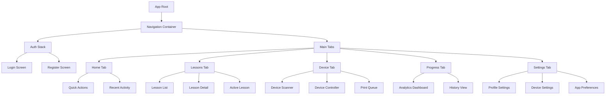
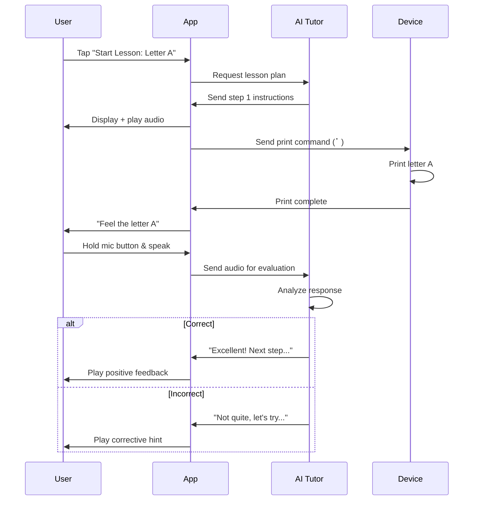

# Chapter 6: Mobile Application (React Native)

## 6.1 App Overview

The React Native mobile application serves as the primary user interface for the braille plotter system, providing:

- **Device control** via Bluetooth Low Energy (BLE)
- **Lesson management** and progress tracking
- **Voice command** processing and interaction
- **Print job** creation and queue management
- **Analytics dashboard** for educators and learners
- **Settings** and device configuration

### 6.1.1 Platform Support

- **iOS:** 13.0 and above
- **Android:** API 24 (Android 7.0) and above
- **Framework:** React Native 0.72+ with Expo SDK 49+

### 6.1.2 Technology Stack

| Component | Library | Version | Purpose |
|-----------|---------|---------|---------|
| **Framework** | React Native | 0.72 | Core mobile framework |
| **Build Tool** | Expo | 49 | Development workflow |
| **BLE** | react-native-ble-manager | 10.0 | Bluetooth connectivity |
| **Voice** | @react-native-voice/voice | 3.2 | Speech recognition |
| **Navigation** | @react-navigation/native | 6.1 | App navigation |
| **State** | Redux Toolkit | 1.9 | State management |
| **Audio** | expo-av | 13.4 | Audio playback |
| **Storage** | AsyncStorage | 1.19 | Local data persistence |
| **API** | Axios | 1.5 | HTTP client |
| **Charts** | react-native-chart-kit | 6.12 | Progress visualization |

## 6.2 App Architecture

### 6.2.1 Component Structure



### 6.2.2 State Management (Redux)

**Store Structure:**
```javascript
{
  auth: {
    user: {...},
    token: "jwt_token",
    isAuthenticated: true
  },
  device: {
    connected: true,
    deviceInfo: {...},
    status: "ready | printing | error",
    currentJob: {...},
    queue: [...]
  },
  lessons: {
    available: [...],
    completed: [...],
    current: {...},
    progress: 0.75
  },
  tutor: {
    chatHistory: [...],
    isListening: false,
    currentResponse: "..."
  },
  analytics: {
    stats: {...},
    timeline: [...]
  }
}
```

## 6.3 Screen Designs & User Flows

### 6.3.1 Home Screen

**Layout:**
```
┌─────────────────────────────────┐
│  [Logo]    Braille Tutor        │
├─────────────────────────────────┤
│                                 │
│  👋 Hello, [User Name]          │
│                                 │
│  🟢 Device Connected            │
│  📊 Lesson Progress: 45%        │
│                                 │
│  ┌───────────────────────────┐ │
│  │   🎤 Start Voice Lesson   │ │
│  └───────────────────────────┘ │
│                                 │
│  ┌────────┐ ┌────────┐         │
│  │ 📝 Print│ │ 📖 Learn│        │
│  │  Text  │ │ Letter │        │
│  └────────┘ └────────┘         │
│                                 │
│  Recent Activity:               │
│  • Completed Lesson: Letter B  │
│  • Printed: Math Worksheet     │
│                                 │
└─────────────────────────────────┘
```

**Accessibility Features:**
- **Large touch targets:** Min 44×44pt (iOS HIG guideline)
- **VoiceOver labels:** Descriptive for screen readers
- **High contrast mode:** Support system-wide settings
- **Voice commands:** "Start lesson on letter A"

### 6.3.2 Lesson Flow Screen

**Active Lesson UI:**
```
┌─────────────────────────────────┐
│  ← Lesson: Letter A        [•••]│
├─────────────────────────────────┤
│                                 │
│  Step 2 of 5                    │
│  ████████░░░░░░░░░░░  40%      │
│                                 │
│  🔊 "Feel the raised dot at     │
│     position 1. This is the     │
│     letter A in braille."       │
│                                 │
│  ┌───────────────────────────┐ │
│  │                           │ │
│  │     Printing now...       │ │
│  │         ⠁                 │ │
│  │     [Animation]           │ │
│  │                           │ │
│  └───────────────────────────┘ │
│                                 │
│  ┌─────────────────────────┐   │
│  │  🎤  Press & Speak       │   │
│  └─────────────────────────┘   │
│                                 │
│  [Skip]           [Next Step →]│
└─────────────────────────────────┘
```

**Interaction Flow:**


### 6.3.3 Device Control Screen

**UI Elements:**
```
┌─────────────────────────────────┐
│  Device: BraillePlotter-A3E2    │
├─────────────────────────────────┤
│                                 │
│  Status: 🟢 Ready               │
│  Battery: N/A (AC Powered)      │
│  Firmware: v1.0.2               │
│                                 │
│  ┌───────────────────────────┐ │
│  │   🏠 Home Device          │ │
│  └───────────────────────────┘ │
│                                 │
│  Print Queue (2 jobs):          │
│  ┌─────────────────────────┐   │
│  │ 1. Lesson Exercise      │   │
│  │    Status: Printing 65% │   │
│  │    ETA: 2 min           │   │
│  └─────────────────────────┘   │
│  ┌─────────────────────────┐   │
│  │ 2. "Hello World"        │   │
│  │    Status: Queued       │   │
│  └─────────────────────────┘   │
│                                 │
│  ┌────────┐ ┌────────┐         │
│  │  Pause │ │ Cancel │         │
│  └────────┘ └────────┘         │
│                                 │
└─────────────────────────────────┘
```

### 6.3.4 Progress Dashboard

**Analytics View:**
```
┌─────────────────────────────────┐
│  📊 Your Progress               │
├─────────────────────────────────┤
│                                 │
│  Lessons Completed: 15/50       │
│  Current Streak: 7 days 🔥      │
│  Reading Speed: 45 WPM          │
│                                 │
│  Weekly Activity:               │
│  ┌─────────────────────────┐   │
│  │     ██                  │   │
│  │  ██ ██ ██ ██            │   │
│  │  ██ ██ ██ ██ ██ ██ ██  │   │
│  │  M  T  W  T  F  S  S    │   │
│  └─────────────────────────┘   │
│                                 │
│  Mastery by Topic:              │
│  Alphabet:      ████████░░ 80%  │
│  Numbers:       ██████░░░░ 60%  │
│  Punctuation:   ███░░░░░░░ 30%  │
│                                 │
│  Achievements:                  │
│  🏆 First 10 Lessons            │
│  ⭐ Perfect Score on Quiz       │
│  📅 7-Day Streak                │
│                                 │
└─────────────────────────────────┘
```

## 6.4 BLE Integration

### 6.4.1 Device Discovery & Connection

**Code Implementation:**
```javascript
import BleManager from 'react-native-ble-manager';
import { NativeEventEmitter, NativeModules } from 'react-native';

const BleManagerModule = NativeModules.BleManager;
const bleManagerEmitter = new NativeEventEmitter(BleManagerModule);

class BLEService {
  constructor() {
    this.devices = [];
    this.connectedDevice = null;
    this.SERVICE_UUID = '0000ffe0-0000-1000-8000-00805f9b34fb';
    this.RX_CHAR_UUID = '0000ffe1-0000-1000-8000-00805f9b34fb';
    this.TX_CHAR_UUID = '0000ffe2-0000-1000-8000-00805f9b34fb';
  }
  
  async init() {
    await BleManager.start({ showAlert: false });
    
    // Listen for device discovery
    this.discoveryListener = bleManagerEmitter.addListener(
      'BleManagerDiscoverPeripheral',
      (device) => this.onDeviceDiscovered(device)
    );
    
    // Listen for disconnection
    this.disconnectListener = bleManagerEmitter.addListener(
      'BleManagerDisconnectPeripheral',
      (device) => this.onDeviceDisconnected(device)
    );
  }
  
  async scan() {
    this.devices = [];
    await BleManager.scan([], 5, true); // 5 seconds scan
  }
  
  onDeviceDiscovered(device) {
    if (device.name && device.name.startsWith('BraillePlotter')) {
      this.devices.push(device);
      // Update UI with discovered device
    }
  }
  
  async connect(deviceId) {
    try {
      await BleManager.connect(deviceId);
      this.connectedDevice = deviceId;
      
      // Retrieve services
      await BleManager.retrieveServices(deviceId);
      
      // Enable notifications for TX characteristic
      await BleManager.startNotification(
        deviceId,
        this.SERVICE_UUID,
        this.TX_CHAR_UUID
      );
      
      // Listen for data
      this.dataListener = bleManagerEmitter.addListener(
        'BleManagerDidUpdateValueForCharacteristic',
        (data) => this.onDataReceived(data)
      );
      
      return true;
    } catch (error) {
      console.error('Connection error:', error);
      return false;
    }
  }
  
  async disconnect() {
    if (this.connectedDevice) {
      await BleManager.disconnect(this.connectedDevice);
      this.connectedDevice = null;
    }
  }
  
  async sendCommand(command) {
    if (!this.connectedDevice) {
      throw new Error('No device connected');
    }
    
    const data = JSON.stringify(command);
    const bytes = this.stringToBytes(data);
    
    await BleManager.write(
      this.connectedDevice,
      this.SERVICE_UUID,
      this.RX_CHAR_UUID,
      bytes
    );
  }
  
  onDataReceived(data) {
    const text = this.bytesToString(data.value);
    const response = JSON.parse(text);
    
    // Dispatch to Redux store or handle response
    this.handleDeviceResponse(response);
  }
  
  stringToBytes(str) {
    return Array.from(str, char => char.charCodeAt(0));
  }
  
  bytesToString(bytes) {
    return String.fromCharCode(...bytes);
  }
}

export default new BLEService();
```

### 6.4.2 Print Job Transmission

**Redux Action:**
```javascript
// actions/deviceActions.js
export const sendPrintJob = (jobData) => async (dispatch, getState) => {
  dispatch({ type: 'PRINT_JOB_SENDING' });
  
  try {
    const { dots, settings } = jobData;
    
    // Send command to device
    await BLEService.sendCommand({
      cmd: 'print',
      data: {
        job_id: Date.now().toString(),
        dots: dots,
        settings: settings
      }
    });
    
    dispatch({
      type: 'PRINT_JOB_SENT',
      payload: jobData
    });
  } catch (error) {
    dispatch({
      type: 'PRINT_JOB_ERROR',
      payload: error.message
    });
  }
};
```

## 6.5 Voice Command System

### 6.5.1 Voice Commands List

| Command | Action | Example |
|---------|--------|---------|
| "Start lesson on [topic]" | Begin specific lesson | "Start lesson on letter B" |
| "Print [text]" | Convert & print text | "Print hello world" |
| "Read my progress" | Read analytics | "Read my progress" |
| "Connect to device" | Scan & connect to plotter | "Connect to device" |
| "Home device" | Run homing sequence | "Home device" |
| "Pause printing" | Pause current job | "Pause printing" |
| "Resume printing" | Resume paused job | "Resume printing" |
| "What's my streak?" | Get current streak | "What's my streak?" |
| "Help" | Show available commands | "Help" |

### 6.5.2 Voice Recognition Implementation

```javascript
import Voice from '@react-native-voice/voice';

class VoiceCommandHandler {
  constructor() {
    Voice.onSpeechStart = this.onSpeechStart;
    Voice.onSpeechResults = this.onSpeechResults;
    Voice.onSpeechError = this.onSpeechError;
  }
  
  async startListening() {
    try {
      await Voice.start('en-US');
    } catch (error) {
      console.error(error);
    }
  }
  
  async stopListening() {
    await Voice.stop();
  }
  
  onSpeechStart = () => {
    console.log('Listening...');
  };
  
  onSpeechResults = (event) => {
    const spokenText = event.value[0].toLowerCase();
    this.processCommand(spokenText);
  };
  
  onSpeechError = (error) => {
    console.error('Speech error:', error);
  };
  
  processCommand(text) {
    // Parse intent
    if (text.includes('start lesson')) {
      const topic = this.extractTopic(text);
      this.startLesson(topic);
    } else if (text.includes('print')) {
      const content = text.replace('print', '').trim();
      this.printText(content);
    } else if (text.includes('progress')) {
      this.readProgress();
    } else if (text.includes('connect')) {
      this.connectDevice();
    } else {
      this.speakResponse("Sorry, I didn't understand that command.");
    }
  }
  
  extractTopic(text) {
    // Simple extraction: "start lesson on letter A" -> "letter A"
    const match = text.match(/start lesson on (.+)/);
    return match ? match[1] : null;
  }
  
  async startLesson(topic) {
    // Navigate to lesson
    navigation.navigate('Lesson', { topic });
    this.speakResponse(`Starting lesson on ${topic}`);
  }
  
  async printText(text) {
    // Send to translation API, then print
    const response = await api.post('/translate', { text });
    await BLEService.sendCommand({
      cmd: 'print',
      data: response.data.dot_pattern
    });
    this.speakResponse(`Printing ${text}`);
  }
  
  async readProgress() {
    const stats = store.getState().analytics.stats;
    const message = `You have completed ${stats.lessonsCompleted} lessons 
      with an average score of ${stats.averageScore}%. Your current streak 
      is ${stats.streak} days.`;
    this.speakResponse(message);
  }
  
  async speakResponse(text) {
    // Use TTS
    await Tts.speak(text);
  }
}

export default new VoiceCommandHandler();
```

## 6.6 Accessibility Features

### 6.6.1 Screen Reader Support

**Accessibility Labels:**
```javascript
<TouchableOpacity
  accessible={true}
  accessibilityLabel="Start voice lesson button"
  accessibilityHint="Double tap to begin an interactive lesson with voice guidance"
  accessibilityRole="button"
  onPress={startVoiceLesson}
>
  <Text>🎤 Start Voice Lesson</Text>
</TouchableOpacity>
```

### 6.6.2 Gesture Controls

- **Double tap:** Activate button
- **Swipe right:** Next item
- **Swipe left:** Previous item
- **Triple tap:** Additional context/help
- **Two-finger double tap:** Play/pause audio

### 6.6.3 Dynamic Type

Support system font scaling for low-vision users:
```javascript
import { Text } from 'react-native';

const ScalableText = ({ children, style }) => (
  <Text
    style={[style, { fontSize: 16 }]}
    allowFontScaling={true}
    maxFontSizeMultiplier={2.5}
  >
    {children}
  </Text>
);
```

## 6.7 Offline Mode

### 6.7.1 Data Caching

**Local Storage Strategy:**
- **Completed lessons:** Cache to AsyncStorage
- **Common braille patterns:** Pre-loaded dictionary (A-Z, 0-9)
- **Recent print jobs:** Store history locally
- **User progress:** Sync when online, queue updates when offline

**Implementation:**
```javascript
import AsyncStorage from '@react-native-async-storage/async-storage';

class OfflineManager {
  async cacheLessons(lessons) {
    await AsyncStorage.setItem('cached_lessons', JSON.stringify(lessons));
  }
  
  async getCachedLessons() {
    const data = await AsyncStorage.getItem('cached_lessons');
    return data ? JSON.parse(data) : [];
  }
  
  async queueUpdate(updateData) {
    const queue = await this.getQueue();
    queue.push(updateData);
    await AsyncStorage.setItem('update_queue', JSON.stringify(queue));
  }
  
  async syncQueue() {
    const queue = await this.getQueue();
    for (const update of queue) {
      try {
        await api.post('/sync', update);
        // Remove from queue on success
        await this.removeFromQueue(update);
      } catch (error) {
        console.log('Sync failed, will retry later');
      }
    }
  }
}
```

## 6.8 App Settings

### 6.8.1 User Preferences

**Configurable Options:**
- **Voice speed:** Slow, Normal, Fast
- **Audio volume:** 0-100%
- **Dot depth:** 0.5-0.8mm (sent to device)
- **Print speed:** Slow, Normal, Fast
- **Lesson difficulty:** Auto, Easy, Medium, Hard
- **Language:** English, Spanish, French, etc.
- **Notifications:** On/Off
- **Dark mode:** On/Off

**UI:**
```javascript
<View style={styles.settingsContainer}>
  <Text>Voice Speed</Text>
  <Slider
    minimumValue={0.5}
    maximumValue={1.5}
    value={settings.voiceSpeed}
    onValueChange={(value) => updateSetting('voiceSpeed', value)}
  />
  
  <Text>Dot Depth (mm)</Text>
  <Slider
    minimumValue={0.5}
    maximumValue={0.8}
    step={0.1}
    value={settings.dotDepth}
    onValueChange={(value) => updateSetting('dotDepth', value)}
  />
  
  <Text>Enable Notifications</Text>
  <Switch
    value={settings.notificationsEnabled}
    onValueChange={(value) => updateSetting('notificationsEnabled', value)}
  />
</View>
```

## 6.9 Deployment

### 6.9.1 Build Configuration

**package.json:**
```json
{
  "name": "BrailleTutorApp",
  "version": "1.0.0",
  "scripts": {
    "start": "expo start",
    "android": "expo run:android",
    "ios": "expo run:ios",
    "build:android": "eas build --platform android",
    "build:ios": "eas build --platform ios",
    "submit:android": "eas submit --platform android",
    "submit:ios": "eas submit --platform ios"
  },
  "dependencies": {
    "react": "18.2.0",
    "react-native": "0.72.4",
    "expo": "~49.0.0",
    "react-native-ble-manager": "^10.0.0",
    "@react-native-voice/voice": "^3.2.4",
    "@react-navigation/native": "^6.1.7",
    "@reduxjs/toolkit": "^1.9.5",
    "axios": "^1.5.0",
    "expo-av": "~13.4.1"
  }
}
```

### 6.9.2 App Store Submission

**iOS (App Store):**
- Create App Store Connect entry
- Provide screenshots (6.5", 5.5" devices)
- Write accessibility-focused description
- Highlight VoiceOver support
- Submit for review (typically 24-48 hours)

**Android (Google Play):**
- Create Play Console entry
- Upload AAB (Android App Bundle)
- Content rating questionnaire
- Privacy policy URL required
- Accessibility features in description

## 6.10 Summary

This chapter defined the complete React Native mobile app:

**Features:**
- Intuitive UI with accessibility-first design
- BLE integration for device control
- Voice command system for hands-free operation
- Progress tracking and analytics
- Offline mode with local caching

**Technologies:**
- React Native + Expo for cross-platform development
- Redux for state management
- BLE Manager for device connectivity
- Voice recognition and TTS for audio interaction

**Next Chapter:** Curriculum design and pedagogical framework for lessons.

---
