# Chapter 6: Mobile Application (React Native)

## 6.1 App Overview

The React Native mobile application serves as the primary user interface for the braille plotter system, providing:

- **Device control** via Bluetooth Low Energy (BLE)
- **Lesson management** and progress tracking
- **Voice command** processing and interaction
- **Print job** creation and queue management
- **Analytics dashboard** for educators and learners
- **Settings** and device configuration

### 6.1.1 Platform Support

- **iOS:** 13.0 and above
- **Android:** API 24 (Android 7.0) and above
- **Framework:** React Native 0.72+ with Expo SDK 49+

### 6.1.2 Technology Stack

| Component | Library | Version | Purpose |
|-----------|---------|---------|---------|
| **Framework** | React Native | 0.72 | Core mobile framework |
| **Build Tool** | Expo | 49 | Development workflow |
| **BLE** | react-native-ble-manager | 10.0 | Bluetooth connectivity |
| **Voice** | @react-native-voice/voice | 3.2 | Speech recognition |
| **Navigation** | @react-navigation/native | 6.1 | App navigation |
| **State** | Redux Toolkit | 1.9 | State management |
| **Audio** | expo-av | 13.4 | Audio playback |
| **Storage** | AsyncStorage | 1.19 | Local data persistence |
| **API** | Axios | 1.5 | HTTP client |
| **Charts** | react-native-chart-kit | 6.12 | Progress visualization |

## 6.2 App Architecture

### 6.2.1 Component Structure


### 6.2.2 State Management (Redux)

**Store Structure:**
```javascript
{
  auth: {
    user: {...},
    token: "jwt_token",
    isAuthenticated: true
  },
  device: {
    connected: true,
    deviceInfo: {...},
    status: "ready | printing | error",
    currentJob: {...},
    queue: [...]
  },
  lessons: {
    available: [...],
    completed: [...],
    current: {...},
    progress: 0.75
  },
  tutor: {
    chatHistory: [...],
    isListening: false,
    currentResponse: "..."
  },
  analytics: {
    stats: {...},
    timeline: [...]
  }
}
```

## 6.3 Screen Designs & User Flows

### 6.3.1 Home Screen

**Layout:**
```
┌─────────────────────────────────┐
│  [Logo]    Braille Tutor        │
├─────────────────────────────────┤
│                                 │
│  👋 Hello, [User Name]          │
│                                 │
│  🟢 Device Connected            │
│  📊 Lesson Progress: 45%        │
│                                 │
│  ┌───────────────────────────┐ │
│  │   🎤 Start Voice Lesson   │ │
│  └───────────────────────────┘ │
│                                 │
│  ┌────────┐ ┌────────┐         │
│  │ 📝 Print│ │ 📖 Learn│        │
│  │  Text  │ │ Letter │        │
│  └────────┘ └────────┘         │
│                                 │
│  Recent Activity:               │
│  • Completed Lesson: Letter B  │
│  • Printed: Math Worksheet     │
│                                 │
└─────────────────────────────────┘
```

**Accessibility Features:**
- **Large touch targets:** Min 44×44pt (iOS HIG guideline)
- **VoiceOver labels:** Descriptive for screen readers
- **High contrast mode:** Support system-wide settings
- **Voice commands:** "Start lesson on letter A"

### 6.3.2 Lesson Flow Screen

**Active Lesson UI:**
```
┌─────────────────────────────────┐
│  ← Lesson: Letter A        [•••]│
├─────────────────────────────────┤
│                                 │
│  Step 2 of 5                    │
│  ████████░░░░░░░░░░░  40%      │
│                                 │
│  🔊 "Feel the raised dot at     │
│     position 1. This is the     │
│     letter A in braille."       │
│                                 │
│  ┌───────────────────────────┐ │
│  │                           │ │
│  │     Printing now...       │ │
│  │         ⠁                 │ │
│  │     [Animation]           │ │
│  │                           │ │
│  └───────────────────────────┘ │
│                                 │
│  ┌─────────────────────────┐   │
│  │  🎤  Press & Speak       │   │
│  └─────────────────────────┘   │
│                                 │
│  [Skip]           [Next Step →]│
└─────────────────────────────────┘
```

**Interaction Flow (with Motor Acknowledgments):**

```mermaid
sequenceDiagram
    participant U as User
    participant A as App
    participant AI as AI Tutor
    participant D as Device
    participant M as Motors
    
    U->>A: Tap "Start Lesson: Letter A"
    A->>AI: Request lesson plan
    AI->>A: Send step 1 instructions
    A->>U: Display + play audio
    A->>D: Send print command (⠁)
    D->>D: Parse job, plan path
    D->>A: Job accepted (ack)
    D->>M: Move to position & actuate
    
    loop For each dot
        M->>M: Move X/Y to position
        M->>M: Actuate stylus (servo down)
        M->>M: Release stylus (servo up)
        M->>D: Dot complete (position, index)
        D->>A: Progress update (dot_complete)
        A->>U: Update progress bar
    end
    
    M->>D: All dots complete
    D->>A: Job complete (status, duration)
    A->>U: "Feel the letter A" + haptic feedback
    
    U->>A: Hold mic button & speak
    A->>AI: Send audio for evaluation
    AI->>AI: Analyze response
    alt Correct
        AI->>A: "Excellent! Next step..."
        A->>U: Play positive feedback
    else Incorrect
        AI->>A: "Not quite, let's try..."
        A->>U: Play corrective hint
    end
    
    Note over M,D: If motor error occurs:
    M-->>D: Error (MOTOR_STALL, position)
    D-->>A: Job failed (error details)
    A-->>U: Alert + recovery options
```


### 6.3.3 Device Control Screen

**UI Elements:**
```
┌─────────────────────────────────┐
│  Device: BraillePlotter-A3E2    │
├─────────────────────────────────┤
│                                 │
│  Status: 🟢 Ready               │
│  Battery: N/A (AC Powered)      │
│  Firmware: v1.0.2               │
│                                 │
│  ┌───────────────────────────┐ │
│  │   🏠 Home Device          │ │
│  └───────────────────────────┘ │
│                                 │
│  Print Queue (2 jobs):          │
│  ┌─────────────────────────┐   │
│  │ 1. Lesson Exercise      │   │
│  │    Status: Printing 65% │   │
│  │    ETA: 2 min           │   │
│  └─────────────────────────┘   │
│  ┌─────────────────────────┐   │
│  │ 2. "Hello World"        │   │
│  │    Status: Queued       │   │
│  └─────────────────────────┘   │
│                                 │
│  ┌────────┐ ┌────────┐         │
│  │  Pause │ │ Cancel │         │
│  └────────┘ └────────┘         │
│                                 │
└─────────────────────────────────┘
```

### 6.3.4 Real-Time Print Progress

**Live Job Monitoring UI:**
```
┌─────────────────────────────────┐
│  Printing: Lesson Exercise      │
├─────────────────────────────────┤
│                                 │
│  Progress: 127/195 dots (65%)   │
│  ████████████░░░░░░░░           │
│                                 │
│  Current Position:              │
│  X: 22.5mm  Y: 8.3mm            │
│                                 │
│  Status: Printing row 8 of 13   │
│  Time Elapsed: 2m 15s           │
│  ETA: 1m 30s remaining          │
│                                 │
│  [Visual dot matrix preview]    │
│  ⠁⠃⠉⠙⠑⠋⠛⠓⠊⠚                │
│  ⠅⠇⠍⠝⠕⠏⠟⠗⠎⠞                │
│  ⠥⠧⠺⠭⠽⠵░░░░  ← printing       │
│                                 │
│  Last Acknowledgment: 0.2s ago  │
│  Connection: Strong (RSSI: -45) │
│                                 │
│  ┌─────┐ ┌─────┐ ┌──────┐      │
│  │Pause│ │Cancel│ │Details│     │
│  └─────┘ └─────┘ └──────┘      │
└─────────────────────────────────┘
```

**React Component with Live Updates:**
```javascript
const LivePrintMonitor = () => {
  const currentJob = useSelector(state => state.device.currentJob);
  const [lastAck, setLastAck] = useState(Date.now());
  const [healthStatus, setHealthStatus] = useState('healthy');
  
  useEffect(() => {
    // Monitor acknowledgment freshness
    const interval = setInterval(() => {
      const timeSinceAck = Date.now() - lastAck;
      
      if (timeSinceAck > 5000) {
        setHealthStatus('warning'); // No ack for 5 seconds
      } else if (timeSinceAck > 10000) {
        setHealthStatus('error'); // Connection likely lost
      } else {
        setHealthStatus('healthy');
      }
    }, 1000);
    
    return () => clearInterval(interval);
  }, [lastAck]);
  
  useEffect(() => {
    // Listen for device updates
    const unsubscribe = store.subscribe(() => {
      const state = store.getState();
      if (state.device.currentJob?.lastUpdate) {
        setLastAck(state.device.currentJob.lastUpdate);
      }
    });
    
    return unsubscribe;
  }, []);
  
  const getHealthIndicator = () => {
    switch(healthStatus) {
      case 'healthy': return '🟢';
      case 'warning': return '🟡';
      case 'error': return '🔴';
      default: return '⚪';
    }
  };
  
  const calculateETA = () => {
    if (!currentJob?.dotsCompleted || !currentJob?.total_dots) return 'Calculating...';
    
    const elapsed = Date.now() - currentJob.startTime;
    const dotsRemaining = currentJob.total_dots - currentJob.dotsCompleted;
    const msPerDot = elapsed / currentJob.dotsCompleted;
    const etaMs = dotsRemaining * msPerDot;
    
    return formatDuration(etaMs);
  };
  
  return (
    <View style={styles.monitorContainer}>
      <Text style={styles.jobTitle}>{currentJob?.name}</Text>
      
      <View style={styles.progressContainer}>
        <Text>{currentJob?.dotsCompleted}/{currentJob?.total_dots} dots</Text>
        <ProgressBar progress={currentJob?.progress || 0} />
      </View>
      
      <View style={styles.positionContainer}>
        <Text>Current Position:</Text>
        <Text>X: {currentJob?.position?.x}mm  Y: {currentJob?.position?.y}mm</Text>
      </View>
      
      <View style={styles.statusRow}>
        <Text>{getHealthIndicator()} Connection</Text>
        <Text>Last ack: {formatTimeAgo(lastAck)}</Text>
      </View>
      
      <Text>ETA: {calculateETA()}</Text>
      
      {healthStatus === 'error' && (
        <View style={styles.errorBanner}>
          <Text style={styles.errorText}>⚠️ Device not responding</Text>
          <TouchableOpacity onPress={attemptReconnect}>
            <Text style={styles.reconnectBtn}>Reconnect</Text>
          </TouchableOpacity>
        </View>
      )}
    </View>
  );
};
```

### 6.3.5 Progress Dashboard

**Analytics View:**
```
┌─────────────────────────────────┐
│  📊 Your Progress               │
├─────────────────────────────────┤
│                                 │
│  Lessons Completed: 15/50       │
│  Current Streak: 7 days 🔥      │
│  Reading Speed: 45 WPM          │
│                                 │
│  Weekly Activity:               │
│  ┌─────────────────────────┐   │
│  │     ██                  │   │
│  │  ██ ██ ██ ██            │   │
│  │  ██ ██ ██ ██ ██ ██ ██  │   │
│  │  M  T  W  T  F  S  S    │   │
│  └─────────────────────────┘   │
│                                 │
│  Mastery by Topic:              │
│  Alphabet:      ████████░░ 80%  │
│  Numbers:       ██████░░░░ 60%  │
│  Punctuation:   ███░░░░░░░ 30%  │
│                                 │
│  Achievements:                  │
│  🏆 First 10 Lessons            │
│  ⭐ Perfect Score on Quiz       │
│  📅 7-Day Streak                │
│                                 │
└─────────────────────────────────┘
```

## 6.4 BLE Integration

### 6.4.1 Motor Acknowledgment Protocol

**Critical Design Issue Identified:**
The workflow diagram shows that after motors execute the print loop (Move X/Y → Actuate stylus → Release), there is **no acknowledgment** sent back to the Device/App confirming:
- Individual dot completion
- Row/line completion  
- Full job completion
- Error states (motor stall, position lost, etc.)

This creates race conditions, prevents accurate progress tracking, and hides failures.

**Solution: Bi-directional Status Protocol**

**Motor → Device Acknowledgments:**
```python
# After each dot is printed
{
  "type": "dot_complete",
  "job_id": "1234567890",
  "dot_index": 42,
  "position": {"x": 15.5, "y": 8.2},
  "timestamp": 1701360000
}

# After each row/line
{
  "type": "row_complete",
  "job_id": "1234567890",
  "row_index": 3,
  "dots_printed": 28,
  "timestamp": 1701360005
}

# Job completion
{
  "type": "job_complete",
  "job_id": "1234567890",
  "total_dots": 150,
  "duration_ms": 45200,
  "status": "success",
  "timestamp": 1701360045
}

# Error states
{
  "type": "error",
  "job_id": "1234567890",
  "error_code": "MOTOR_STALL",
  "message": "X-axis motor stalled at position 22.3mm",
  "position": {"x": 22.3, "y": 10.1},
  "dot_index": 67,
  "recoverable": false,
  "timestamp": 1701360020
}
```

**Device Firmware Responsibility:**
- Send `dot_complete` after each stylus up/down cycle
- Send `row_complete` after finishing each horizontal line
- Send `job_complete` when print queue job finishes
- Send `error` immediately on motor failure, endstop trigger, or timeout

**App BLE Handler Updates:**
```javascript
onDataReceived(data) {
  const response = JSON.parse(this.bytesToString(data.value));
  
  switch(response.type) {
    case 'dot_complete':
      store.dispatch(updateDotProgress(response));
      break;
      
    case 'row_complete':
      store.dispatch(updateRowProgress(response));
      break;
      
    case 'job_complete':
      store.dispatch(jobCompleted(response));
      this.playCompletionSound();
      this.notifyUser('Print job completed!');
      break;
      
    case 'error':
      store.dispatch(jobError(response));
      this.handlePrintError(response);
      break;
      
    case 'status':
      store.dispatch(updateDeviceStatus(response));
      break;
  }
}

handlePrintError(errorData) {
  // Stop current job
  store.dispatch({ type: 'PRINT_JOB_FAILED', payload: errorData });
  
  // Show error to user
  Alert.alert(
    'Print Error',
    `${errorData.message}\n\nDot ${errorData.dot_index} at position (${errorData.position.x}, ${errorData.position.y})`,
    [
      { text: 'Cancel Job', onPress: () => this.cancelJob(errorData.job_id) },
      { 
        text: 'Retry', 
        onPress: () => this.retryFromPosition(errorData),
        disabled: !errorData.recoverable
      }
    ]
  );
  
  // Voice feedback for accessibility
  this.speakResponse(`Print error: ${errorData.message}`);
}
```

**Progress Tracking in Redux:**
```javascript
// reducer deviceReducer.js
case 'DOT_COMPLETE': {
  const { dot_index, job_id } = action.payload;
  const job = state.queue.find(j => j.id === job_id);
  
  return {
    ...state,
    currentJob: {
      ...state.currentJob,
      dotsCompleted: dot_index + 1,
      progress: ((dot_index + 1) / job.total_dots) * 100,
      lastUpdate: Date.now()
    }
  };
}

case 'JOB_COMPLETE': {
  const { job_id, duration_ms } = action.payload;
  
  return {
    ...state,
    currentJob: null,
    queue: state.queue.filter(j => j.id !== job_id),
    history: [
      ...state.history,
      {
        id: job_id,
        completedAt: Date.now(),
        duration: duration_ms,
        status: 'success'
      }
    ]
  };
}
```

**Timeout & Watchdog:**
```javascript
class PrintJobMonitor {
  constructor() {
    this.timeout = 30000; // 30 seconds per dot max
    this.watchdogTimer = null;
  }
  
  startWatchdog(jobId) {
    this.resetWatchdog();
    this.currentJobId = jobId;
  }
  
  resetWatchdog() {
    if (this.watchdogTimer) clearTimeout(this.watchdogTimer);
    
    this.watchdogTimer = setTimeout(() => {
      // No acknowledgment received in timeout period
      store.dispatch({
        type: 'PRINT_TIMEOUT',
        payload: {
          job_id: this.currentJobId,
          message: 'Device not responding'
        }
      });
      
      this.attemptRecovery();
    }, this.timeout);
  }
  
  onAcknowledgment(ack) {
    // Reset watchdog on each acknowledgment
    this.resetWatchdog();
  }
  
  async attemptRecovery() {
    // Try to ping device
    try {
      await BLEService.sendCommand({ cmd: 'status' });
      // Wait for response...
    } catch (error) {
      // Device lost, attempt reconnect
      this.handleDisconnect();
    }
  }
}
```

### 6.4.2 Device Discovery & Connection

**Code Implementation:**
```javascript
import BleManager from 'react-native-ble-manager';
import { NativeEventEmitter, NativeModules } from 'react-native';

const BleManagerModule = NativeModules.BleManager;
const bleManagerEmitter = new NativeEventEmitter(BleManagerModule);

class BLEService {
  constructor() {
    this.devices = [];
    this.connectedDevice = null;
    this.SERVICE_UUID = '0000ffe0-0000-1000-8000-00805f9b34fb';
    this.RX_CHAR_UUID = '0000ffe1-0000-1000-8000-00805f9b34fb';
    this.TX_CHAR_UUID = '0000ffe2-0000-1000-8000-00805f9b34fb';
  }
  
  async init() {
    await BleManager.start({ showAlert: false });
    
    // Listen for device discovery
    this.discoveryListener = bleManagerEmitter.addListener(
      'BleManagerDiscoverPeripheral',
      (device) => this.onDeviceDiscovered(device)
    );
    
    // Listen for disconnection
    this.disconnectListener = bleManagerEmitter.addListener(
      'BleManagerDisconnectPeripheral',
      (device) => this.onDeviceDisconnected(device)
    );
  }
  
  async scan() {
    this.devices = [];
    await BleManager.scan([], 5, true); // 5 seconds scan
  }
  
  onDeviceDiscovered(device) {
    if (device.name && device.name.startsWith('BraillePlotter')) {
      this.devices.push(device);
      // Update UI with discovered device
    }
  }
  
  async connect(deviceId) {
    try {
      await BleManager.connect(deviceId);
      this.connectedDevice = deviceId;
      
      // Retrieve services
      await BleManager.retrieveServices(deviceId);
      
      // Enable notifications for TX characteristic
      await BleManager.startNotification(
        deviceId,
        this.SERVICE_UUID,
        this.TX_CHAR_UUID
      );
      
      // Listen for data
      this.dataListener = bleManagerEmitter.addListener(
        'BleManagerDidUpdateValueForCharacteristic',
        (data) => this.onDataReceived(data)
      );
      
      return true;
    } catch (error) {
      console.error('Connection error:', error);
      return false;
    }
  }
  
  async disconnect() {
    if (this.connectedDevice) {
      await BleManager.disconnect(this.connectedDevice);
      this.connectedDevice = null;
    }
  }
  
  async sendCommand(command, options = {}) {
    if (!this.connectedDevice) {
      throw new Error('No device connected');
    }
    
    const { expectAck = true, timeout = 5000, retries = 3 } = options;
    const data = JSON.stringify(command);
    const bytes = this.stringToBytes(data);
    
    for (let attempt = 0; attempt <= retries; attempt++) {
      try {
        await BleManager.write(
          this.connectedDevice,
          this.SERVICE_UUID,
          this.RX_CHAR_UUID,
          bytes
        );
        
        if (expectAck) {
          // Wait for acknowledgment
          const ack = await this.waitForAck(command.cmd, timeout);
          return ack;
        }
        
        return { success: true };
      } catch (error) {
        console.error(`Command failed (attempt ${attempt + 1}/${retries + 1}):`, error);
        
        if (attempt === retries) {
          throw new Error(`Command '${command.cmd}' failed after ${retries + 1} attempts`);
        }
        
        // Exponential backoff
        await this.sleep(Math.pow(2, attempt) * 500);
      }
    }
  }
  
  waitForAck(cmdType, timeout) {
    return new Promise((resolve, reject) => {
      const timeoutId = setTimeout(() => {
        this.ackCallbacks.delete(cmdType);
        reject(new Error(`Acknowledgment timeout for '${cmdType}'`));
      }, timeout);
      
      this.ackCallbacks.set(cmdType, (ackData) => {
        clearTimeout(timeoutId);
        this.ackCallbacks.delete(cmdType);
        resolve(ackData);
      });
    });
  }
  
  sleep(ms) {
    return new Promise(resolve => setTimeout(resolve, ms));
  }
  
  onDataReceived(data) {
    const text = this.bytesToString(data.value);
    const response = JSON.parse(text);
    
    // Dispatch to Redux store or handle response
    this.handleDeviceResponse(response);
  }
  
  stringToBytes(str) {
    return Array.from(str, char => char.charCodeAt(0));
  }
  
  bytesToString(bytes) {
    return String.fromCharCode(...bytes);
  }
}

export default new BLEService();
```

### 6.4.2 Print Job Transmission

**Redux Action:**
```javascript
// actions/deviceActions.js
export const sendPrintJob = (jobData) => async (dispatch, getState) => {
  dispatch({ type: 'PRINT_JOB_SENDING' });
  
  try {
    const { dots, settings } = jobData;
    
    // Send command to device
    await BLEService.sendCommand({
      cmd: 'print',
      data: {
        job_id: Date.now().toString(),
        dots: dots,
        settings: settings
      }
    });
    
    dispatch({
      type: 'PRINT_JOB_SENT',
      payload: jobData
    });
  } catch (error) {
    dispatch({
      type: 'PRINT_JOB_ERROR',
      payload: error.message
    });
  }
};
```

## 6.5 Voice Command System

### 6.5.1 Voice Commands List

| Command | Action | Example |
|---------|--------|---------|
| "Start lesson on [topic]" | Begin specific lesson | "Start lesson on letter B" |
| "Print [text]" | Convert & print text | "Print hello world" |
| "Read my progress" | Read analytics | "Read my progress" |
| "Connect to device" | Scan & connect to plotter | "Connect to device" |
| "Home device" | Run homing sequence | "Home device" |
| "Pause printing" | Pause current job | "Pause printing" |
| "Resume printing" | Resume paused job | "Resume printing" |
| "What's my streak?" | Get current streak | "What's my streak?" |
| "Help" | Show available commands | "Help" |

### 6.5.2 Voice Recognition Implementation

```javascript
import Voice from '@react-native-voice/voice';

class VoiceCommandHandler {
  constructor() {
    Voice.onSpeechStart = this.onSpeechStart;
    Voice.onSpeechResults = this.onSpeechResults;
    Voice.onSpeechError = this.onSpeechError;
  }
  
  async startListening() {
    try {
      await Voice.start('en-US');
    } catch (error) {
      console.error(error);
    }
  }
  
  async stopListening() {
    await Voice.stop();
  }
  
  onSpeechStart = () => {
    console.log('Listening...');
  };
  
  onSpeechResults = (event) => {
    const spokenText = event.value[0].toLowerCase();
    this.processCommand(spokenText);
  };
  
  onSpeechError = (error) => {
    console.error('Speech error:', error);
  };
  
  processCommand(text) {
    // Parse intent
    if (text.includes('start lesson')) {
      const topic = this.extractTopic(text);
      this.startLesson(topic);
    } else if (text.includes('print')) {
      const content = text.replace('print', '').trim();
      this.printText(content);
    } else if (text.includes('progress')) {
      this.readProgress();
    } else if (text.includes('connect')) {
      this.connectDevice();
    } else {
      this.speakResponse("Sorry, I didn't understand that command.");
    }
  }
  
  extractTopic(text) {
    // Simple extraction: "start lesson on letter A" -> "letter A"
    const match = text.match(/start lesson on (.+)/);
    return match ? match[1] : null;
  }
  
  async startLesson(topic) {
    // Navigate to lesson
    navigation.navigate('Lesson', { topic });
    this.speakResponse(`Starting lesson on ${topic}`);
  }
  
  async printText(text) {
    // Send to translation API, then print
    const response = await api.post('/translate', { text });
    await BLEService.sendCommand({
      cmd: 'print',
      data: response.data.dot_pattern
    });
    this.speakResponse(`Printing ${text}`);
  }
  
  async readProgress() {
    const stats = store.getState().analytics.stats;
    const message = `You have completed ${stats.lessonsCompleted} lessons 
      with an average score of ${stats.averageScore}%. Your current streak 
      is ${stats.streak} days.`;
    this.speakResponse(message);
  }
  
  async speakResponse(text) {
    // Use TTS
    await Tts.speak(text);
  }
}

export default new VoiceCommandHandler();
```

## 6.6 Accessibility Features

### 6.6.1 Screen Reader Support

**Accessibility Labels:**
```javascript
<TouchableOpacity
  accessible={true}
  accessibilityLabel="Start voice lesson button"
  accessibilityHint="Double tap to begin an interactive lesson with voice guidance"
  accessibilityRole="button"
  onPress={startVoiceLesson}
>
  <Text>🎤 Start Voice Lesson</Text>
</TouchableOpacity>
```

### 6.6.2 Gesture Controls

- **Double tap:** Activate button
- **Swipe right:** Next item
- **Swipe left:** Previous item
- **Triple tap:** Additional context/help
- **Two-finger double tap:** Play/pause audio

### 6.6.3 Dynamic Type

Support system font scaling for low-vision users:
```javascript
import { Text } from 'react-native';

const ScalableText = ({ children, style }) => (
  <Text
    style={[style, { fontSize: 16 }]}
    allowFontScaling={true}
    maxFontSizeMultiplier={2.5}
  >
    {children}
  </Text>
);
```

## 6.7 Offline Mode

### 6.7.1 Data Caching

**Local Storage Strategy:**
- **Completed lessons:** Cache to AsyncStorage
- **Common braille patterns:** Pre-loaded dictionary (A-Z, 0-9)
- **Recent print jobs:** Store history locally
- **User progress:** Sync when online, queue updates when offline

**Implementation:**
```javascript
import AsyncStorage from '@react-native-async-storage/async-storage';

class OfflineManager {
  async cacheLessons(lessons) {
    await AsyncStorage.setItem('cached_lessons', JSON.stringify(lessons));
  }
  
  async getCachedLessons() {
    const data = await AsyncStorage.getItem('cached_lessons');
    return data ? JSON.parse(data) : [];
  }
  
  async queueUpdate(updateData) {
    const queue = await this.getQueue();
    queue.push(updateData);
    await AsyncStorage.setItem('update_queue', JSON.stringify(queue));
  }
  
  async syncQueue() {
    const queue = await this.getQueue();
    for (const update of queue) {
      try {
        await api.post('/sync', update);
        // Remove from queue on success
        await this.removeFromQueue(update);
      } catch (error) {
        console.log('Sync failed, will retry later');
      }
    }
  }
}
```

## 6.8 App Settings

### 6.8.1 User Preferences

**Configurable Options:**
- **Voice speed:** Slow, Normal, Fast
- **Audio volume:** 0-100%
- **Dot depth:** 0.5-0.8mm (sent to device)
- **Print speed:** Slow, Normal, Fast
- **Lesson difficulty:** Auto, Easy, Medium, Hard
- **Language:** English, Spanish, French, etc.
- **Notifications:** On/Off
- **Dark mode:** On/Off

**UI:**
```javascript
<View style={styles.settingsContainer}>
  <Text>Voice Speed</Text>
  <Slider
    minimumValue={0.5}
    maximumValue={1.5}
    value={settings.voiceSpeed}
    onValueChange={(value) => updateSetting('voiceSpeed', value)}
  />
  
  <Text>Dot Depth (mm)</Text>
  <Slider
    minimumValue={0.5}
    maximumValue={0.8}
    step={0.1}
    value={settings.dotDepth}
    onValueChange={(value) => updateSetting('dotDepth', value)}
  />
  
  <Text>Enable Notifications</Text>
  <Switch
    value={settings.notificationsEnabled}
    onValueChange={(value) => updateSetting('notificationsEnabled', value)}
  />
</View>
```

## 6.9 Deployment

### 6.9.1 Build Configuration

**package.json:**
```json
{
  "name": "BrailleTutorApp",
  "version": "1.0.0",
  "scripts": {
    "start": "expo start",
    "android": "expo run:android",
    "ios": "expo run:ios",
    "build:android": "eas build --platform android",
    "build:ios": "eas build --platform ios",
    "submit:android": "eas submit --platform android",
    "submit:ios": "eas submit --platform ios"
  },
  "dependencies": {
    "react": "18.2.0",
    "react-native": "0.72.4",
    "expo": "~49.0.0",
    "react-native-ble-manager": "^10.0.0",
    "@react-native-voice/voice": "^3.2.4",
    "@react-navigation/native": "^6.1.7",
    "@reduxjs/toolkit": "^1.9.5",
    "axios": "^1.5.0",
    "expo-av": "~13.4.1"
  }
}
```

### 6.9.2 App Store Submission

**iOS (App Store):**
- Create App Store Connect entry
- Provide screenshots (6.5", 5.5" devices)
- Write accessibility-focused description
- Highlight VoiceOver support
- Submit for review (typically 24-48 hours)

**Android (Google Play):**
- Create Play Console entry
- Upload AAB (Android App Bundle)
- Content rating questionnaire
- Privacy policy URL required
- Accessibility features in description

## 6.10 Summary

This chapter defined the complete React Native mobile app:

**Features:**
- Intuitive UI with accessibility-first design
- BLE integration for device control
- Voice command system for hands-free operation
- Progress tracking and analytics
- Offline mode with local caching

**Technologies:**
- React Native + Expo for cross-platform development
- Redux for state management
- BLE Manager for device connectivity
- Voice recognition and TTS for audio interaction

**Next Chapter:** Curriculum design and pedagogical framework for lessons.

---
