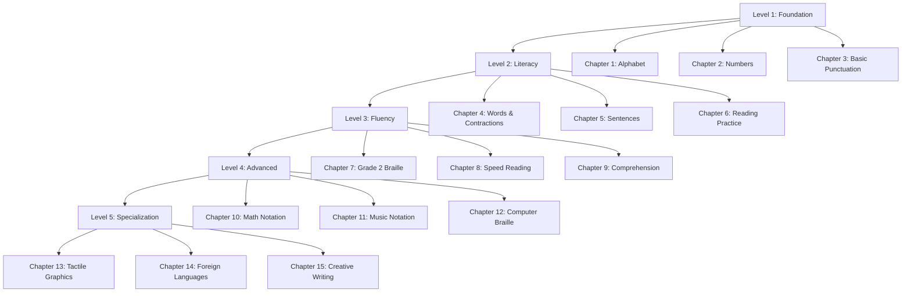

# Chapter 7: Curriculum Design & Pedagogical Framework

## 7.1 Curriculum Overview

The braille tutoring curriculum is structured as a **progressive, mastery-based learning path** that takes students from complete beginners to proficient braille readers. The curriculum is divided into five levels with multiple chapters and lessons.

### 7.1.1 Learning Philosophy

**Evidence-Based Principles:**
1. **Mastery Learning:** Students must achieve 80%+ proficiency before advancing
2. **Spaced Repetition:** Review intervals based on forgetting curve (Ebbinghaus)
3. **Multi-Sensory:** Tactile + auditory reinforcement
4. **Immediate Feedback:** AI provides real-time corrections
5. **Personalization:** Adaptive difficulty based on performance
6. **Scaffolding:** Gradual increase in complexity with support

### 7.1.2 Curriculum Structure



## 7.2 Level 1: Foundation (Beginner)

### 7.2.1 Chapter 1: The Alphabet (Lessons L001-L026)

**Learning Objectives:**
- Recognize all 26 letters of the alphabet in braille
- Distinguish between similar patterns (e.g., b/d, h/j)
- Develop tactile sensitivity and finger positioning
- Build confidence through progressive difficulty

**Lesson Structure (Example: L001 - Letter A):**

```json
{
  "lesson_id": "L001",
  "title": "Learning the Letter A",
  "level": "foundation",
  "chapter": "Alphabet",
  "duration_min": 10,
  "prerequisites": [],
  
  "learning_objectives": [
    "Identify the braille pattern for letter A (dot 1)",
    "Distinguish A from other single-dot patterns",
    "Practice reading A in context"
  ],
  
  "content": {
    "introduction": {
      "audio": "Welcome to your first braille lesson! Today we'll learn the letter A, the first letter of the alphabet. The letter A is very simple - it uses just one dot, located at the top left of the braille cell. Let's explore it together.",
      "duration_sec": 20
    },
    
    "demonstration": {
      "audio": "I'm printing the letter A for you now. Feel for a single raised dot at the top left position.",
      "print_content": "⠁",
      "tactile_guidance": "Use your index finger to gently scan from left to right. You should feel one raised dot."
    },
    
    "practice": [
      {
        "step": 1,
        "type": "recognition",
        "audio": "Feel this character. Is it the letter A?",
        "print_content": "⠁",
        "expected_answer": "yes",
        "feedback_correct": "Excellent! You correctly identified the letter A.",
        "feedback_incorrect": "Not quite. Remember, A has only one dot at position 1, the top left."
      },
      {
        "step": 2,
        "type": "discrimination",
        "audio": "Now I'll print two characters. Tell me which one is the letter A.",
        "print_content": "⠁ ⠃",
        "expected_answer": "first",
        "feedback_correct": "Perfect! The first character is A, with one dot. The second is B, with two dots.",
        "feedback_incorrect": "Let's try again. The letter A has only ONE dot at the top left. Feel each character carefully."
      },
      {
        "step": 3,
        "type": "context",
        "audio": "Great! Now find the letter A in this simple word: CAT",
        "print_content": "⠉⠁⠞",
        "expected_answer": "second position",
        "feedback_correct": "Yes! The A is in the middle of the word CAT."
      }
    ],
    
    "assessment": {
      "type": "quiz",
      "questions": [
        {
          "audio": "How many dots does the letter A have?",
          "expected_answers": ["one", "1"],
          "points": 25
        },
        {
          "audio": "I'm printing a character. What letter is it?",
          "print_content": "⠁",
          "expected_answers": ["a", "letter a"],
          "points": 25
        },
        {
          "audio": "Which position is the dot for letter A? Top left, top right, bottom left, or bottom right?",
          "expected_answers": ["top left"],
          "points": 25
        },
        {
          "audio": "Find the letter A in this word and tell me its position: HAT",
          "print_content": "⠓⠁⠞",
          "expected_answers": ["second", "middle", "2"],
          "points": 25
        }
      ],
      "passing_score": 80
    },
    
    "conclusion": {
      "audio": "Congratulations! You've successfully learned the letter A in braille. You can recognize it, distinguish it from other letters, and find it in words. Keep practicing, and soon it will become second nature. In our next lesson, we'll learn the letter B.",
      "reward": "achievement_first_letter"
    }
  }
}
```

**Lesson Progression (A-Z):**
- **L001-L005:** Vowels (A, E, I, O, U) - Start with familiar, high-frequency letters
- **L006-L015:** Common consonants (B, C, D, F, G, H, J, K, L, M)
- **L016-L026:** Remaining consonants (N, P, Q, R, S, T, V, W, X, Y, Z)

**Pedagogical Notes:**
- Group similar patterns together (e.g., B and L both have dots 1-2)
- Introduce mnemonic devices ("A is like a dot on an apple")
- Use frequent words for context (CAT, DOG, HAT)

### 7.2.2 Chapter 2: Numbers (Lessons L027-L036)

**Number Sign (⠼):**
In braille, numbers use the same patterns as letters A-J, preceded by a **number sign** (⠼).

| Number | Braille | Pattern |
|--------|---------|---------|
| 1 | ⠼⠁ | Number sign + A |
| 2 | ⠼⠃ | Number sign + B |
| 3 | ⠼⠉ | Number sign + C |
| 4 | ⠼⠙ | Number sign + D |
| 5 | ⠼⠑ | Number sign + E |
| 6 | ⠼⠋ | Number sign + F |
| 7 | ⠼⠛ | Number sign + G |
| 8 | ⠼⠓ | Number sign + H |
| 9 | ⠼⠊ | Number sign + I |
| 0 | ⠼⠚ | Number sign + J |

**Lesson Example (L027 - Number 1):**
- Introduce number sign concept
- Practice number 1 (⠼⠁)
- Distinguish between letter A and number 1
- Simple arithmetic: 1+1, counting

### 7.2.3 Chapter 3: Basic Punctuation (Lessons L037-L045)

**Common Punctuation:**
- Period: ⠲
- Comma: ⠂
- Question mark: ⠦
- Exclamation: ⠖
- Apostrophe: ⠄

**Lesson Focus:**
- Recognize punctuation marks
- Use punctuation in sentences
- Reading with proper phrasing

## 7.3 Level 2: Literacy (Intermediate)

### 7.3.1 Chapter 4: Words & Contractions (Lessons L046-L070)

**Grade 2 Braille Contractions:**
Grade 2 braille uses single-cell contractions for common words to increase reading speed.

**Examples:**
- **but** = ⠃
- **can** = ⠉
- **do** = ⠙
- **every** = ⠑
- **from** = ⠋
- **go** = ⠛
- **have** = ⠓
- **just** = ⠚
- **knowledge** = ⠅
- **like** = ⠇
- **more** = ⠍

**Lesson Structure:**
1. Introduce 3-5 contractions per lesson
2. Practice reading sentences with contractions
3. Dictation exercises (hear word, write in braille mentally)
4. Speed drills

### 7.3.2 Chapter 5: Sentences (Lessons L071-L085)

**Skills Developed:**
- Reading complete sentences fluently
- Understanding capitalization (⠠ symbol)
- Tracking across lines
- Context comprehension

**Sample Sentence Exercises:**
- "The cat sat on the mat." (⠠⠮ ⠉⠁⠞ ⠎⠁⠞ ⠕⠝ ⠮ ⠍⠁⠞⠲)
- "I can read braille!" (⠠⠊ ⠉ ⠗⠑⠁⠙ ⠃⠗⠇⠖)

### 7.3.3 Chapter 6: Reading Practice (Lessons L086-L100)

**Objectives:**
- Improve reading speed (target: 40-60 WPM)
- Enhance comprehension
- Read short stories and passages

**Sample Passage (Lesson L095 - Fable):**
```
The Tortoise and the Hare

Once upon a time, a hare laughed at a tortoise for being slow. 
The tortoise challenged the hare to a race. The hare, confident 
of winning, took a nap during the race. The tortoise kept going 
and won the race!

Moral: Slow and steady wins the race.
```

**Comprehension Questions:**
1. Who laughed at the tortoise?
2. What did the hare do during the race?
3. Who won the race?
4. What is the moral of the story?

## 7.4 Level 3: Fluency (Advanced)

### 7.4.1 Chapter 7: Grade 2 Braille Mastery (Lessons L101-L125)

**Advanced Contractions:**
- **ble**: able, table, possible
- **tion**: action, nation, question
- **ing**: going, running, speaking
- **ed**: walked, jumped, played

**Multi-cell contractions:**
- **ound** = ⠨⠙
- **ount** = ⠨⠞
- **ence** = ⠰⠑
- **ance** = ⠰⠁

### 7.4.2 Chapter 8: Speed Reading (Lessons L126-L140)

**Techniques:**
- **Chunking:** Read words as units, not letter-by-letter
- **Skimming:** Quickly identify main ideas
- **Scanning:** Find specific information

**Target Speeds:**
- Beginner: 20-40 WPM
- Intermediate: 40-80 WPM
- Advanced: 80-120 WPM
- Expert: 120-200 WPM

**Timed Reading Exercises:**
- 1-minute passages with WPM calculation
- Gradual increase in passage difficulty
- AI tracks progress and adjusts content

## 7.5 Level 4: Advanced Topics

### 7.5.1 Chapter 10: Nemeth Code (Math Notation)

**Mathematical Symbols:**
- Plus: ⠬
- Minus: ⠤
- Multiply: ⠡
- Divide: ⠌
- Equals: ⠀⠨⠅
- Fraction: ⠹⠼⠁⠌⠼⠃⠼ (1/2)

**Sample Math Problem (Lesson L150):**
```
Solve: 3 + 4 = ?

Braille: ⠼⠉⠬⠼⠙⠀⠨⠅⠀⠼⠛

Answer: 7
```

**Topics Covered:**
- Basic arithmetic
- Fractions and decimals
- Algebra (variables, equations)
- Geometry (shapes, angles)

### 7.5.2 Chapter 11: Music Notation (Lessons L161-L175)

**Musical Braille Basics:**
- Notes: ⠙ (D), ⠑ (E), ⠋ (F), etc.
- Octave marks
- Note duration (whole, half, quarter notes)
- Time signatures

**Sample Exercise:**
Print and read simple melodies like "Twinkle Twinkle Little Star"

### 7.5.3 Chapter 12: Computer Braille Code (Lessons L176-L190)

**Programming Symbols:**
- Brackets: [ ] { } ( )
- Operators: < > = == != && ||
- Special characters: @ # $ % ^ &

**Sample Code (Python):**
```python
for i in range(10):
    print(i)
```

Translated to computer braille for tactile reading

## 7.6 Level 5: Specialization

### 7.6.1 Chapter 13: Tactile Graphics (Lessons L191-L205)

**Skills:**
- Interpret raised-line diagrams
- Understand spatial relationships

**Lesson Example:**
- Print simple shapes (square, circle, triangle)
- Maps with tactile landmarks
- Bar charts and graphs in tactile form

### 7.6.2 Chapter 14: Foreign Languages (Lessons L206-L225)

**Supported Languages:**
- Spanish braille (with unique symbols: ñ, á, é, í, ó, ú)
- French braille (accents, special characters)
- German braille (ä, ö, ü, ß)
- Arabic braille (right-to-left)
- Hindi braille (Devanagari script)

**Lesson Structure:**
- Alphabet in target language
- Common phrases
- Reading short texts

### 7.6.3 Chapter 15: Creative Writing (Lessons L226-L250)

**Activities:**
- Story composition
- Poetry writing in braille
- Journal entries
- Peer sharing (if multi-user feature enabled)

**AI Tutor Role:**
- Provide writing prompts
- Give constructive feedback on grammar and creativity
- Encourage self-expression

## 7.7 Assessment & Evaluation

### 7.7.1 Formative Assessment

**Ongoing Evaluation During Lessons:**
- **Real-time feedback:** Immediate correction of errors
- **Progress tracking:** % completion, accuracy, speed
- **Adaptive difficulty:** Easier/harder content based on performance

**Metrics Collected:**
```json
{
  "lesson_id": "L001",
  "user_id": "user123",
  "timestamp": "2025-11-16T14:30:00Z",
  "metrics": {
    "completion_time_sec": 600,
    "accuracy_percent": 85,
    "attempts": {
      "first_try_correct": 3,
      "needed_hints": 1,
      "incorrect_answers": 0
    },
    "quiz_score": 90,
    "reading_speed_wpm": null
  }
}
```

### 7.7.2 Summative Assessment

**End-of-Chapter Tests:**
- Comprehensive quiz covering all chapter content
- Minimum 80% to unlock next chapter
- Certificate awarded upon completion

**End-of-Level Exams:**
- Formal assessment of all skills in level
- Reading speed test
- Comprehension test
- Writing/composition test (for advanced levels)

**Certification:**
- **Foundation Certificate:** Complete Level 1
- **Literacy Certificate:** Complete Level 2
- **Fluency Certificate:** Complete Level 3
- **Advanced Certificate:** Complete Level 4
- **Master Certificate:** Complete Level 5

### 7.7.3 Analytics Dashboard (for Educators)

**Teacher/Parent View:**
```
Student: John Doe
Age: 12
Enrollment: Oct 1, 2025

Progress Summary:
- Current Level: 2 (Literacy)
- Lessons Completed: 65/250 (26%)
- Average Score: 87%
- Reading Speed: 52 WPM
- Time Spent: 15 hours

Strengths:
- Excellent recall of alphabet
- Strong punctuation skills

Areas for Improvement:
- Confusion between contractions "for" and "from"
- Speed could be improved

Recommendations:
- Additional practice on contractions (Chapter 4)
- Daily 10-minute speed reading exercises
```

## 7.8 Personalization & Adaptive Learning

### 7.8.1 AI Tutor Personalization

**Adaptation Strategies:**

1. **Pace Adjustment:**
   - Fast learners: Skip review, faster progression
   - Slower learners: More repetition, additional practice

2. **Content Selection:**
   - Interest-based: Sports, science, stories tailored to student interests
   - Difficulty scaling: Sentence complexity adjusted

3. **Feedback Style:**
   - Encouraging for struggling students
   - Challenging for advanced students

4. **Mnemonic Generation:**
   - AI creates personalized memory aids based on student's background

**Example:**
If a student loves dogs, the AI might say:
"Think of the letter B as two dots stacked like a dog's nose and mouth!"

### 7.8.2 Learning Path Customization

**Student Profiles:**
- **Age:** Lessons adapted for children vs. adults
- **Prior Knowledge:** Skip basics if student already knows alphabet
- **Goals:** Career-focused (Nemeth for STEM) vs. leisure reading
- **Learning Style:** Auditory, kinesthetic, mixed

## 7.9 Gamification & Motivation

### 7.9.1 Achievements & Badges

**Examples:**
- 🏆 **First Lesson Complete** - Finish lesson L001
- ⭐ **Perfect Score** - Get 100% on any quiz
- 🔥 **7-Day Streak** - Practice for 7 consecutive days
- 📚 **Bookworm** - Complete 50 lessons
- 🚀 **Speed Demon** - Read at 100 WPM
- 🎓 **Graduate** - Complete all 250 lessons

### 7.9.2 Leaderboards (Optional)

**Privacy-Conscious:**
- Anonymous usernames only
- Opt-in feature
- Filter by age group or level

**Categories:**
- Most lessons completed this week
- Highest reading speed
- Longest streak

### 7.9.3 Daily Challenges

**Examples:**
- "Read 3 new words today"
- "Practice for 15 minutes"
- "Complete a quiz with 90%+ score"

**Rewards:**
- XP points
- Unlock new avatar customizations
- Special badges

## 7.10 Content Development Pipeline

### 7.10.1 Lesson Creation Process

**Steps:**
1. **Instructional Design:** Define learning objectives, prerequisites
2. **Content Writing:** Write audio scripts, create exercises
3. **Braille Encoding:** Convert text to braille Unicode
4. **AI Tutor Training:** Fine-tune GPT prompts for each lesson
5. **Quality Assurance:** Blind user testing for accessibility
6. **Iteration:** Refine based on feedback

**Timeline:** 2-3 days per lesson (250 lessons = ~18 months full curriculum)

### 7.10.2 Community Contributions

**Open-Source Lessons:**
- GitHub repository for lesson content
- Community can submit new lessons, translations
- Review and approval process by accessibility experts

**Moderation:**
- Ensure pedagogical quality
- Verify braille accuracy
- Test with real users

## 7.11 Summary

This chapter outlined a comprehensive 250-lesson curriculum:

**Structure:**
- 5 levels from foundation to specialization
- 15 chapters covering alphabet, numbers, literacy, advanced topics
- Progressive difficulty with mastery-based advancement

**Pedagogy:**
- Evidence-based learning principles
- Multi-sensory approach (tactile + audio)
- Immediate AI feedback and personalization
- Gamification for motivation

**Assessment:**
- Formative (ongoing) and summative (chapter/level tests)
- Analytics for educators and learners
- Adaptive difficulty based on performance

**Next Chapter:** Prototype development plan and testing methodology.

---
