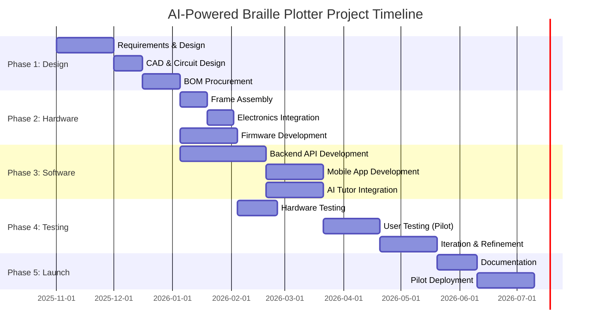
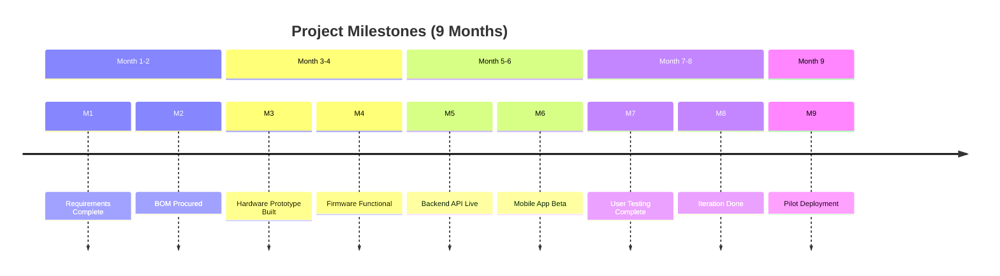

# Chapter 8: Timeline, Milestones & Project Plan

## 8.1 Project Phases Overview

The project is structured in **5 major phases** over a **9-month period** from concept to working prototype and pilot deployment.

## 8.2 Phase 1: Design & Planning (Weeks 1-10)

### 8.2.1 Week 1-2: Requirements Finalization

**Activities:**
- Conduct stakeholder interviews (blind users, educators, accessibility experts)
- Define detailed functional requirements
- Finalize hardware specifications
- Create project charter and risk register

**Deliverables:**
- Requirements document (functional & non-functional)
- Success criteria and acceptance tests
- Risk mitigation plan

**Team:**
- Project Manager
- Accessibility Consultant
- Hardware Engineer
- Software Engineer

### 8.2.2 Week 3-5: Mechanical & Electrical Design

**Activities:**
- CAD design of frame, carriage, stylus mount (SolidWorks/Fusion 360)
- Circuit schematic design (KiCad/Eagle)
- PCB layout (optional for v1.0, use breadboard)
- Simulate motion paths and print area
- Select suppliers for components

**Deliverables:**
- 3D CAD files (STL for 3D printing, DXF for laser cutting)
- Circuit schematic (PDF + editable source)
- Bill of Materials (BOM) with part numbers
- Supplier quotes and lead times

**Tools:**
- Fusion 360 (free for education/startups)
- KiCad (open-source PCB design)
- FreeCAD (open-source mechanical)

### 8.2.3 Week 6-8: Firmware Architecture

**Activities:**
- Set up ESP32 development environment (Arduino IDE / PlatformIO)
- Design firmware state machine
- Implement basic motion control (homing, moveAbsolute)
- Develop BLE GATT profile and command parser
- Write unit tests for critical functions

**Deliverables:**
- Firmware source code (GitHub repository)
- Architecture documentation
- Unit test suite

**Libraries Used:**
- AccelStepper
- ESP32Servo
- BLEDevice (ESP32 built-in)

### 8.2.4 Week 9-10: Component Procurement

**Activities:**
- Place orders for all BOM items (electronics, mechanical)
- Track shipments and manage inventory
- Prepare assembly workspace and tools

**Vendors:**
- Amazon, Aliexpress (electronics)
- McMaster-Carr (fasteners, bearings)
- Local hardware store (aluminum extrusion, acrylic)
- 3D printing service or in-house FDM printer

**Lead Times:**
- Domestic: 3-7 days
- International (China): 2-4 weeks
- Custom 3D prints: 1-2 weeks

## 8.3 Phase 2: Hardware & Firmware (Weeks 11-20)

### 8.3.1 Week 11-12: Frame Assembly

**Tasks:**
- Cut aluminum extrusion to length
- Assemble frame with corner brackets
- Mount linear rods and bearings
- Install GT2 belts and pulleys
- Attach stepper motors

**Testing:**
- Verify frame is square (measure diagonals)
- Check smooth motion of carriages (no binding)
- Test belt tension

**Milestone:** Mechanical assembly complete, motors can move carriages manually

### 8.3.2 Week 13-14: Electronics Integration

**Tasks:**
- Wire ESP32, stepper drivers, power supply per schematic
- Solder connections or use breadboard/perfboard
- Mount limit switches and paper sensor
- Attach servo motor and stylus mechanism
- Cable management (zip ties, drag chain)

**Testing:**
- Continuity tests (multimeter)
- Power-on test (check voltages: 12V, 5V, 3.3V)
- Upload basic firmware (LED blink test)
- Test each motor individually (jog commands)

**Milestone:** All electronics powered and communicating with ESP32

### 8.3.3 Week 15-17: Firmware Development

**Core Features:**
- **Homing routine:** Use limit switches to find origin
- **Motion control:** AccelStepper integration, path planning
- **Stylus actuation:** Servo control with timing
- **BLE server:** Implement GATT service, handle commands
- **Status reporting:** Send progress updates to app
- **Error handling:** Detect faults, enter safe mode

**Testing:**
- Print test pattern (grid of dots)
- Measure accuracy (caliper verification of dot spacing)
- Stress test (continuous operation for 1 hour)

**Milestone:** Firmware can receive print job via BLE and execute accurately

### 8.3.4 Week 18-20: Hardware Refinement

**Activities:**
- Calibrate steps-per-mm for both axes
- Tune servo angles for optimal dot depth
- Adjust acceleration/speed for smooth motion
- Test on different paper thicknesses (140-160 GSM)
- Improve cable management and aesthetics

**Testing:**
- Print braille alphabet (A-Z) and verify tactile readability
- Blind user testing for dot quality
- Document optimal settings (speed, depth, paper type)

**Milestone:** Hardware prototype validated and ready for software integration

## 8.4 Phase 3: Software Development (Weeks 15-25)

### 8.4.1 Week 15-20: Backend API (Node.js)

**Features:**
- User authentication (JWT)
- Text-to-braille translation (Liblouis integration)
- Image-to-tactile conversion (OpenCV + Python microservice)
- Lesson content API (MongoDB)
- Progress tracking (PostgreSQL)
- AI tutor endpoints (OpenAI GPT-4 integration)

**Database Setup:**
- PostgreSQL for user data, progress, print jobs
- MongoDB for lesson content (JSON documents)
- Redis for caching and session management

**Testing:**
- Postman API tests
- Unit tests (Jest)
- Integration tests (Supertest)

**Deployment:**
- Docker containers
- Deploy to AWS EC2 or Google Cloud Run
- Set up CI/CD pipeline (GitHub Actions)

**Milestone:** Backend API deployed and accessible via HTTPS

### 8.4.2 Week 20-23: Mobile App (React Native)

**Features:**
- Onboarding and authentication
- Device scanner and BLE connection
- Print job creation (text input, image upload)
- Lesson browser and active lesson UI
- Voice command handler
- Progress dashboard with charts
- Settings and preferences

**Screens:**
- Splash, Login/Register
- Home, Lessons, Device, Progress, Settings
- Lesson Detail, Active Lesson
- Device Controller, Print Queue

**Testing:**
- Manual testing on iOS (TestFlight) and Android (Google Play Console)
- Accessibility testing with VoiceOver/TalkBack
- BLE connectivity testing with prototype device

**Milestone:** App successfully connects to device and sends print jobs

### 8.4.3 Week 23-25: AI Tutor Integration

**Activities:**
- Write system prompts for GPT-4 tutor persona
- Implement lesson script generation
- Integrate speech-to-text (Whisper API)
- Integrate text-to-speech (ElevenLabs)
- Build conversation flow (multi-turn dialogues)
- Adaptive learning algorithm (Leitner system)

**Testing:**
- Test with sample lessons (L001-L010)
- Evaluate AI responses for accuracy and tone
- Measure latency (target <3 sec end-to-end)

**Milestone:** AI tutor can conduct a full lesson with voice interaction

## 8.5 Phase 4: Testing & Iteration (Weeks 26-35)

### 8.5.1 Week 26-28: Hardware Testing

**Test Plan:**

| Test Case | Description | Pass Criteria | Status |
|-----------|-------------|---------------|--------|
| **T-HW-001** | Homing accuracy | Returns to (0,0) ±0.2mm | |
| **T-HW-002** | Dot spacing | 2.5mm ±0.1mm center-to-center | |
| **T-HW-003** | Dot height | 0.6mm ±0.1mm on 150 GSM | |
| **T-HW-004** | Print speed | 15-30 characters/min | |
| **T-HW-005** | Continuous operation | 2 hours without failure | |
| **T-HW-006** | Paper handling | 140-160 GSM without jamming | |
| **T-HW-007** | BLE range | 10m line-of-sight | |
| **T-HW-008** | Power consumption | <50W average | |

**Reliability Testing:**
- 100,000 dot cycle test
- Temperature stress (ambient 15-35°C)
- Vibration test (desktop movement)

**Milestone:** Hardware passes all acceptance tests

### 8.5.2 Week 29-31: User Acceptance Testing (UAT)

**Participants:**
- 5-10 blind or low-vision individuals
- 2-3 special education teachers
- 2-3 sighted caregivers/parents

**Testing Protocol:**
1. **Onboarding:** Can user set up device with minimal assistance?
2. **First lesson:** Complete lesson L001 (Letter A) independently
3. **Print job:** User dictates text, app translates and prints
4. **Image conversion:** Upload photo, review tactile output
5. **Voice commands:** "Start lesson on letter B", "Print hello"
6. **Usability:** SUS (System Usability Scale) questionnaire
7. **Accessibility:** VoiceOver/TalkBack compatibility

**Data Collected:**
- Task completion rate (%)
- Time on task (minutes)
- Error count
- User satisfaction (1-5 Likert scale)
- Qualitative feedback (interviews)

**Sample Questions:**
- "Was the tactile output clear and easy to read?"
- "Did the AI tutor provide helpful feedback?"
- "Would you use this device regularly for learning braille?"

**Success Criteria:**
- 90%+ task completion rate
- SUS score ≥70 (above average)
- 80%+ users would recommend to others

**Milestone:** Positive feedback from blind user testing, identified improvements

### 8.5.3 Week 32-35: Iteration & Refinement

**Based on UAT Feedback:**

**Example Issues & Fixes:**

| Issue Identified | Priority | Solution | Timeline |
|------------------|----------|----------|----------|
| Dots too shallow on 160 GSM | High | Increase servo angle by 5° | Week 32 |
| Voice commands slow (5s latency) | Medium | Optimize API, cache common responses | Week 33 |
| Difficulty navigating app (VoiceOver) | High | Improve accessibility labels | Week 32 |
| Lesson too long (15 min) | Medium | Break into shorter 5-min segments | Week 34 |
| Paper slips during printing | Medium | Add rubber mat under paper | Week 33 |

**Re-testing:**
- Implement fixes
- Conduct round 2 UAT with subset of users (3-5)
- Validate improvements

**Milestone:** All critical and high-priority issues resolved

## 8.6 Phase 5: Documentation & Pilot (Weeks 36-40)

### 8.6.1 Week 36-37: Documentation

**User Documentation:**
- **Quick Start Guide:** Unboxing, setup, first print (illustrated PDF)
- **User Manual:** Full feature guide, troubleshooting (50+ pages)
- **Video Tutorials:** YouTube series (setup, first lesson, app tour)
- **Accessibility Guide:** VoiceOver/TalkBack usage

**Developer Documentation:**
- **Hardware Assembly Guide:** Step-by-step with photos
- **Firmware Guide:** Code structure, flashing firmware, debugging
- **API Documentation:** Swagger/OpenAPI spec
- **App Development:** Contribution guide for open-source developers

**Educator Documentation:**
- **Teacher's Guide:** Lesson structure, tracking student progress
- **Curriculum Overview:** Learning objectives by chapter
- **FAQ:** Common questions from educators

**Deliverables:**
- All documentation published to project website
- GitHub repository with README, CONTRIBUTING, LICENSE
- Video tutorials on YouTube channel

### 8.6.2 Week 38-40: Pilot Deployment

**Pilot Sites (3-5 locations):**
- Special education school (10 students)
- NGO for the blind (5 adult learners)
- Individual home users (3 families)

**Pilot Objectives:**
- Validate device reliability in real-world settings
- Collect long-term usage data (3 months)
- Measure learning outcomes (pre/post braille proficiency tests)
- Identify maintenance and support needs

**Support Plan:**
- Weekly check-ins (video call)
- Dedicated support email/chat
- Remote firmware updates (OTA if possible)
- On-site visits if needed

**Data Collection:**
- Device logs (print jobs, errors, uptime)
- User progress (lessons completed, scores)
- Feedback surveys (monthly)
- Learning outcomes (braille reading test at 0, 1, 3 months)

**Milestone:** Pilot deployment complete, 90%+ device uptime, positive user feedback

## 8.7 Key Milestones Summary

**Major Milestones:**
- **M1 (Week 2):** Requirements and design finalized
- **M2 (Week 10):** All components procured
- **M3 (Week 14):** Hardware prototype assembled
- **M4 (Week 17):** Firmware can print braille
- **M5 (Week 20):** Backend API deployed
- **M6 (Week 23):** Mobile app beta ready
- **M7 (Week 28):** Hardware testing complete
- **M8 (Week 31):** User acceptance testing done
- **M9 (Week 35):** Iteration and refinement complete
- **M10 (Week 40):** Pilot deployment launched

## 8.8 Resource Allocation

### 8.8.1 Team Structure

| Role | Responsibility | Time Allocation | Weeks Active |
|------|----------------|-----------------|--------------|
| **Project Manager** | Planning, coordination, stakeholder communication | Part-time (20 hrs/week) | 1-40 |
| **Hardware Engineer** | Mechanical design, assembly, testing | Full-time | 1-20, 26-28 |
| **Firmware Developer** | ESP32 firmware, BLE, motion control | Full-time | 6-20 |
| **Backend Developer** | Node.js API, database, AI integration | Full-time | 15-25 |
| **Mobile Developer** | React Native app, BLE, UI/UX | Full-time | 20-28 |
| **AI/ML Engineer** | Image processing, GPT tutor, speech APIs | Part-time (20 hrs/week) | 15-28 |
| **Accessibility Consultant** | User testing, WCAG compliance, curriculum review | Part-time (10 hrs/week) | 1-35 |
| **Technical Writer** | Documentation, user guides, videos | Part-time (20 hrs/week) | 32-40 |

**Total Team:** 5 full-time equivalents (FTEs) over 9 months

### 8.8.2 Budget Breakdown

| Category | Description | Cost (USD) |
|----------|-------------|------------|
| **Hardware Prototype** | Components, tools, 3D printing | $500 |
| **Pilot Units (5x)** | Manufacturing 5 units | $1,500 |
| **Development Tools** | Software licenses, cloud services | $800 |
| **User Testing** | Compensation for testers, accessibility experts | $1,000 |
| **Salaries** | Team (5 FTE × 9 months, outsourced/contract) | $90,000 |
| **Marketing** | Website, video production, outreach | $1,200 |
| **Travel** | Pilot site visits, conferences | $1,500 |
| **Contingency (15%)** | Unexpected costs | $14,500 |
| **Total** | | **$110,000** |

**Funding Sources:**
- University research grant
- Accessibility-focused VC/angel investors
- Crowdfunding (Kickstarter, Indiegogo)
- Government innovation grants (NSF SBIR, EU Horizon)
- NGO partnerships

## 8.9 Risk Management

### 8.9.1 Technical Risks

| Risk | Probability | Impact | Mitigation |
|------|-------------|--------|------------|
| **Component supply chain delays** | Medium | High | Order early, identify alternative suppliers |
| **Firmware bugs causing misprints** | Medium | Medium | Extensive testing, unit tests, version control |
| **BLE connectivity issues** | Low | Medium | Use proven libraries, test across devices |
| **AI tutor inaccurate responses** | Medium | High | Prompt engineering, human review, feedback loop |
| **Paper jamming/inconsistent dots** | High | High | Test multiple paper types, adjustable depth |

### 8.9.2 Schedule Risks

| Risk | Mitigation |
|------|------------|
| **Procurement delays** | Add 2-week buffer, order critical items first |
| **Scope creep** | Strict change management, prioritize MVP features |
| **Testing takes longer** | Allocate extra iteration time (Weeks 32-35) |

### 8.9.3 User Adoption Risks

| Risk | Mitigation |
|------|------------|
| **Users find device too complex** | Simplify UI, provide video tutorials, voice-first design |
| **Tactile output not readable** | Consult blind users early, iterate on dot quality |
| **Low engagement with lessons** | Gamification, personalized content, short lessons |

## 8.10 Success Metrics (KPIs)

### 8.10.1 Technical Metrics
- **Dot accuracy:** 95%+ dots correctly formed
- **Positioning error:** <0.2mm
- **MTBF:** 500+ hours
- **Print speed:** 15-30 characters/minute

### 8.10.2 User Metrics
- **SUS score:** ≥70 (above average usability)
- **Task completion rate:** ≥90%
- **Lesson completion rate:** ≥60% of users complete 10+ lessons
- **User retention:** 70%+ active after 1 month

### 8.10.3 Learning Outcomes
- **Braille proficiency:** 80%+ users can read Grade 1 braille after 6 weeks
- **Reading speed:** Average 40+ WPM after completing Level 2
- **User satisfaction:** 4+/5 stars average rating

## 8.11 Post-Pilot Plans

### 8.11.1 Months 10-12: Production Preparation
- Finalize design for manufacturing (DFM)
- Source contract manufacturer
- Set up quality control processes
- Plan for initial production run (50-100 units)

### 8.11.2 Year 2: Scale & Improve
- **Q1:** Launch crowdfunding campaign, pre-orders
- **Q2:** Ship first 100 units to backers
- **Q3:** Iterate based on user feedback, expand curriculum
- **Q4:** Partner with schools/NGOs for bulk orders

### 8.11.3 Long-term Vision (Year 3+)
- Multi-stylus head for faster printing (60 cps)
- Embossing head for permanent dots (like commercial embossers)
- Cloud lesson marketplace (community-created content)
- Multi-user classrooms with teacher dashboard
- Integration with e-book platforms (accessible textbooks)

## 8.12 Summary

This chapter laid out a detailed 9-month timeline:

**5 Phases:**
1. Design & Planning (10 weeks)
2. Hardware & Firmware (10 weeks)
3. Software Development (11 weeks, parallel with Phase 2)
4. Testing & Iteration (10 weeks)
5. Documentation & Pilot (5 weeks)

**Key Deliverables:**
- Working hardware prototype
- ESP32 firmware with BLE
- Cloud backend API
- React Native mobile app
- AI tutor integration
- Comprehensive documentation
- Pilot deployment with 3-5 sites

**Resource Requirements:**
- 5 FTE team
- $110,000 budget
- 9-month timeline

**Next Chapter:** Market analysis and business model.

---
