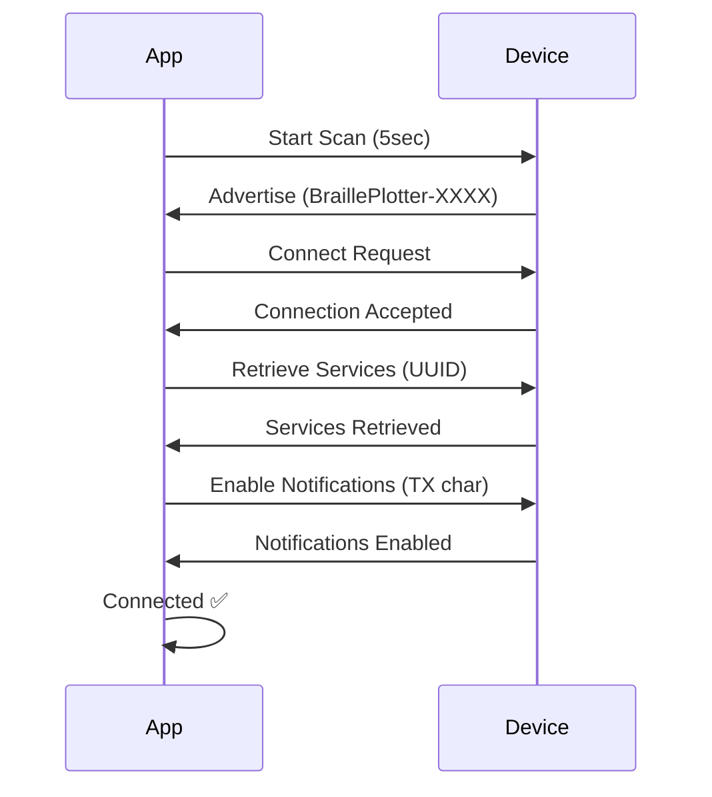

# 🎯 Braille Tutor - AI-Powered Mobile App

**Professional React Native application for interactive braille learning with real-time device control, voice commands, and AI tutoring.**

---

## ✨ Features

### 🏠 Core Functionality
- ✅ **AI-Powered Tutoring** - GPT-4 powered conversational learning
- ✅ **Voice Commands** - Hands-free operation in 10+ languages
- ✅ **Real-Time Device Control** - BLE connection with braille plotter
- ✅ **250+ Lessons** - Structured curriculum from beginner to advanced
- ✅ **Progress Analytics** - Comprehensive tracking with visualizations
- ✅ **Image-to-Braille** - Convert photos to tactile graphics
- ✅ **Offline Mode** - Cached lessons work without internet

### 🎨 UI/UX Excellence
- 🌙 **Dark Mode** - Premium, eye-friendly dark theme
- ⚡ **Smooth Animations** - 60fps transitions with Reanimated
- 📱 **Responsive Design** - Works on all screen sizes
- ♿ **Accessibility First** - VoiceOver/TalkBack optimized
- 🎭 **Haptic Feedback** - Tactile responses for actions
- 🎨 **Modern Design** - Gradient effects, glassmorphism

### 🔧 Technical Features
- 📡 **BLE Integration** - Real-time motor acknowledgments
- 🎤 **Voice Recognition** - Whisper API for speech-to-text
- 🔊 **Text-to-Speech** - Natural voice feedback
- 📊 **Live Progress Tracking** - Dot-by-dot print monitoring
- 🔄 **Redux Persist** - Offline-first data management
- 🚀 **Performance Optimized** - Lazy loading, memoization

---

## 🏗️ Architecture

### Navigation Structure
```
RootNavigator
├── Auth Stack (Unauthenticated)
│   ├── SplashScreen
│   ├── LoginScreen
│   └── RegisterScreen
│
└── Main Stack (Authenticated)
    ├── MainTabNavigator
    │   ├── HomeScreen (Tab 1)
    │   ├── LessonsScreen (Tab 2)
    │   ├── DeviceScreen (Tab 3)
    │   ├── ProgressScreen (Tab 4)
    │   └── SettingsScreen (Tab 5)
    │
    ├── LessonDetailScreen (Modal)
    └── ActiveLessonScreen (Full Screen)
```

### State Management (Redux Toolkit)
```javascript
store/
├── index.ts (Store configuration)
└── slices/
    ├── authSlice.ts (User authentication)
    ├── deviceSlice.ts (BLE device management)
    ├── lessonsSlice.ts (Curriculum progress)
    ├── tutorSlice.ts (AI chat history)
    ├── analyticsSlice.ts (User statistics)
    └── settingsSlice.ts (App preferences)
```

### Screen Components
```
screens/
├── Auth/
│   ├── SplashScreen.tsx
│   ├── LoginScreen.tsx
│   └── RegisterScreen.tsx
├── Home/
│   └── HomeScreen.tsx (Quick actions, recent activity)
├── Lessons/
│   ├── LessonsScreen.tsx (Lesson browser)
│   ├── LessonDetailScreen.tsx (Lesson preview)
│   └── ActiveLessonScreen.tsx (Interactive lesson)
├── Device/
│   └── DeviceScreen.tsx (BLE control, print queue)
├── Progress/
│   └── ProgressScreen.tsx (Analytics dashboard)
└── Settings/
    └── SettingsScreen.tsx (Preferences)
```

---

## 🚀 Getting Started

### Prerequisites
- **Node.js** 18+ ([Install](https://nodejs.org/))
- **Expo CLI** `npm install -g expo-cli`
- **iOS Simulator** (Mac only) or **Android Studio** ([Setup Guide](https://reactnative.dev/docs/environment-setup))
- **Physical Device** (Recommended for BLE testing)

### Installation

```bash
# Navigate to app directory
cd /Users/vikrant/Documents/DFP-13/BrailleTutorApp

# Install dependencies
npm install

# Start development server
npm start

# Run on iOS (requires Mac + Xcode)
npm run ios

# Run on Android
npm run android

# Run on web (limited BLE support)
npm run web
```

### Environment Setup

Create `.env` file:
```env
API_BASE_URL=https://api.brailleplotter.com/v1
OPENAI_API_KEY=your_openai_key_here
ELEVENLABS_API_KEY=your_elevenlabs_key_here
```

---

## 📦 Dependencies

### Core
- `react-native` 0.72.6
- `expo` ~49.0.15
- `@react-navigation/native` ^6.1.9
- `@reduxjs/toolkit` ^1.9.7
- `react-redux` ^8.1.3

### Device Communication
- `react-native-ble-manager` ^10.1.0
- `@react-native-voice/voice` ^3.2.4
- `axios` ^1.6.2

### UI/UX
- `expo-linear-gradient` ~12.3.0
- `react-native-reanimated` ~3.3.0
- `react-native-gesture-handler` ~2.12.0
- `lottie-react-native` 6.0.1
- `react-native-vector-icons` ^10.0.3

### Analytics
- `react-native-chart-kit` ^6.12.0
- `react-native-svg` 13.9.0

---

## 🎨 Design System

### Color Palette
```javascript
Primary: #6C63FF (Vibrant Purple)
Secondary: #FF6584 (Warm Pink)
Success: #2DD4BF (Teal)
Background: #0F0F1E (Deep Dark Blue)
Surface: #252541 (Elevated Card)
Text: #FFFFFF (Primary White)
```

### Typography
- **Headings:** System Font (SF Pro / Roboto)
- **Body:** 16px, Line Height 1.5
- **Accessible:** Dynamic Type support

### Spacing (8px Grid)
- xs: 4px, sm: 8px, md: 16px
- lg: 24px, xl: 32px, xxl: 48px

---

## 📱 Screen Details

### 1. Home Screen
**Features:**
- Quick actions (Start Voice Lesson, Print Text, Learn Letter)
- Device connection status widget
- Recent activity timeline
- Lesson progress ring chart
- Voice command button (floating action)

**Animations:**
- Fade-in on mount
- Card slide-up transitions
- Pulse animation on voice button

### 2. Lessons Screen
**Features:**
- Filterable lesson list (by level, chapter, completion)
- Search functionality
- Lesson cards with progress indicators
- Chapter grouping with collapsible sections
- "Continue where you left off" banner

**Interactions:**
- Swipe to favorite
- Long press for lesson preview
- Pull-to-refresh

### 3. Device Screen
**Features:**
- BLE device scanner with RSSI indicators
- Connection manager (connect/disconnect)
- Live print monitor with:
  - Real-time position (X/Y coordinates)
  - Progress bar (dots completed / total)
  - ETA calculation
  - Connection health indicator
  - Last acknowledgment timestamp
- Print queue with drag-to-reorder
- Pause/Resume/Cancel controls
- Home device button (calibration)

**Real-Time Updates:**
- Motor acknowledgments (dot_complete, row_complete)
- Progress percentage
- Error notifications with recovery options

### 4. Progress Screen
**Features:**
- Summary cards (Lessons Completed, Avg Score, Streak, Reading Speed)
- Weekly activity heatmap
- Mastery by topic (Alphabet 80%, Numbers 60%, etc.)
- Achievement badges
- Timeline of completed lessons

**Visualizations:**
- Line chart (progress over time)
- Pie chart (time spent by chapter)
- Bar chart (scores by lesson)

### 5. Settings Screen
**Features:**
- Voice speed slider (0.5x - 2.0x)
- Audio volume control
- Dot depth adjustment (0.5-0.8mm)
- Print speed (Slow/Normal/Fast)
- Language selection (10+ languages)
- Notifications toggle
- Dark mode toggle (auto-detect system)
- Haptic feedback toggle
- Account management (logout, delete data)

---

## 🔌 BLE Integration

### Connection Flow


### Command Protocol
```javascript
// Send print job
{
  "cmd": "print",
  "data": {
    "job_id": "1234567890",
    "dots": [[0,0], [2.5,0], ...],
    "settings": { "dot_depth": 0.6 }
  }
}

// Receive acknowledgment
{
  "type": "dot_complete",
  "job_id": "1234567890",
  "dot_index": 42,
  "position": {"x": 15.5, "y": 8.2},
  "timestamp": 1701360000
}
```

---

## 🎤 Voice Commands

### Supported Commands
- "Start lesson on letter A" → Navigate to lesson
- "Print hello world" → Translate and print
- "Connect to device" → BLE scan & connect
- "Read my progress" → TTS analytics summary
- "Pause printing" → Pause current job
- "Home device" → Run homing sequence

### Implementation
```javascript
import Voice from '@react-native-voice/voice';

Voice.onSpeechResults = (event) => {
  const command = event.value[0].toLowerCase();
  processCommand(command);
};
```

---

## 📊 Performance Optimizations

### Rendering
- **React.memo()** on expensive components
- **useMemo() / useCallback()** for derived state
- **FlatList** with `getItemLayout` for lists
- **Lazy loading** for lesson content

### Animations
- **Reanimated 2** for 60fps native animations
- **Spring animations** for natural feel
- **InteractionManager** to defer heavy work

### Network
- **Redux Thunk** for async actions
- **Axios interceptors** for token refresh
- **Request debouncing** for search
- **Image caching** with FastImage

---

## ♿ Accessibility

### VoiceOver / TalkBack Support
```javascript
<TouchableOpacity
  accessible={true}
  accessibilityLabel="Start voice lesson"
  accessibilityHint="Double tap to begin interactive lesson"
  accessibilityRole="button"
>
  <Text>🎤 Start Voice Lesson</Text>
</TouchableOpacity>
```

### Features
- **Semantic labels** on all interactive elements
- **Minimum touch target:** 44×44pt
- **High contrast mode** support
- **Dynamic Type** (font scaling)
- **Screen reader announcements** for state changes

---

## 🧪 Testing

### Unit Tests (Jest)
```bash
npm test
```

### E2E Tests (Detox) - Future
```bash
npm run test:e2e
```

### Manual Testing Checklist
- [ ] BLE connection on real device
- [ ] Voice commands accuracy
- [ ] Print job completion
- [ ] Offline lesson access
- [ ] VoiceOver navigation
- [ ] Android back button
- [ ] Deep linking

---

## 📂 Project Structure

```
BrailleTutorApp/
├── App.tsx (Entry point)
├── app.json (Expo config)
├── package.json
├── src/
│   ├── navigation/ (Navigators)
│   ├── screens/ (UI screens)
│   ├── components/ (Reusable UI)
│   ├── store/ (Redux slices)
│   ├── services/ (BLE, API clients)
│   ├── theme/ (Colors, typography)
│   ├── utils/ (Helper functions)
│   ├── hooks/ (Custom hooks)
│   └── assets/ (Images, fonts)
└── README.md
```

---

## 🚢 Deployment

### iOS (TestFlight / App Store)
```bash
# Build for iOS
eas build --platform ios

# Submit to App Store
eas submit --platform ios
```

### Android (Google Play)
```bash
# Build AAB
eas build --platform android

# Submit to Play Store
eas submit --platform android
```

---

## 🤝 Contributing

This is an open-source project. Contributions welcome!

1. Fork the repository
2. Create feature branch (`git checkout -b feature/AmazingFeature`)
3. Commit changes (`git commit -m 'Add AmazingFeature'`)
4. Push to branch (`git push origin feature/AmazingFeature`)
5. Open Pull Request

---

## 📄 License

MIT License - See LICENSE file for details

---

## 👥 Team

- **Project Lead:** Vikrant
- **Institution:** [Your Institution]
- **Contact:** [Email]

---

## 🙏 Acknowledgments

- OpenAI (GPT-4 API)
- Liblouis (Braille translation)
- React Native community
- Blind user testers

---

## 📞 Support

- **Documentation:** [Wiki](https://github.com/yourrepo/wiki)
- **Issues:** [GitHub Issues](https://github.com/yourrepo/issues)
- **Email:** support@brailletutor.com

---

**Built with ❤️ for accessibility and education**
